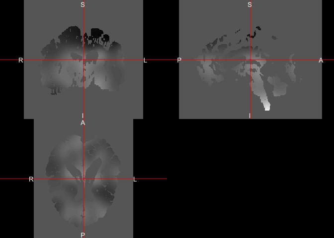
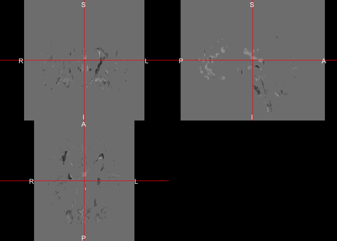
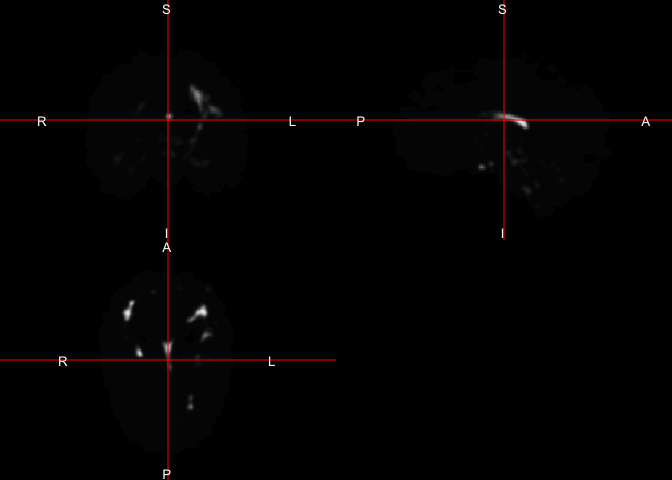
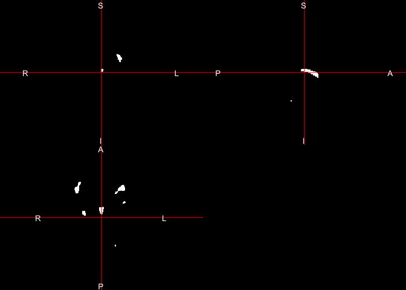
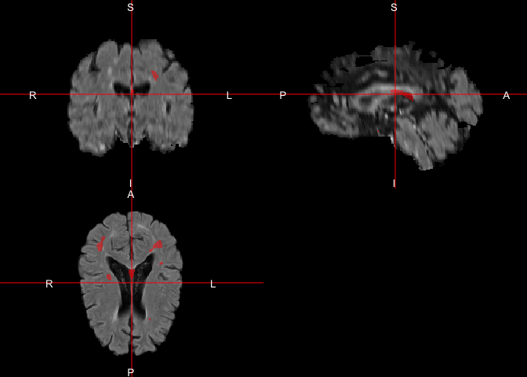

MIMoSA: A Method for Inter-Modal Segmentation Analysis
================
Alessandra Valcarcel
2017-12-22

Overview
--------

The mimosa package trains and makes predictions from the MIMoSA method. Access to the full paper can be found [here](http://www.biorxiv.org/content/early/2017/06/15/150284). Additionally, it allows for implementation of some common segmentation metrics such as true positive rate, false positive rate, false negative rate, false positive count, and sensitivity based on lesion count.

Installation
------------

To install the package from neuroconductor, type:

``` r
source("https://neuroconductor.org/neurocLite.R")
neuro_install("mimosa")
```

To get the latest development version from GitHub:

``` r
devtools::install_github('avalcarcel9/mimosa')
```

When going through this tutorial be sure your package is up to date. You will also need to install and load the following packages:

``` r
library(neurobase)
library(mimosa)
library(dplyr)
library(oasis)
library(fslr)
```

Tutorial Data
-------------

We will be using data from the [2015 Longitudinal Multiple Sclerosis Lesion Segmentation Challenge](https://smart-stats-tools.org/node/26).

The MIMoSA algorithm is most powerful when FLAIR, T1, T2, and PD imaging modalities are provided but the algorithm only needs FLAIR and T1 in order to run. While there is no statistically significant loss is power when reducing the types of imaging modalities there may be changes in qualitative results.

### Getting and organizing the data for use

After going to [2015 Longitudinal Multiple Sclerosis Lesion Segmentation Challenge](https://smart-stats-tools.org/node/26) you will need to create an account in order to download the data. After creating an account, you will receive an email (mine took a little over a day to get) with your login allowing you to set up a password. At this point you can go [here](https://smart-stats-tools.org/lesion-challenge-2015) to download the data.

The data consists of a set of training subjects in the training folder for which we have 2 sets of gold standard manual segmentations and 14 test subjects for which there are no gold standard manual segmentations provided. Each subject may have data for multiple time points. After downloading these data, I put the training and testdata\_website data into a folder ISBI\_Challenge\_2015.

For these analysis, we will use the ISBI\_Challenge\_2015/training/training01/preprocessed data to train the model using the gold standard manually segmented images in ISBI\_Challenge\_2015/training/masks/training01\_0\#\_mask2.nii. We will then apply the trained model on ISBI\_Challenge\_2015/testdata\_website/test01/preprocessed/ images to generate probability maps and MIMoSA predicted lesion masks. We will also use ISBI\_Challenge\_2015/training/training02/preprocessed/ data from the first time point to evaluate performance. If you have your own data you can adapt code provided here and apply the methods to your own data. For this reason, all code provided is intended to provide a direct application of methods therefore speed and efficiency were sacrificed in the examples provided.

### Creating a filename `matrix`

Before loading the data into R let's first organize the image file paths into a `matrix`.

``` r
# Note these paths will be to where you 
# have stored the data or to your own data
train_dir = file.path(train_data_dir, "training01")

T1_files = list.files(path = 
                        file.path(train_dir,
                                  "preprocessed"), 
                      pattern = "mprage_pp[.]nii", 
                      full.names = TRUE)
T2_files = list.files(path = 
                        file.path(train_dir,
                                  "preprocessed"), 
                      pattern = "t2_pp[.]nii", 
                      full.names = TRUE)
FLAIR_files = list.files(path = 
                           file.path(train_dir,
                                     "preprocessed"), 
                         pattern = "flair_pp[.]nii", 
                         full.names = TRUE)
PD_files = list.files(path = 
                        file.path(train_dir,
                                  "preprocessed"), 
                      pattern = "pd_pp[.]nii", 
                      full.names = TRUE)
GS_files = list.files(path = 
                        file.path(train_dir,
                                  "masks"), 
                      pattern = "mask2[.]nii", 
                      full.names = TRUE)
filepaths = data.frame(T1 = T1_files, T2 = T2_files, FLAIR = FLAIR_files, PD = PD_files, GS = GS_files, stringsAsFactors = FALSE)
ss = strsplit(nii.stub(filepaths$T1), split = "_")
filepaths$visit_id = sapply(ss, function(x) x[2])
filepaths
```

    ##                                                                                                         T1
    ## 1 /Users/alval/Documents/ISBI_Challenge_2015//training/training01/preprocessed/training01_01_mprage_pp.nii
    ## 2 /Users/alval/Documents/ISBI_Challenge_2015//training/training01/preprocessed/training01_02_mprage_pp.nii
    ## 3 /Users/alval/Documents/ISBI_Challenge_2015//training/training01/preprocessed/training01_03_mprage_pp.nii
    ## 4 /Users/alval/Documents/ISBI_Challenge_2015//training/training01/preprocessed/training01_04_mprage_pp.nii
    ##                                                                                                     T2
    ## 1 /Users/alval/Documents/ISBI_Challenge_2015//training/training01/preprocessed/training01_01_t2_pp.nii
    ## 2 /Users/alval/Documents/ISBI_Challenge_2015//training/training01/preprocessed/training01_02_t2_pp.nii
    ## 3 /Users/alval/Documents/ISBI_Challenge_2015//training/training01/preprocessed/training01_03_t2_pp.nii
    ## 4 /Users/alval/Documents/ISBI_Challenge_2015//training/training01/preprocessed/training01_04_t2_pp.nii
    ##                                                                                                     FLAIR
    ## 1 /Users/alval/Documents/ISBI_Challenge_2015//training/training01/preprocessed/training01_01_flair_pp.nii
    ## 2 /Users/alval/Documents/ISBI_Challenge_2015//training/training01/preprocessed/training01_02_flair_pp.nii
    ## 3 /Users/alval/Documents/ISBI_Challenge_2015//training/training01/preprocessed/training01_03_flair_pp.nii
    ## 4 /Users/alval/Documents/ISBI_Challenge_2015//training/training01/preprocessed/training01_04_flair_pp.nii
    ##                                                                                                     PD
    ## 1 /Users/alval/Documents/ISBI_Challenge_2015//training/training01/preprocessed/training01_01_pd_pp.nii
    ## 2 /Users/alval/Documents/ISBI_Challenge_2015//training/training01/preprocessed/training01_02_pd_pp.nii
    ## 3 /Users/alval/Documents/ISBI_Challenge_2015//training/training01/preprocessed/training01_03_pd_pp.nii
    ## 4 /Users/alval/Documents/ISBI_Challenge_2015//training/training01/preprocessed/training01_04_pd_pp.nii
    ##                                                                                              GS
    ## 1 /Users/alval/Documents/ISBI_Challenge_2015//training/training01/masks/training01_01_mask2.nii
    ## 2 /Users/alval/Documents/ISBI_Challenge_2015//training/training01/masks/training01_02_mask2.nii
    ## 3 /Users/alval/Documents/ISBI_Challenge_2015//training/training01/masks/training01_03_mask2.nii
    ## 4 /Users/alval/Documents/ISBI_Challenge_2015//training/training01/masks/training01_04_mask2.nii
    ##    visit_id
    ## 1 Challenge
    ## 2 Challenge
    ## 3 Challenge
    ## 4 Challenge

### Preprocessing

The `mimosa` package does not provide a preprocessing pipeline function. For the preprocessing pipeline used in the original methods please see our [paper](http://www.biorxiv.org/content/early/2017/06/15/150284). Before implementing the method, data should be inhomogeneity corrected, registered, skull stripped, and normalized to obtain accurate predicted lesion segmentations. The training functions in this package allow for z-score normalization, WhiteStripe normalization, or no normalization method for data that have been previousl normalized.

Some preprocessing tips:

In the implementation of this method, we notice that the specific preprocessing pipeline does not seem to make a difference so long as each preprocessing step does not fail. In cases with large lesion load, z-score normalization often fails and we suggest using `WhiteStripe`. In future versions of this package we plan to allow for `WhiteStripe` normalization.

For this example, data are preprocessed for us. That is, they have been inhomogeneity corrected, registered, and skull stripped. They have not been normalized yet so we will apply z-score normalization through the `mimosa` package function arguments.

Creating Predictors
-------------------

Once data are preprocessed we can create a `data.frame` of predictors using the `mimosa_data` function which creates the training vectors from a single MRI study that has FLAIR, T1, T2, and PD volumes. The user only needs FLAIR and T1 sequences but performance may suffer qualitatively. When training the model binary lesion masks are also required. The function returns a tissue mask, the candidate voxels mask for lesion segmentation, smoothed volumes, and coupling maps. The user may supply already normalized data if they wish to use an alternative normalization method.

``` r
# The R package neurobase is needed for the readnii function
T1_training01_01 = readnii(filepaths$T1[1])
T2_training01_01 = readnii(filepaths$T2[1])
FLAIR_training01_01 = readnii(filepaths$FLAIR[1])
PD_training01_01 = readnii(filepaths$PD[1])
gold_standard = readnii(filepaths$GS[1])
```

Before making the predictor data let's just visualize the loaded data.

``` r
sequence = list(FLAIR = FLAIR_training01_01,
                T1 = T1_training01_01,
                T2 = T2_training01_01,
                PD = PD_training01_01)
multi_overlay(sequence,
              z = floor(oro.nifti::nsli(sequence[[1]])/2),
              text = names(sequence),
              text.y = rep(1.4, length(sequence)),
              text.cex = rep(2.5, length(sequence))
)
```


``` r
rm(sequence)
```

Let's first create a brain mask by taking the union of positive voxels in the T1, T2, PD, and FLAIR. We use the union in order to include all voxels across all images with brain matter. The difference in these is typically only near the skull and will not be important after the selection of candidate voxels. We can then create the training `data.frame` for the sequence loaded in memory. The preprocessing carried out previously did not normalize the data therefore we will set `normalize = 'Z'`. We are supplying the brain mask rather than a tissue mask so we set `tissue = FALSE`. If you supply the tissue mask as the `brain_mask` you can set `tissue = TRUE`.

``` r
create_brain_mask = function(...) {
  x = list(...)
  x = check_nifti(x)
  x = lapply(x, function(img) {
    img > 0
  })
  mask = Reduce("|", x)
  mask = datatyper(mask)
  mask
}
```

``` r
# Create a brain mask
brain_mask = create_brain_mask(
  T1_training01_01, 
  T2_training01_01,
  FLAIR_training01_01,
  PD_training01_01
)

# The mimosa R package is needed to run mimosa_data
mimosa_data = mimosa_data(
  brain_mask = brain_mask, 
  FLAIR = FLAIR_training01_01, 
  T1 = T1_training01_01, 
  T2 = T2_training01_01, 
  PD = PD_training01_01, 
  tissue = FALSE, 
  gold_standard = gold_standard, 
  normalize = 'Z', 
  cand_mask = NULL, 
  slices = NULL, 
  orientation = c("axial", "coronal", "sagittal"), 
  cores = 1, 
  verbose = TRUE)
```

    ## # Checking File inputs

    ## # Getting Tissue Mask

    ## Warning in get.fsl(): Setting fsl.path to /usr/local/fsl

    ## Warning in get.fsloutput(): Can't find FSLOUTPUTTYPE, setting to NIFTI_GZ

    ## FSLDIR='/usr/local/fsl'; PATH=${FSLDIR}/bin:${PATH};export PATH FSLDIR; sh "${FSLDIR}/etc/fslconf/fsl.sh"; FSLOUTPUTTYPE=NIFTI_GZ; export FSLOUTPUTTYPE; ${FSLDIR}/bin/fslmaths "/private/var/folders/sq/x3htb34928bfn79jk3qksqg56zmf39/T/Rtmp4l2g5w/fileff5754a39d0.nii.gz" -kernel box 5x5x5 -ero  "/var/folders/sq/x3htb34928bfn79jk3qksqg56zmf39/T//Rtmp4l2g5w/fileff5723118a9"

    ## # Normalizing Images using Z-score

    ## # Voxel Selection Procedure

    ## # Smoothing Images: Sigma = 10

    ## FSLDIR='/usr/local/fsl'; PATH=${FSLDIR}/bin:${PATH};export PATH FSLDIR; sh "${FSLDIR}/etc/fslconf/fsl.sh"; FSLOUTPUTTYPE=NIFTI_GZ; export FSLOUTPUTTYPE; ${FSLDIR}/bin/fslmaths "/private/var/folders/sq/x3htb34928bfn79jk3qksqg56zmf39/T/Rtmp4l2g5w/fileff55c19c2d8.nii.gz"  -s 10 "/var/folders/sq/x3htb34928bfn79jk3qksqg56zmf39/T//Rtmp4l2g5w/fileff51f472225";

    ## FSLDIR='/usr/local/fsl'; PATH=${FSLDIR}/bin:${PATH};export PATH FSLDIR; sh "${FSLDIR}/etc/fslconf/fsl.sh"; FSLOUTPUTTYPE=NIFTI_GZ; export FSLOUTPUTTYPE; ${FSLDIR}/bin/fslmaths "/private/var/folders/sq/x3htb34928bfn79jk3qksqg56zmf39/T/Rtmp4l2g5w/fileff57712bb2d.nii.gz"  -mas "/private/var/folders/sq/x3htb34928bfn79jk3qksqg56zmf39/T/Rtmp4l2g5w/fileff56ebec46d.nii.gz"  -s 10 "/var/folders/sq/x3htb34928bfn79jk3qksqg56zmf39/T//Rtmp4l2g5w/fileff52e5208e8"; FSLDIR='/usr/local/fsl'; PATH=${FSLDIR}/bin:${PATH};export PATH FSLDIR; sh "${FSLDIR}/etc/fslconf/fsl.sh"; FSLOUTPUTTYPE=NIFTI_GZ; export FSLOUTPUTTYPE; ${FSLDIR}/bin/fslmaths "/var/folders/sq/x3htb34928bfn79jk3qksqg56zmf39/T//Rtmp4l2g5w/fileff52e5208e8" -div "/private/var/folders/sq/x3htb34928bfn79jk3qksqg56zmf39/T/Rtmp4l2g5w/fileff51f472225.nii.gz" -mas "/private/var/folders/sq/x3htb34928bfn79jk3qksqg56zmf39/T/Rtmp4l2g5w/fileff56ebec46d.nii.gz" "/var/folders/sq/x3htb34928bfn79jk3qksqg56zmf39/T//Rtmp4l2g5w/fileff52e5208e8";

    ## FSLDIR='/usr/local/fsl'; PATH=${FSLDIR}/bin:${PATH};export PATH FSLDIR; sh "${FSLDIR}/etc/fslconf/fsl.sh"; FSLOUTPUTTYPE=NIFTI_GZ; export FSLOUTPUTTYPE; ${FSLDIR}/bin/fslmaths "/private/var/folders/sq/x3htb34928bfn79jk3qksqg56zmf39/T/Rtmp4l2g5w/fileff5bc6cf1a.nii.gz"  -mas "/private/var/folders/sq/x3htb34928bfn79jk3qksqg56zmf39/T/Rtmp4l2g5w/fileff52946ba00.nii.gz"  -s 10 "/var/folders/sq/x3htb34928bfn79jk3qksqg56zmf39/T//Rtmp4l2g5w/fileff5625d6b2b"; FSLDIR='/usr/local/fsl'; PATH=${FSLDIR}/bin:${PATH};export PATH FSLDIR; sh "${FSLDIR}/etc/fslconf/fsl.sh"; FSLOUTPUTTYPE=NIFTI_GZ; export FSLOUTPUTTYPE; ${FSLDIR}/bin/fslmaths "/var/folders/sq/x3htb34928bfn79jk3qksqg56zmf39/T//Rtmp4l2g5w/fileff5625d6b2b" -div "/private/var/folders/sq/x3htb34928bfn79jk3qksqg56zmf39/T/Rtmp4l2g5w/fileff51f472225.nii.gz" -mas "/private/var/folders/sq/x3htb34928bfn79jk3qksqg56zmf39/T/Rtmp4l2g5w/fileff52946ba00.nii.gz" "/var/folders/sq/x3htb34928bfn79jk3qksqg56zmf39/T//Rtmp4l2g5w/fileff5625d6b2b";

    ## FSLDIR='/usr/local/fsl'; PATH=${FSLDIR}/bin:${PATH};export PATH FSLDIR; sh "${FSLDIR}/etc/fslconf/fsl.sh"; FSLOUTPUTTYPE=NIFTI_GZ; export FSLOUTPUTTYPE; ${FSLDIR}/bin/fslmaths "/private/var/folders/sq/x3htb34928bfn79jk3qksqg56zmf39/T/Rtmp4l2g5w/fileff563270680.nii.gz"  -mas "/private/var/folders/sq/x3htb34928bfn79jk3qksqg56zmf39/T/Rtmp4l2g5w/fileff5171bf05b.nii.gz"  -s 10 "/var/folders/sq/x3htb34928bfn79jk3qksqg56zmf39/T//Rtmp4l2g5w/fileff52b40f237"; FSLDIR='/usr/local/fsl'; PATH=${FSLDIR}/bin:${PATH};export PATH FSLDIR; sh "${FSLDIR}/etc/fslconf/fsl.sh"; FSLOUTPUTTYPE=NIFTI_GZ; export FSLOUTPUTTYPE; ${FSLDIR}/bin/fslmaths "/var/folders/sq/x3htb34928bfn79jk3qksqg56zmf39/T//Rtmp4l2g5w/fileff52b40f237" -div "/private/var/folders/sq/x3htb34928bfn79jk3qksqg56zmf39/T/Rtmp4l2g5w/fileff51f472225.nii.gz" -mas "/private/var/folders/sq/x3htb34928bfn79jk3qksqg56zmf39/T/Rtmp4l2g5w/fileff5171bf05b.nii.gz" "/var/folders/sq/x3htb34928bfn79jk3qksqg56zmf39/T//Rtmp4l2g5w/fileff52b40f237";

    ## FSLDIR='/usr/local/fsl'; PATH=${FSLDIR}/bin:${PATH};export PATH FSLDIR; sh "${FSLDIR}/etc/fslconf/fsl.sh"; FSLOUTPUTTYPE=NIFTI_GZ; export FSLOUTPUTTYPE; ${FSLDIR}/bin/fslmaths "/private/var/folders/sq/x3htb34928bfn79jk3qksqg56zmf39/T/Rtmp4l2g5w/fileff534de0f10.nii.gz"  -mas "/private/var/folders/sq/x3htb34928bfn79jk3qksqg56zmf39/T/Rtmp4l2g5w/fileff55eaefe8d.nii.gz"  -s 10 "/var/folders/sq/x3htb34928bfn79jk3qksqg56zmf39/T//Rtmp4l2g5w/fileff532ca0b8b"; FSLDIR='/usr/local/fsl'; PATH=${FSLDIR}/bin:${PATH};export PATH FSLDIR; sh "${FSLDIR}/etc/fslconf/fsl.sh"; FSLOUTPUTTYPE=NIFTI_GZ; export FSLOUTPUTTYPE; ${FSLDIR}/bin/fslmaths "/var/folders/sq/x3htb34928bfn79jk3qksqg56zmf39/T//Rtmp4l2g5w/fileff532ca0b8b" -div "/private/var/folders/sq/x3htb34928bfn79jk3qksqg56zmf39/T/Rtmp4l2g5w/fileff51f472225.nii.gz" -mas "/private/var/folders/sq/x3htb34928bfn79jk3qksqg56zmf39/T/Rtmp4l2g5w/fileff55eaefe8d.nii.gz" "/var/folders/sq/x3htb34928bfn79jk3qksqg56zmf39/T//Rtmp4l2g5w/fileff532ca0b8b";

    ## # Smoothing Images: Sigma = 20

    ## FSLDIR='/usr/local/fsl'; PATH=${FSLDIR}/bin:${PATH};export PATH FSLDIR; sh "${FSLDIR}/etc/fslconf/fsl.sh"; FSLOUTPUTTYPE=NIFTI_GZ; export FSLOUTPUTTYPE; ${FSLDIR}/bin/fslmaths "/private/var/folders/sq/x3htb34928bfn79jk3qksqg56zmf39/T/Rtmp4l2g5w/fileff56ebbecb9.nii.gz"  -s 20 "/var/folders/sq/x3htb34928bfn79jk3qksqg56zmf39/T//Rtmp4l2g5w/fileff573b29e7a";

    ## FSLDIR='/usr/local/fsl'; PATH=${FSLDIR}/bin:${PATH};export PATH FSLDIR; sh "${FSLDIR}/etc/fslconf/fsl.sh"; FSLOUTPUTTYPE=NIFTI_GZ; export FSLOUTPUTTYPE; ${FSLDIR}/bin/fslmaths "/private/var/folders/sq/x3htb34928bfn79jk3qksqg56zmf39/T/Rtmp4l2g5w/fileff553c296ed.nii.gz"  -mas "/private/var/folders/sq/x3htb34928bfn79jk3qksqg56zmf39/T/Rtmp4l2g5w/fileff5c42cc91.nii.gz"  -s 20 "/var/folders/sq/x3htb34928bfn79jk3qksqg56zmf39/T//Rtmp4l2g5w/fileff5758449e0"; FSLDIR='/usr/local/fsl'; PATH=${FSLDIR}/bin:${PATH};export PATH FSLDIR; sh "${FSLDIR}/etc/fslconf/fsl.sh"; FSLOUTPUTTYPE=NIFTI_GZ; export FSLOUTPUTTYPE; ${FSLDIR}/bin/fslmaths "/var/folders/sq/x3htb34928bfn79jk3qksqg56zmf39/T//Rtmp4l2g5w/fileff5758449e0" -div "/private/var/folders/sq/x3htb34928bfn79jk3qksqg56zmf39/T/Rtmp4l2g5w/fileff573b29e7a.nii.gz" -mas "/private/var/folders/sq/x3htb34928bfn79jk3qksqg56zmf39/T/Rtmp4l2g5w/fileff5c42cc91.nii.gz" "/var/folders/sq/x3htb34928bfn79jk3qksqg56zmf39/T//Rtmp4l2g5w/fileff5758449e0";

    ## FSLDIR='/usr/local/fsl'; PATH=${FSLDIR}/bin:${PATH};export PATH FSLDIR; sh "${FSLDIR}/etc/fslconf/fsl.sh"; FSLOUTPUTTYPE=NIFTI_GZ; export FSLOUTPUTTYPE; ${FSLDIR}/bin/fslmaths "/private/var/folders/sq/x3htb34928bfn79jk3qksqg56zmf39/T/Rtmp4l2g5w/fileff5400e4d66.nii.gz"  -mas "/private/var/folders/sq/x3htb34928bfn79jk3qksqg56zmf39/T/Rtmp4l2g5w/fileff56afb8464.nii.gz"  -s 20 "/var/folders/sq/x3htb34928bfn79jk3qksqg56zmf39/T//Rtmp4l2g5w/fileff526b0f81b"; FSLDIR='/usr/local/fsl'; PATH=${FSLDIR}/bin:${PATH};export PATH FSLDIR; sh "${FSLDIR}/etc/fslconf/fsl.sh"; FSLOUTPUTTYPE=NIFTI_GZ; export FSLOUTPUTTYPE; ${FSLDIR}/bin/fslmaths "/var/folders/sq/x3htb34928bfn79jk3qksqg56zmf39/T//Rtmp4l2g5w/fileff526b0f81b" -div "/private/var/folders/sq/x3htb34928bfn79jk3qksqg56zmf39/T/Rtmp4l2g5w/fileff573b29e7a.nii.gz" -mas "/private/var/folders/sq/x3htb34928bfn79jk3qksqg56zmf39/T/Rtmp4l2g5w/fileff56afb8464.nii.gz" "/var/folders/sq/x3htb34928bfn79jk3qksqg56zmf39/T//Rtmp4l2g5w/fileff526b0f81b";

    ## FSLDIR='/usr/local/fsl'; PATH=${FSLDIR}/bin:${PATH};export PATH FSLDIR; sh "${FSLDIR}/etc/fslconf/fsl.sh"; FSLOUTPUTTYPE=NIFTI_GZ; export FSLOUTPUTTYPE; ${FSLDIR}/bin/fslmaths "/private/var/folders/sq/x3htb34928bfn79jk3qksqg56zmf39/T/Rtmp4l2g5w/fileff52c70c875.nii.gz"  -mas "/private/var/folders/sq/x3htb34928bfn79jk3qksqg56zmf39/T/Rtmp4l2g5w/fileff52078901e.nii.gz"  -s 20 "/var/folders/sq/x3htb34928bfn79jk3qksqg56zmf39/T//Rtmp4l2g5w/fileff54b3db239"; FSLDIR='/usr/local/fsl'; PATH=${FSLDIR}/bin:${PATH};export PATH FSLDIR; sh "${FSLDIR}/etc/fslconf/fsl.sh"; FSLOUTPUTTYPE=NIFTI_GZ; export FSLOUTPUTTYPE; ${FSLDIR}/bin/fslmaths "/var/folders/sq/x3htb34928bfn79jk3qksqg56zmf39/T//Rtmp4l2g5w/fileff54b3db239" -div "/private/var/folders/sq/x3htb34928bfn79jk3qksqg56zmf39/T/Rtmp4l2g5w/fileff573b29e7a.nii.gz" -mas "/private/var/folders/sq/x3htb34928bfn79jk3qksqg56zmf39/T/Rtmp4l2g5w/fileff52078901e.nii.gz" "/var/folders/sq/x3htb34928bfn79jk3qksqg56zmf39/T//Rtmp4l2g5w/fileff54b3db239";

    ## FSLDIR='/usr/local/fsl'; PATH=${FSLDIR}/bin:${PATH};export PATH FSLDIR; sh "${FSLDIR}/etc/fslconf/fsl.sh"; FSLOUTPUTTYPE=NIFTI_GZ; export FSLOUTPUTTYPE; ${FSLDIR}/bin/fslmaths "/private/var/folders/sq/x3htb34928bfn79jk3qksqg56zmf39/T/Rtmp4l2g5w/fileff53f7fe2c6.nii.gz"  -mas "/private/var/folders/sq/x3htb34928bfn79jk3qksqg56zmf39/T/Rtmp4l2g5w/fileff5650155bb.nii.gz"  -s 20 "/var/folders/sq/x3htb34928bfn79jk3qksqg56zmf39/T//Rtmp4l2g5w/fileff53aa39bcb"; FSLDIR='/usr/local/fsl'; PATH=${FSLDIR}/bin:${PATH};export PATH FSLDIR; sh "${FSLDIR}/etc/fslconf/fsl.sh"; FSLOUTPUTTYPE=NIFTI_GZ; export FSLOUTPUTTYPE; ${FSLDIR}/bin/fslmaths "/var/folders/sq/x3htb34928bfn79jk3qksqg56zmf39/T//Rtmp4l2g5w/fileff53aa39bcb" -div "/private/var/folders/sq/x3htb34928bfn79jk3qksqg56zmf39/T/Rtmp4l2g5w/fileff573b29e7a.nii.gz" -mas "/private/var/folders/sq/x3htb34928bfn79jk3qksqg56zmf39/T/Rtmp4l2g5w/fileff5650155bb.nii.gz" "/var/folders/sq/x3htb34928bfn79jk3qksqg56zmf39/T//Rtmp4l2g5w/fileff53aa39bcb";

    ## # Running Coupling

    ## # Extracting neighborhood data 
    ## # Computing weighted regressions

    ## # Ran Coupling for FLAIR and T1 Combinations Successfully

    ## # Extracting neighborhood data 
    ## # Computing weighted regressions

    ## # Ran Coupling for FLAIR and T2 Combinations Successfully

    ## # Extracting neighborhood data 
    ## # Computing weighted regressions

    ## # Ran Coupling for FLAIR and PD Combinations Successfully

    ## # Extracting neighborhood data 
    ## # Computing weighted regressions

    ## # Ran Coupling for T1 and T2 Combinations Successfully

    ## # Extracting neighborhood data 
    ## # Computing weighted regressions

    ## # Ran Coupling for T1 and PD Combinations Successfully

    ## # Extracting neighborhood data 
    ## # Computing weighted regressions

    ## # Ran Coupling for T2 and PD Combinations Successfully

A note on the returned objects:

``` r
is.list(mimosa_data)
```

    ## [1] TRUE

``` r
names(mimosa_data)
```

    ## [1] "mimosa_dataframe"    "top_voxels"          "smoothed"           
    ## [4] "coupling_intercepts" "coupling_slopes"     "normalized"         
    ## [7] "tissue_mask"

``` r
names(mimosa_data$smoothed)
```

    ## [1] "smooth_10" "smooth_20"

``` r
names(mimosa_data$smoothed$smooth_10)
```

    ## [1] "FLAIR_10" "T1_10"    "T2_10"    "PD_10"

``` r
names(mimosa_data$smoothed$smooth_20)
```

    ## [1] "FLAIR_20" "T1_20"    "T2_20"    "PD_20"

``` r
names(mimosa_data$coupling_intercepts)
```

    ##  [1] "FLAIRonT1_intercepts" "FLAIRonT2_intercepts" "FLAIRonPD_intercepts"
    ##  [4] "T1onT2_intercepts"    "T1onPD_intercepts"    "T2onPD_intercepts"   
    ##  [7] "T1onFLAIR_intercepts" "T2onFLAIR_intercepts" "PDonFLAIR_intercepts"
    ## [10] "T2onT1_intercepts"    "PDonT1_intercepts"    "PDonT2_intercepts"

``` r
names(mimosa_data$coupling_slopes)
```

    ##  [1] "FLAIRonT1_slopes" "FLAIRonT2_slopes" "FLAIRonPD_slopes"
    ##  [4] "T1onT2_slopes"    "T1onPD_slopes"    "T2onPD_slopes"   
    ##  [7] "T1onFLAIR_slopes" "T2onFLAIR_slopes" "PDonFLAIR_slopes"
    ## [10] "T2onT1_slopes"    "PDonT1_slopes"    "PDonT2_slopes"

``` r
names(mimosa_data$normalized)
```

    ## [1] "FLAIR" "T1"    "T2"    "PD"

The following items are always returned from the `mimosa_data` function:

-   `mimosa_dataframe` is the predictor dataframe
-   `top_voxels` is a mask for candidate lesion voxels. This is a binary mask of class `nifti`.
-   `smoothed` is an embedded list of smoothed volumes. Here there is another set of lists `smooth_10` and `smooth_20`. Each object in these lists is a `nifti`.
-   `coupling_intercepts` is an embedded list of the coupling intercept values inside of the candidate mask. Each object in this list is a `nifti`.
-   `coupling_slopes` is an embedded list of the coupling slopes inside of the candidate\_mask. Each object in this list is a `nifti`.

The following may be returned depending on input arguments:

-   `normalized` is an embedded list of normalized volumes. Returned when `normalize != 'no'`. Each object in this list is a `nifti`.
-   `tissue_mask` is a brain mask that excludes CSF. Returned when `tissue = FALSE`. Each object in this list is a `nifti`.

Next, I show the first 5 rows of the `$mimosa_dataframe` and a few of the nifti objects displayed using `ortho2`. You can always save these objects using `writenii` and use a viewer of your choosing.

``` r
head(mimosa_data$mimosa_dataframe)
```

    ##   axial coronal sagittal    FLAIR         T1       T2       PD FLAIR_10
    ## 1    89     131       14 2.287876  0.3325792 2.978799 1.826240 1.345828
    ## 2    90     131       14 1.874878 -0.7364550 2.382731 1.104095 1.338061
    ## 3    91     131       14 1.010692 -1.1051463 2.280783 1.132581 1.329444
    ## 4    87     132       14 2.466950  1.0201121 2.101769 2.289588 1.365884
    ## 5    88     132       14 2.945115  0.5568896 1.451685 1.445819 1.359961
    ## 6    89     132       14 3.900877  1.0178453 1.233909 1.022983 1.352887
    ##       T1_10      T2_10      PD_10  FLAIR_20     T1_20        T2_20
    ## 1 0.6592031 -0.1901898 -0.2468355 0.6474552 0.2910269  0.000566980
    ## 2 0.6605375 -0.1933210 -0.2540186 0.6505741 0.2913818 -0.001028678
    ## 3 0.6580319 -0.1937983 -0.2581899 0.6537054 0.2910491 -0.002226533
    ## 4 0.6224467 -0.1800741 -0.2070445 0.6423467 0.2802900  0.002779433
    ## 5 0.6318335 -0.1887418 -0.2210913 0.6453856 0.2820102  0.000373256
    ## 6 0.6373675 -0.1947359 -0.2321712 0.6484272 0.2830644 -0.001649527
    ##        PD_20 FLAIRonT1_intercepts FLAIRonT2_intercepts
    ## 1 0.02472147             1.978254             3.094457
    ## 2 0.02340431             2.113199             3.340455
    ## 3 0.02254762             2.163857             3.239328
    ## 4 0.03069922             1.877730             2.673693
    ## 5 0.02850217             2.204823             2.710227
    ## 6 0.02673587             2.344998             3.025394
    ##   FLAIRonPD_intercepts T1onT2_intercepts T1onPD_intercepts
    ## 1             2.786600         0.7985530         0.6560151
    ## 2             2.963397         0.7953269         0.6020742
    ## 3             2.921179         0.8235107         0.6302789
    ## 4             2.509352         0.8371162         0.8418676
    ## 5             2.601480         0.7037769         0.7038838
    ## 6             2.866669         0.6566802         0.6164097
    ##   T2onPD_intercepts T1onFLAIR_intercepts T2onFLAIR_intercepts
    ## 1         0.5441183           -0.1433273             2.359314
    ## 2         0.4986216           -0.5572880             2.603463
    ## 3         0.4321312           -0.6491797             2.501936
    ## 4         0.4084644            0.5448248             1.525459
    ## 5         0.4576744            0.4195870             1.198191
    ## 6         0.4940783            0.1181139             1.405964
    ##   PDonFLAIR_intercepts T2onT1_intercepts PDonT1_intercepts
    ## 1            1.2911246         1.6238123        0.83106840
    ## 2            1.3743492         1.5406436        0.76015747
    ## 3            1.2738388         1.3883365        0.66100413
    ## 4            1.0168229         0.5679893        0.06205135
    ## 5            0.4738148         0.6213107        0.07796650
    ## 6            0.4193721         0.8390649        0.20795220
    ##   PDonT2_intercepts FLAIRonT1_slopes FLAIRonT2_slopes FLAIRonPD_slopes
    ## 1        -0.3498044        1.0316484       -0.4148830      -0.31754342
    ## 2        -0.2968841        1.2056293       -0.5861660      -0.54055744
    ## 3        -0.2561787        1.1090856       -0.6150841      -0.65929365
    ## 4        -0.3754155        0.6311461       -0.3432816      -0.22702217
    ## 5        -0.4050355        0.5284612       -0.1873812      -0.07495169
    ## 6        -0.4074095        0.8238434       -0.2703279      -0.10323296
    ##   T1onT2_slopes T1onPD_slopes T2onPD_slopes T1onFLAIR_slopes
    ## 1   -0.17286156   -0.11019603     1.0720415        0.2820754
    ## 2   -0.29160452   -0.25846463     1.1885583        0.3816717
    ## 3   -0.39586002   -0.45491019     1.2978518        0.4145818
    ## 4    0.03995403    0.06483474     0.8490924        0.1325317
    ## 5    0.01670031    0.04502903     0.8908101        0.1144331
    ## 6   -0.06687764   -0.01920854     0.9694657        0.1737537
    ##   T2onFLAIR_slopes PDonFLAIR_slopes T2onT1_slopes PDonT1_slopes
    ## 1       -0.4351121      -0.25012395   -0.66304100   -0.31745678
    ## 2       -0.5466345      -0.31137839   -0.85900265   -0.47029632
    ## 3       -0.5914921      -0.33566803   -1.01838243   -0.61960024
    ## 4       -0.3296554      -0.26504087    0.18271768    0.36046460
    ## 5       -0.2005083      -0.08667877    0.08252635    0.24048357
    ## 6       -0.2660460      -0.09155627   -0.31207380   -0.08077458
    ##   PDonT2_slopes gold_standard
    ## 1     0.8051713             0
    ## 2     0.7341599             0
    ## 3     0.6871345             0
    ## 4     1.0322618             0
    ## 5     0.9627423             0
    ## 6     0.8736477             0

``` r
ortho2(mimosa_data$top_voxels)
```


``` r
ortho2(mimosa_data$smoothed$smooth_10$FLAIR_10)
```



``` r
ortho2(mimosa_data$coupling_slopes$FLAIRonT1_slopes)
```



``` r
# Remove mimosa_data from memory
rm(mimosa_data)
```

The `mimosa_data$mimosa_dataframe` in conjunction with the candidate voxel mask or `mimosa_data$top_voxels` can be used to generate probability maps which can in turn be thresholded to generate predicted lesion masks.

The `mimosa_data$mimosa_dataframe` is also used to train the model which we will cover in detail in the next section.

Train the MIMoSA Model
----------------------

There are two (2) approaches to training the mimosa model. In the first approach we will use the built in `mimosa_training` function which will create a large predictor matrix for all subjects supplied, train the model, and calculate the optimal threshold. In the second, you can utilize the `mimosa_data` and `mimosa_fit` functions to break up this process and train the model yourself. Both approaches yield the same results and therefore choice of approaches comes down to user preference and need. We will first show the approach using `mimosa_training` and then show an example broken down using the `mimosa_data` and `mimosa_fit` approach.

1.  `mimosa_training`

Unlike `mimosa_data` here `brain_mask`, `FLAIR`, `T1`, `T2`, `PD`, and `gold_standard` are vectors of file paths to their respective object. We will use a simple for loop to generate and save the brain masks. You may need to change the `substr(filepaths, 74, 78)` if your file path is different. Again, we note that this is not the most efficient computational approach.

Since we need to supply vectors of file paths and not local objects when applying this function. We will need to create brain masks for each subject and add them to the `matrix` `filepaths`. After that, we will use the same arguments as in the `mimosa_data` example.

``` r
filepaths$brainmask = NA

# The neurobase R package is required to read and write images
for (i in seq(nrow(filepaths))) {
  # Load files
  visit_id = filepaths$visit_id[i]
  fname = file.path(train_dir, 
                    "preprocessed", 
                    paste0("brainmask_",
                           visit_id, ".nii.gz"))
  if (!file.exists(fname)) {
    T1_training = readnii(filepaths$T1[i])
    T2_training = readnii(filepaths$T2[i])
    FLAIR_training = readnii(filepaths$FLAIR[i])
    PD_training = readnii(filepaths$PD[i])
    brain_mask = create_brain_mask(
      T1_training,
      T2_training,
      FLAIR_training,
      PD_training
    )
  # Save brain mask to local working directory
  writenii(brain_mask, 
           filename = fname)
  }
  filepaths$brainmask[i] = fname
}
```

Now we have all file paths for the input arguments required for `mimosa_training`. Let's apply `mimosa_training` to train the model. We will set `optimal_threshold = seq(0.25, 0.35, 0.01)` in order for the optimal thresholding algorithm to calculate the threshold that optimizes DSC compared to gold standard manually segmented images within these supplied values. We will keep `outdir = NULL` but if you wanted to save all returned objects for all subjects you should specify a vector of file paths with unique IDs.

``` r
mimosa_training = mimosa_training(
  brain_mask = filepaths$brainmask,
  FLAIR = filepaths$FLAIR,
  T1 = filepaths$T1,
  T2 = filepaths$T2,
  PD = filepaths$PD,
  tissue = FALSE, 
  gold_standard = filepaths$GS,
  normalize = 'Z', 
  slices = NULL, 
  orientation = c("axial", "coronal", "sagittal"),
  cores = 1, 
  verbose = TRUE, 
  outdir = NULL, 
  optimal_threshold = seq(0.25, 0.35, 0.01))
```

    ## # Obtaining training subject data

    ## # Checking File inputs

    ## # Getting Tissue Mask

    ## FSLDIR='/usr/local/fsl'; PATH=${FSLDIR}/bin:${PATH};export PATH FSLDIR; sh "${FSLDIR}/etc/fslconf/fsl.sh"; FSLOUTPUTTYPE=NIFTI_GZ; export FSLOUTPUTTYPE; ${FSLDIR}/bin/fslmaths "/private/var/folders/sq/x3htb34928bfn79jk3qksqg56zmf39/T/Rtmp4l2g5w/fileff53f3b25ae.nii.gz" -kernel box 5x5x5 -ero  "/var/folders/sq/x3htb34928bfn79jk3qksqg56zmf39/T//Rtmp4l2g5w/fileff532dec491"

    ## # Normalizing Images using Z-score

    ## # Voxel Selection Procedure

    ## # Smoothing Images: Sigma = 10

    ## FSLDIR='/usr/local/fsl'; PATH=${FSLDIR}/bin:${PATH};export PATH FSLDIR; sh "${FSLDIR}/etc/fslconf/fsl.sh"; FSLOUTPUTTYPE=NIFTI_GZ; export FSLOUTPUTTYPE; ${FSLDIR}/bin/fslmaths "/private/var/folders/sq/x3htb34928bfn79jk3qksqg56zmf39/T/Rtmp4l2g5w/fileff54426e2f0.nii.gz"  -s 10 "/var/folders/sq/x3htb34928bfn79jk3qksqg56zmf39/T//Rtmp4l2g5w/fileff554fd1d84";

    ## FSLDIR='/usr/local/fsl'; PATH=${FSLDIR}/bin:${PATH};export PATH FSLDIR; sh "${FSLDIR}/etc/fslconf/fsl.sh"; FSLOUTPUTTYPE=NIFTI_GZ; export FSLOUTPUTTYPE; ${FSLDIR}/bin/fslmaths "/private/var/folders/sq/x3htb34928bfn79jk3qksqg56zmf39/T/Rtmp4l2g5w/fileff5359cf0b3.nii.gz"  -mas "/private/var/folders/sq/x3htb34928bfn79jk3qksqg56zmf39/T/Rtmp4l2g5w/fileff5527e9344.nii.gz"  -s 10 "/var/folders/sq/x3htb34928bfn79jk3qksqg56zmf39/T//Rtmp4l2g5w/fileff573f67fab"; FSLDIR='/usr/local/fsl'; PATH=${FSLDIR}/bin:${PATH};export PATH FSLDIR; sh "${FSLDIR}/etc/fslconf/fsl.sh"; FSLOUTPUTTYPE=NIFTI_GZ; export FSLOUTPUTTYPE; ${FSLDIR}/bin/fslmaths "/var/folders/sq/x3htb34928bfn79jk3qksqg56zmf39/T//Rtmp4l2g5w/fileff573f67fab" -div "/private/var/folders/sq/x3htb34928bfn79jk3qksqg56zmf39/T/Rtmp4l2g5w/fileff554fd1d84.nii.gz" -mas "/private/var/folders/sq/x3htb34928bfn79jk3qksqg56zmf39/T/Rtmp4l2g5w/fileff5527e9344.nii.gz" "/var/folders/sq/x3htb34928bfn79jk3qksqg56zmf39/T//Rtmp4l2g5w/fileff573f67fab";

    ## FSLDIR='/usr/local/fsl'; PATH=${FSLDIR}/bin:${PATH};export PATH FSLDIR; sh "${FSLDIR}/etc/fslconf/fsl.sh"; FSLOUTPUTTYPE=NIFTI_GZ; export FSLOUTPUTTYPE; ${FSLDIR}/bin/fslmaths "/private/var/folders/sq/x3htb34928bfn79jk3qksqg56zmf39/T/Rtmp4l2g5w/fileff53c37ef07.nii.gz"  -mas "/private/var/folders/sq/x3htb34928bfn79jk3qksqg56zmf39/T/Rtmp4l2g5w/fileff57c2dd373.nii.gz"  -s 10 "/var/folders/sq/x3htb34928bfn79jk3qksqg56zmf39/T//Rtmp4l2g5w/fileff5249562b6"; FSLDIR='/usr/local/fsl'; PATH=${FSLDIR}/bin:${PATH};export PATH FSLDIR; sh "${FSLDIR}/etc/fslconf/fsl.sh"; FSLOUTPUTTYPE=NIFTI_GZ; export FSLOUTPUTTYPE; ${FSLDIR}/bin/fslmaths "/var/folders/sq/x3htb34928bfn79jk3qksqg56zmf39/T//Rtmp4l2g5w/fileff5249562b6" -div "/private/var/folders/sq/x3htb34928bfn79jk3qksqg56zmf39/T/Rtmp4l2g5w/fileff554fd1d84.nii.gz" -mas "/private/var/folders/sq/x3htb34928bfn79jk3qksqg56zmf39/T/Rtmp4l2g5w/fileff57c2dd373.nii.gz" "/var/folders/sq/x3htb34928bfn79jk3qksqg56zmf39/T//Rtmp4l2g5w/fileff5249562b6";

    ## FSLDIR='/usr/local/fsl'; PATH=${FSLDIR}/bin:${PATH};export PATH FSLDIR; sh "${FSLDIR}/etc/fslconf/fsl.sh"; FSLOUTPUTTYPE=NIFTI_GZ; export FSLOUTPUTTYPE; ${FSLDIR}/bin/fslmaths "/private/var/folders/sq/x3htb34928bfn79jk3qksqg56zmf39/T/Rtmp4l2g5w/fileff54b83ad7d.nii.gz"  -mas "/private/var/folders/sq/x3htb34928bfn79jk3qksqg56zmf39/T/Rtmp4l2g5w/fileff531f31046.nii.gz"  -s 10 "/var/folders/sq/x3htb34928bfn79jk3qksqg56zmf39/T//Rtmp4l2g5w/fileff54cb17d48"; FSLDIR='/usr/local/fsl'; PATH=${FSLDIR}/bin:${PATH};export PATH FSLDIR; sh "${FSLDIR}/etc/fslconf/fsl.sh"; FSLOUTPUTTYPE=NIFTI_GZ; export FSLOUTPUTTYPE; ${FSLDIR}/bin/fslmaths "/var/folders/sq/x3htb34928bfn79jk3qksqg56zmf39/T//Rtmp4l2g5w/fileff54cb17d48" -div "/private/var/folders/sq/x3htb34928bfn79jk3qksqg56zmf39/T/Rtmp4l2g5w/fileff554fd1d84.nii.gz" -mas "/private/var/folders/sq/x3htb34928bfn79jk3qksqg56zmf39/T/Rtmp4l2g5w/fileff531f31046.nii.gz" "/var/folders/sq/x3htb34928bfn79jk3qksqg56zmf39/T//Rtmp4l2g5w/fileff54cb17d48";

    ## FSLDIR='/usr/local/fsl'; PATH=${FSLDIR}/bin:${PATH};export PATH FSLDIR; sh "${FSLDIR}/etc/fslconf/fsl.sh"; FSLOUTPUTTYPE=NIFTI_GZ; export FSLOUTPUTTYPE; ${FSLDIR}/bin/fslmaths "/private/var/folders/sq/x3htb34928bfn79jk3qksqg56zmf39/T/Rtmp4l2g5w/fileff51898294e.nii.gz"  -mas "/private/var/folders/sq/x3htb34928bfn79jk3qksqg56zmf39/T/Rtmp4l2g5w/fileff52dbfcc7f.nii.gz"  -s 10 "/var/folders/sq/x3htb34928bfn79jk3qksqg56zmf39/T//Rtmp4l2g5w/fileff5b0abd50"; FSLDIR='/usr/local/fsl'; PATH=${FSLDIR}/bin:${PATH};export PATH FSLDIR; sh "${FSLDIR}/etc/fslconf/fsl.sh"; FSLOUTPUTTYPE=NIFTI_GZ; export FSLOUTPUTTYPE; ${FSLDIR}/bin/fslmaths "/var/folders/sq/x3htb34928bfn79jk3qksqg56zmf39/T//Rtmp4l2g5w/fileff5b0abd50" -div "/private/var/folders/sq/x3htb34928bfn79jk3qksqg56zmf39/T/Rtmp4l2g5w/fileff554fd1d84.nii.gz" -mas "/private/var/folders/sq/x3htb34928bfn79jk3qksqg56zmf39/T/Rtmp4l2g5w/fileff52dbfcc7f.nii.gz" "/var/folders/sq/x3htb34928bfn79jk3qksqg56zmf39/T//Rtmp4l2g5w/fileff5b0abd50";

    ## # Smoothing Images: Sigma = 20

    ## FSLDIR='/usr/local/fsl'; PATH=${FSLDIR}/bin:${PATH};export PATH FSLDIR; sh "${FSLDIR}/etc/fslconf/fsl.sh"; FSLOUTPUTTYPE=NIFTI_GZ; export FSLOUTPUTTYPE; ${FSLDIR}/bin/fslmaths "/private/var/folders/sq/x3htb34928bfn79jk3qksqg56zmf39/T/Rtmp4l2g5w/fileff56e12d4d9.nii.gz"  -s 20 "/var/folders/sq/x3htb34928bfn79jk3qksqg56zmf39/T//Rtmp4l2g5w/fileff516542b04";

    ## FSLDIR='/usr/local/fsl'; PATH=${FSLDIR}/bin:${PATH};export PATH FSLDIR; sh "${FSLDIR}/etc/fslconf/fsl.sh"; FSLOUTPUTTYPE=NIFTI_GZ; export FSLOUTPUTTYPE; ${FSLDIR}/bin/fslmaths "/private/var/folders/sq/x3htb34928bfn79jk3qksqg56zmf39/T/Rtmp4l2g5w/fileff56fd41f0f.nii.gz"  -mas "/private/var/folders/sq/x3htb34928bfn79jk3qksqg56zmf39/T/Rtmp4l2g5w/fileff54f434b24.nii.gz"  -s 20 "/var/folders/sq/x3htb34928bfn79jk3qksqg56zmf39/T//Rtmp4l2g5w/fileff54afa5123"; FSLDIR='/usr/local/fsl'; PATH=${FSLDIR}/bin:${PATH};export PATH FSLDIR; sh "${FSLDIR}/etc/fslconf/fsl.sh"; FSLOUTPUTTYPE=NIFTI_GZ; export FSLOUTPUTTYPE; ${FSLDIR}/bin/fslmaths "/var/folders/sq/x3htb34928bfn79jk3qksqg56zmf39/T//Rtmp4l2g5w/fileff54afa5123" -div "/private/var/folders/sq/x3htb34928bfn79jk3qksqg56zmf39/T/Rtmp4l2g5w/fileff516542b04.nii.gz" -mas "/private/var/folders/sq/x3htb34928bfn79jk3qksqg56zmf39/T/Rtmp4l2g5w/fileff54f434b24.nii.gz" "/var/folders/sq/x3htb34928bfn79jk3qksqg56zmf39/T//Rtmp4l2g5w/fileff54afa5123";

    ## FSLDIR='/usr/local/fsl'; PATH=${FSLDIR}/bin:${PATH};export PATH FSLDIR; sh "${FSLDIR}/etc/fslconf/fsl.sh"; FSLOUTPUTTYPE=NIFTI_GZ; export FSLOUTPUTTYPE; ${FSLDIR}/bin/fslmaths "/private/var/folders/sq/x3htb34928bfn79jk3qksqg56zmf39/T/Rtmp4l2g5w/fileff577e4f749.nii.gz"  -mas "/private/var/folders/sq/x3htb34928bfn79jk3qksqg56zmf39/T/Rtmp4l2g5w/fileff55927171d.nii.gz"  -s 20 "/var/folders/sq/x3htb34928bfn79jk3qksqg56zmf39/T//Rtmp4l2g5w/fileff5155e9ea5"; FSLDIR='/usr/local/fsl'; PATH=${FSLDIR}/bin:${PATH};export PATH FSLDIR; sh "${FSLDIR}/etc/fslconf/fsl.sh"; FSLOUTPUTTYPE=NIFTI_GZ; export FSLOUTPUTTYPE; ${FSLDIR}/bin/fslmaths "/var/folders/sq/x3htb34928bfn79jk3qksqg56zmf39/T//Rtmp4l2g5w/fileff5155e9ea5" -div "/private/var/folders/sq/x3htb34928bfn79jk3qksqg56zmf39/T/Rtmp4l2g5w/fileff516542b04.nii.gz" -mas "/private/var/folders/sq/x3htb34928bfn79jk3qksqg56zmf39/T/Rtmp4l2g5w/fileff55927171d.nii.gz" "/var/folders/sq/x3htb34928bfn79jk3qksqg56zmf39/T//Rtmp4l2g5w/fileff5155e9ea5";

    ## FSLDIR='/usr/local/fsl'; PATH=${FSLDIR}/bin:${PATH};export PATH FSLDIR; sh "${FSLDIR}/etc/fslconf/fsl.sh"; FSLOUTPUTTYPE=NIFTI_GZ; export FSLOUTPUTTYPE; ${FSLDIR}/bin/fslmaths "/private/var/folders/sq/x3htb34928bfn79jk3qksqg56zmf39/T/Rtmp4l2g5w/fileff577016d98.nii.gz"  -mas "/private/var/folders/sq/x3htb34928bfn79jk3qksqg56zmf39/T/Rtmp4l2g5w/fileff57ec25331.nii.gz"  -s 20 "/var/folders/sq/x3htb34928bfn79jk3qksqg56zmf39/T//Rtmp4l2g5w/fileff57e3f6fb"; FSLDIR='/usr/local/fsl'; PATH=${FSLDIR}/bin:${PATH};export PATH FSLDIR; sh "${FSLDIR}/etc/fslconf/fsl.sh"; FSLOUTPUTTYPE=NIFTI_GZ; export FSLOUTPUTTYPE; ${FSLDIR}/bin/fslmaths "/var/folders/sq/x3htb34928bfn79jk3qksqg56zmf39/T//Rtmp4l2g5w/fileff57e3f6fb" -div "/private/var/folders/sq/x3htb34928bfn79jk3qksqg56zmf39/T/Rtmp4l2g5w/fileff516542b04.nii.gz" -mas "/private/var/folders/sq/x3htb34928bfn79jk3qksqg56zmf39/T/Rtmp4l2g5w/fileff57ec25331.nii.gz" "/var/folders/sq/x3htb34928bfn79jk3qksqg56zmf39/T//Rtmp4l2g5w/fileff57e3f6fb";

    ## FSLDIR='/usr/local/fsl'; PATH=${FSLDIR}/bin:${PATH};export PATH FSLDIR; sh "${FSLDIR}/etc/fslconf/fsl.sh"; FSLOUTPUTTYPE=NIFTI_GZ; export FSLOUTPUTTYPE; ${FSLDIR}/bin/fslmaths "/private/var/folders/sq/x3htb34928bfn79jk3qksqg56zmf39/T/Rtmp4l2g5w/fileff576bdcc9.nii.gz"  -mas "/private/var/folders/sq/x3htb34928bfn79jk3qksqg56zmf39/T/Rtmp4l2g5w/fileff53a6c13ed.nii.gz"  -s 20 "/var/folders/sq/x3htb34928bfn79jk3qksqg56zmf39/T//Rtmp4l2g5w/fileff5d904a92"; FSLDIR='/usr/local/fsl'; PATH=${FSLDIR}/bin:${PATH};export PATH FSLDIR; sh "${FSLDIR}/etc/fslconf/fsl.sh"; FSLOUTPUTTYPE=NIFTI_GZ; export FSLOUTPUTTYPE; ${FSLDIR}/bin/fslmaths "/var/folders/sq/x3htb34928bfn79jk3qksqg56zmf39/T//Rtmp4l2g5w/fileff5d904a92" -div "/private/var/folders/sq/x3htb34928bfn79jk3qksqg56zmf39/T/Rtmp4l2g5w/fileff516542b04.nii.gz" -mas "/private/var/folders/sq/x3htb34928bfn79jk3qksqg56zmf39/T/Rtmp4l2g5w/fileff53a6c13ed.nii.gz" "/var/folders/sq/x3htb34928bfn79jk3qksqg56zmf39/T//Rtmp4l2g5w/fileff5d904a92";

    ## # Running Coupling

    ## # Extracting neighborhood data 
    ## # Computing weighted regressions

    ## # Ran Coupling for FLAIR and T1 Combinations Successfully

    ## # Extracting neighborhood data 
    ## # Computing weighted regressions

    ## # Ran Coupling for FLAIR and T2 Combinations Successfully

    ## # Extracting neighborhood data 
    ## # Computing weighted regressions

    ## # Ran Coupling for FLAIR and PD Combinations Successfully

    ## # Extracting neighborhood data 
    ## # Computing weighted regressions

    ## # Ran Coupling for T1 and T2 Combinations Successfully

    ## # Extracting neighborhood data 
    ## # Computing weighted regressions

    ## # Ran Coupling for T1 and PD Combinations Successfully

    ## # Extracting neighborhood data 
    ## # Computing weighted regressions

    ## # Ran Coupling for T2 and PD Combinations Successfully

    ## # Training Information for/Users/alval/Documents/ISBI_Challenge_2015//training/training01/preprocessed/brainmask_Challenge.nii.gzComplete

    ## # Checking File inputs

    ## # Getting Tissue Mask

    ## FSLDIR='/usr/local/fsl'; PATH=${FSLDIR}/bin:${PATH};export PATH FSLDIR; sh "${FSLDIR}/etc/fslconf/fsl.sh"; FSLOUTPUTTYPE=NIFTI_GZ; export FSLOUTPUTTYPE; ${FSLDIR}/bin/fslmaths "/private/var/folders/sq/x3htb34928bfn79jk3qksqg56zmf39/T/Rtmp4l2g5w/fileff5264058eb.nii.gz" -kernel box 5x5x5 -ero  "/var/folders/sq/x3htb34928bfn79jk3qksqg56zmf39/T//Rtmp4l2g5w/fileff56fd18c07"

    ## # Normalizing Images using Z-score

    ## # Voxel Selection Procedure

    ## # Smoothing Images: Sigma = 10

    ## FSLDIR='/usr/local/fsl'; PATH=${FSLDIR}/bin:${PATH};export PATH FSLDIR; sh "${FSLDIR}/etc/fslconf/fsl.sh"; FSLOUTPUTTYPE=NIFTI_GZ; export FSLOUTPUTTYPE; ${FSLDIR}/bin/fslmaths "/private/var/folders/sq/x3htb34928bfn79jk3qksqg56zmf39/T/Rtmp4l2g5w/fileff54a8dbfeb.nii.gz"  -s 10 "/var/folders/sq/x3htb34928bfn79jk3qksqg56zmf39/T//Rtmp4l2g5w/fileff52033038a";

    ## FSLDIR='/usr/local/fsl'; PATH=${FSLDIR}/bin:${PATH};export PATH FSLDIR; sh "${FSLDIR}/etc/fslconf/fsl.sh"; FSLOUTPUTTYPE=NIFTI_GZ; export FSLOUTPUTTYPE; ${FSLDIR}/bin/fslmaths "/private/var/folders/sq/x3htb34928bfn79jk3qksqg56zmf39/T/Rtmp4l2g5w/fileff5752d6989.nii.gz"  -mas "/private/var/folders/sq/x3htb34928bfn79jk3qksqg56zmf39/T/Rtmp4l2g5w/fileff5786bdd78.nii.gz"  -s 10 "/var/folders/sq/x3htb34928bfn79jk3qksqg56zmf39/T//Rtmp4l2g5w/fileff571992f0b"; FSLDIR='/usr/local/fsl'; PATH=${FSLDIR}/bin:${PATH};export PATH FSLDIR; sh "${FSLDIR}/etc/fslconf/fsl.sh"; FSLOUTPUTTYPE=NIFTI_GZ; export FSLOUTPUTTYPE; ${FSLDIR}/bin/fslmaths "/var/folders/sq/x3htb34928bfn79jk3qksqg56zmf39/T//Rtmp4l2g5w/fileff571992f0b" -div "/private/var/folders/sq/x3htb34928bfn79jk3qksqg56zmf39/T/Rtmp4l2g5w/fileff52033038a.nii.gz" -mas "/private/var/folders/sq/x3htb34928bfn79jk3qksqg56zmf39/T/Rtmp4l2g5w/fileff5786bdd78.nii.gz" "/var/folders/sq/x3htb34928bfn79jk3qksqg56zmf39/T//Rtmp4l2g5w/fileff571992f0b";

    ## FSLDIR='/usr/local/fsl'; PATH=${FSLDIR}/bin:${PATH};export PATH FSLDIR; sh "${FSLDIR}/etc/fslconf/fsl.sh"; FSLOUTPUTTYPE=NIFTI_GZ; export FSLOUTPUTTYPE; ${FSLDIR}/bin/fslmaths "/private/var/folders/sq/x3htb34928bfn79jk3qksqg56zmf39/T/Rtmp4l2g5w/fileff57fdfb570.nii.gz"  -mas "/private/var/folders/sq/x3htb34928bfn79jk3qksqg56zmf39/T/Rtmp4l2g5w/fileff538010da6.nii.gz"  -s 10 "/var/folders/sq/x3htb34928bfn79jk3qksqg56zmf39/T//Rtmp4l2g5w/fileff54d272a03"; FSLDIR='/usr/local/fsl'; PATH=${FSLDIR}/bin:${PATH};export PATH FSLDIR; sh "${FSLDIR}/etc/fslconf/fsl.sh"; FSLOUTPUTTYPE=NIFTI_GZ; export FSLOUTPUTTYPE; ${FSLDIR}/bin/fslmaths "/var/folders/sq/x3htb34928bfn79jk3qksqg56zmf39/T//Rtmp4l2g5w/fileff54d272a03" -div "/private/var/folders/sq/x3htb34928bfn79jk3qksqg56zmf39/T/Rtmp4l2g5w/fileff52033038a.nii.gz" -mas "/private/var/folders/sq/x3htb34928bfn79jk3qksqg56zmf39/T/Rtmp4l2g5w/fileff538010da6.nii.gz" "/var/folders/sq/x3htb34928bfn79jk3qksqg56zmf39/T//Rtmp4l2g5w/fileff54d272a03";

    ## FSLDIR='/usr/local/fsl'; PATH=${FSLDIR}/bin:${PATH};export PATH FSLDIR; sh "${FSLDIR}/etc/fslconf/fsl.sh"; FSLOUTPUTTYPE=NIFTI_GZ; export FSLOUTPUTTYPE; ${FSLDIR}/bin/fslmaths "/private/var/folders/sq/x3htb34928bfn79jk3qksqg56zmf39/T/Rtmp4l2g5w/fileff546375287.nii.gz"  -mas "/private/var/folders/sq/x3htb34928bfn79jk3qksqg56zmf39/T/Rtmp4l2g5w/fileff55a0b4114.nii.gz"  -s 10 "/var/folders/sq/x3htb34928bfn79jk3qksqg56zmf39/T//Rtmp4l2g5w/fileff518ddb63b"; FSLDIR='/usr/local/fsl'; PATH=${FSLDIR}/bin:${PATH};export PATH FSLDIR; sh "${FSLDIR}/etc/fslconf/fsl.sh"; FSLOUTPUTTYPE=NIFTI_GZ; export FSLOUTPUTTYPE; ${FSLDIR}/bin/fslmaths "/var/folders/sq/x3htb34928bfn79jk3qksqg56zmf39/T//Rtmp4l2g5w/fileff518ddb63b" -div "/private/var/folders/sq/x3htb34928bfn79jk3qksqg56zmf39/T/Rtmp4l2g5w/fileff52033038a.nii.gz" -mas "/private/var/folders/sq/x3htb34928bfn79jk3qksqg56zmf39/T/Rtmp4l2g5w/fileff55a0b4114.nii.gz" "/var/folders/sq/x3htb34928bfn79jk3qksqg56zmf39/T//Rtmp4l2g5w/fileff518ddb63b";

    ## FSLDIR='/usr/local/fsl'; PATH=${FSLDIR}/bin:${PATH};export PATH FSLDIR; sh "${FSLDIR}/etc/fslconf/fsl.sh"; FSLOUTPUTTYPE=NIFTI_GZ; export FSLOUTPUTTYPE; ${FSLDIR}/bin/fslmaths "/private/var/folders/sq/x3htb34928bfn79jk3qksqg56zmf39/T/Rtmp4l2g5w/fileff53e6e83e.nii.gz"  -mas "/private/var/folders/sq/x3htb34928bfn79jk3qksqg56zmf39/T/Rtmp4l2g5w/fileff52c994072.nii.gz"  -s 10 "/var/folders/sq/x3htb34928bfn79jk3qksqg56zmf39/T//Rtmp4l2g5w/fileff5156133e"; FSLDIR='/usr/local/fsl'; PATH=${FSLDIR}/bin:${PATH};export PATH FSLDIR; sh "${FSLDIR}/etc/fslconf/fsl.sh"; FSLOUTPUTTYPE=NIFTI_GZ; export FSLOUTPUTTYPE; ${FSLDIR}/bin/fslmaths "/var/folders/sq/x3htb34928bfn79jk3qksqg56zmf39/T//Rtmp4l2g5w/fileff5156133e" -div "/private/var/folders/sq/x3htb34928bfn79jk3qksqg56zmf39/T/Rtmp4l2g5w/fileff52033038a.nii.gz" -mas "/private/var/folders/sq/x3htb34928bfn79jk3qksqg56zmf39/T/Rtmp4l2g5w/fileff52c994072.nii.gz" "/var/folders/sq/x3htb34928bfn79jk3qksqg56zmf39/T//Rtmp4l2g5w/fileff5156133e";

    ## # Smoothing Images: Sigma = 20

    ## FSLDIR='/usr/local/fsl'; PATH=${FSLDIR}/bin:${PATH};export PATH FSLDIR; sh "${FSLDIR}/etc/fslconf/fsl.sh"; FSLOUTPUTTYPE=NIFTI_GZ; export FSLOUTPUTTYPE; ${FSLDIR}/bin/fslmaths "/private/var/folders/sq/x3htb34928bfn79jk3qksqg56zmf39/T/Rtmp4l2g5w/fileff53a094c21.nii.gz"  -s 20 "/var/folders/sq/x3htb34928bfn79jk3qksqg56zmf39/T//Rtmp4l2g5w/fileff53865284b";

    ## FSLDIR='/usr/local/fsl'; PATH=${FSLDIR}/bin:${PATH};export PATH FSLDIR; sh "${FSLDIR}/etc/fslconf/fsl.sh"; FSLOUTPUTTYPE=NIFTI_GZ; export FSLOUTPUTTYPE; ${FSLDIR}/bin/fslmaths "/private/var/folders/sq/x3htb34928bfn79jk3qksqg56zmf39/T/Rtmp4l2g5w/fileff5793870d9.nii.gz"  -mas "/private/var/folders/sq/x3htb34928bfn79jk3qksqg56zmf39/T/Rtmp4l2g5w/fileff56878f4bb.nii.gz"  -s 20 "/var/folders/sq/x3htb34928bfn79jk3qksqg56zmf39/T//Rtmp4l2g5w/fileff55d0b5692"; FSLDIR='/usr/local/fsl'; PATH=${FSLDIR}/bin:${PATH};export PATH FSLDIR; sh "${FSLDIR}/etc/fslconf/fsl.sh"; FSLOUTPUTTYPE=NIFTI_GZ; export FSLOUTPUTTYPE; ${FSLDIR}/bin/fslmaths "/var/folders/sq/x3htb34928bfn79jk3qksqg56zmf39/T//Rtmp4l2g5w/fileff55d0b5692" -div "/private/var/folders/sq/x3htb34928bfn79jk3qksqg56zmf39/T/Rtmp4l2g5w/fileff53865284b.nii.gz" -mas "/private/var/folders/sq/x3htb34928bfn79jk3qksqg56zmf39/T/Rtmp4l2g5w/fileff56878f4bb.nii.gz" "/var/folders/sq/x3htb34928bfn79jk3qksqg56zmf39/T//Rtmp4l2g5w/fileff55d0b5692";

    ## FSLDIR='/usr/local/fsl'; PATH=${FSLDIR}/bin:${PATH};export PATH FSLDIR; sh "${FSLDIR}/etc/fslconf/fsl.sh"; FSLOUTPUTTYPE=NIFTI_GZ; export FSLOUTPUTTYPE; ${FSLDIR}/bin/fslmaths "/private/var/folders/sq/x3htb34928bfn79jk3qksqg56zmf39/T/Rtmp4l2g5w/fileff51360baf7.nii.gz"  -mas "/private/var/folders/sq/x3htb34928bfn79jk3qksqg56zmf39/T/Rtmp4l2g5w/fileff53392b811.nii.gz"  -s 20 "/var/folders/sq/x3htb34928bfn79jk3qksqg56zmf39/T//Rtmp4l2g5w/fileff565727e8a"; FSLDIR='/usr/local/fsl'; PATH=${FSLDIR}/bin:${PATH};export PATH FSLDIR; sh "${FSLDIR}/etc/fslconf/fsl.sh"; FSLOUTPUTTYPE=NIFTI_GZ; export FSLOUTPUTTYPE; ${FSLDIR}/bin/fslmaths "/var/folders/sq/x3htb34928bfn79jk3qksqg56zmf39/T//Rtmp4l2g5w/fileff565727e8a" -div "/private/var/folders/sq/x3htb34928bfn79jk3qksqg56zmf39/T/Rtmp4l2g5w/fileff53865284b.nii.gz" -mas "/private/var/folders/sq/x3htb34928bfn79jk3qksqg56zmf39/T/Rtmp4l2g5w/fileff53392b811.nii.gz" "/var/folders/sq/x3htb34928bfn79jk3qksqg56zmf39/T//Rtmp4l2g5w/fileff565727e8a";

    ## FSLDIR='/usr/local/fsl'; PATH=${FSLDIR}/bin:${PATH};export PATH FSLDIR; sh "${FSLDIR}/etc/fslconf/fsl.sh"; FSLOUTPUTTYPE=NIFTI_GZ; export FSLOUTPUTTYPE; ${FSLDIR}/bin/fslmaths "/private/var/folders/sq/x3htb34928bfn79jk3qksqg56zmf39/T/Rtmp4l2g5w/fileff53fd1ca0e.nii.gz"  -mas "/private/var/folders/sq/x3htb34928bfn79jk3qksqg56zmf39/T/Rtmp4l2g5w/fileff566287ddd.nii.gz"  -s 20 "/var/folders/sq/x3htb34928bfn79jk3qksqg56zmf39/T//Rtmp4l2g5w/fileff56c5f6c90"; FSLDIR='/usr/local/fsl'; PATH=${FSLDIR}/bin:${PATH};export PATH FSLDIR; sh "${FSLDIR}/etc/fslconf/fsl.sh"; FSLOUTPUTTYPE=NIFTI_GZ; export FSLOUTPUTTYPE; ${FSLDIR}/bin/fslmaths "/var/folders/sq/x3htb34928bfn79jk3qksqg56zmf39/T//Rtmp4l2g5w/fileff56c5f6c90" -div "/private/var/folders/sq/x3htb34928bfn79jk3qksqg56zmf39/T/Rtmp4l2g5w/fileff53865284b.nii.gz" -mas "/private/var/folders/sq/x3htb34928bfn79jk3qksqg56zmf39/T/Rtmp4l2g5w/fileff566287ddd.nii.gz" "/var/folders/sq/x3htb34928bfn79jk3qksqg56zmf39/T//Rtmp4l2g5w/fileff56c5f6c90";

    ## FSLDIR='/usr/local/fsl'; PATH=${FSLDIR}/bin:${PATH};export PATH FSLDIR; sh "${FSLDIR}/etc/fslconf/fsl.sh"; FSLOUTPUTTYPE=NIFTI_GZ; export FSLOUTPUTTYPE; ${FSLDIR}/bin/fslmaths "/private/var/folders/sq/x3htb34928bfn79jk3qksqg56zmf39/T/Rtmp4l2g5w/fileff56cd09985.nii.gz"  -mas "/private/var/folders/sq/x3htb34928bfn79jk3qksqg56zmf39/T/Rtmp4l2g5w/fileff5730f2292.nii.gz"  -s 20 "/var/folders/sq/x3htb34928bfn79jk3qksqg56zmf39/T//Rtmp4l2g5w/fileff566a6da41"; FSLDIR='/usr/local/fsl'; PATH=${FSLDIR}/bin:${PATH};export PATH FSLDIR; sh "${FSLDIR}/etc/fslconf/fsl.sh"; FSLOUTPUTTYPE=NIFTI_GZ; export FSLOUTPUTTYPE; ${FSLDIR}/bin/fslmaths "/var/folders/sq/x3htb34928bfn79jk3qksqg56zmf39/T//Rtmp4l2g5w/fileff566a6da41" -div "/private/var/folders/sq/x3htb34928bfn79jk3qksqg56zmf39/T/Rtmp4l2g5w/fileff53865284b.nii.gz" -mas "/private/var/folders/sq/x3htb34928bfn79jk3qksqg56zmf39/T/Rtmp4l2g5w/fileff5730f2292.nii.gz" "/var/folders/sq/x3htb34928bfn79jk3qksqg56zmf39/T//Rtmp4l2g5w/fileff566a6da41";

    ## # Running Coupling

    ## # Extracting neighborhood data 
    ## # Computing weighted regressions

    ## # Ran Coupling for FLAIR and T1 Combinations Successfully

    ## # Extracting neighborhood data 
    ## # Computing weighted regressions

    ## # Ran Coupling for FLAIR and T2 Combinations Successfully

    ## # Extracting neighborhood data 
    ## # Computing weighted regressions

    ## # Ran Coupling for FLAIR and PD Combinations Successfully

    ## # Extracting neighborhood data 
    ## # Computing weighted regressions

    ## # Ran Coupling for T1 and T2 Combinations Successfully

    ## # Extracting neighborhood data 
    ## # Computing weighted regressions

    ## # Ran Coupling for T1 and PD Combinations Successfully

    ## # Extracting neighborhood data 
    ## # Computing weighted regressions

    ## # Ran Coupling for T2 and PD Combinations Successfully

    ## # Training Information for/Users/alval/Documents/ISBI_Challenge_2015//training/training01/preprocessed/brainmask_Challenge.nii.gzComplete

    ## # Checking File inputs

    ## # Getting Tissue Mask

    ## FSLDIR='/usr/local/fsl'; PATH=${FSLDIR}/bin:${PATH};export PATH FSLDIR; sh "${FSLDIR}/etc/fslconf/fsl.sh"; FSLOUTPUTTYPE=NIFTI_GZ; export FSLOUTPUTTYPE; ${FSLDIR}/bin/fslmaths "/private/var/folders/sq/x3htb34928bfn79jk3qksqg56zmf39/T/Rtmp4l2g5w/fileff555bb3ad.nii.gz" -kernel box 5x5x5 -ero  "/var/folders/sq/x3htb34928bfn79jk3qksqg56zmf39/T//Rtmp4l2g5w/fileff5136bb971"

    ## # Normalizing Images using Z-score

    ## # Voxel Selection Procedure

    ## # Smoothing Images: Sigma = 10

    ## FSLDIR='/usr/local/fsl'; PATH=${FSLDIR}/bin:${PATH};export PATH FSLDIR; sh "${FSLDIR}/etc/fslconf/fsl.sh"; FSLOUTPUTTYPE=NIFTI_GZ; export FSLOUTPUTTYPE; ${FSLDIR}/bin/fslmaths "/private/var/folders/sq/x3htb34928bfn79jk3qksqg56zmf39/T/Rtmp4l2g5w/fileff54771259a.nii.gz"  -s 10 "/var/folders/sq/x3htb34928bfn79jk3qksqg56zmf39/T//Rtmp4l2g5w/fileff5555bc61a";

    ## FSLDIR='/usr/local/fsl'; PATH=${FSLDIR}/bin:${PATH};export PATH FSLDIR; sh "${FSLDIR}/etc/fslconf/fsl.sh"; FSLOUTPUTTYPE=NIFTI_GZ; export FSLOUTPUTTYPE; ${FSLDIR}/bin/fslmaths "/private/var/folders/sq/x3htb34928bfn79jk3qksqg56zmf39/T/Rtmp4l2g5w/fileff57c2b00bd.nii.gz"  -mas "/private/var/folders/sq/x3htb34928bfn79jk3qksqg56zmf39/T/Rtmp4l2g5w/fileff56b3db7fa.nii.gz"  -s 10 "/var/folders/sq/x3htb34928bfn79jk3qksqg56zmf39/T//Rtmp4l2g5w/fileff520f9b517"; FSLDIR='/usr/local/fsl'; PATH=${FSLDIR}/bin:${PATH};export PATH FSLDIR; sh "${FSLDIR}/etc/fslconf/fsl.sh"; FSLOUTPUTTYPE=NIFTI_GZ; export FSLOUTPUTTYPE; ${FSLDIR}/bin/fslmaths "/var/folders/sq/x3htb34928bfn79jk3qksqg56zmf39/T//Rtmp4l2g5w/fileff520f9b517" -div "/private/var/folders/sq/x3htb34928bfn79jk3qksqg56zmf39/T/Rtmp4l2g5w/fileff5555bc61a.nii.gz" -mas "/private/var/folders/sq/x3htb34928bfn79jk3qksqg56zmf39/T/Rtmp4l2g5w/fileff56b3db7fa.nii.gz" "/var/folders/sq/x3htb34928bfn79jk3qksqg56zmf39/T//Rtmp4l2g5w/fileff520f9b517";

    ## FSLDIR='/usr/local/fsl'; PATH=${FSLDIR}/bin:${PATH};export PATH FSLDIR; sh "${FSLDIR}/etc/fslconf/fsl.sh"; FSLOUTPUTTYPE=NIFTI_GZ; export FSLOUTPUTTYPE; ${FSLDIR}/bin/fslmaths "/private/var/folders/sq/x3htb34928bfn79jk3qksqg56zmf39/T/Rtmp4l2g5w/fileff569e009ea.nii.gz"  -mas "/private/var/folders/sq/x3htb34928bfn79jk3qksqg56zmf39/T/Rtmp4l2g5w/fileff573ab17f3.nii.gz"  -s 10 "/var/folders/sq/x3htb34928bfn79jk3qksqg56zmf39/T//Rtmp4l2g5w/fileff565b18dd8"; FSLDIR='/usr/local/fsl'; PATH=${FSLDIR}/bin:${PATH};export PATH FSLDIR; sh "${FSLDIR}/etc/fslconf/fsl.sh"; FSLOUTPUTTYPE=NIFTI_GZ; export FSLOUTPUTTYPE; ${FSLDIR}/bin/fslmaths "/var/folders/sq/x3htb34928bfn79jk3qksqg56zmf39/T//Rtmp4l2g5w/fileff565b18dd8" -div "/private/var/folders/sq/x3htb34928bfn79jk3qksqg56zmf39/T/Rtmp4l2g5w/fileff5555bc61a.nii.gz" -mas "/private/var/folders/sq/x3htb34928bfn79jk3qksqg56zmf39/T/Rtmp4l2g5w/fileff573ab17f3.nii.gz" "/var/folders/sq/x3htb34928bfn79jk3qksqg56zmf39/T//Rtmp4l2g5w/fileff565b18dd8";

    ## FSLDIR='/usr/local/fsl'; PATH=${FSLDIR}/bin:${PATH};export PATH FSLDIR; sh "${FSLDIR}/etc/fslconf/fsl.sh"; FSLOUTPUTTYPE=NIFTI_GZ; export FSLOUTPUTTYPE; ${FSLDIR}/bin/fslmaths "/private/var/folders/sq/x3htb34928bfn79jk3qksqg56zmf39/T/Rtmp4l2g5w/fileff56bd79410.nii.gz"  -mas "/private/var/folders/sq/x3htb34928bfn79jk3qksqg56zmf39/T/Rtmp4l2g5w/fileff51639ddc0.nii.gz"  -s 10 "/var/folders/sq/x3htb34928bfn79jk3qksqg56zmf39/T//Rtmp4l2g5w/fileff5310d73a6"; FSLDIR='/usr/local/fsl'; PATH=${FSLDIR}/bin:${PATH};export PATH FSLDIR; sh "${FSLDIR}/etc/fslconf/fsl.sh"; FSLOUTPUTTYPE=NIFTI_GZ; export FSLOUTPUTTYPE; ${FSLDIR}/bin/fslmaths "/var/folders/sq/x3htb34928bfn79jk3qksqg56zmf39/T//Rtmp4l2g5w/fileff5310d73a6" -div "/private/var/folders/sq/x3htb34928bfn79jk3qksqg56zmf39/T/Rtmp4l2g5w/fileff5555bc61a.nii.gz" -mas "/private/var/folders/sq/x3htb34928bfn79jk3qksqg56zmf39/T/Rtmp4l2g5w/fileff51639ddc0.nii.gz" "/var/folders/sq/x3htb34928bfn79jk3qksqg56zmf39/T//Rtmp4l2g5w/fileff5310d73a6";

    ## FSLDIR='/usr/local/fsl'; PATH=${FSLDIR}/bin:${PATH};export PATH FSLDIR; sh "${FSLDIR}/etc/fslconf/fsl.sh"; FSLOUTPUTTYPE=NIFTI_GZ; export FSLOUTPUTTYPE; ${FSLDIR}/bin/fslmaths "/private/var/folders/sq/x3htb34928bfn79jk3qksqg56zmf39/T/Rtmp4l2g5w/fileff56a23b072.nii.gz"  -mas "/private/var/folders/sq/x3htb34928bfn79jk3qksqg56zmf39/T/Rtmp4l2g5w/fileff54d1542ce.nii.gz"  -s 10 "/var/folders/sq/x3htb34928bfn79jk3qksqg56zmf39/T//Rtmp4l2g5w/fileff52ed509eb"; FSLDIR='/usr/local/fsl'; PATH=${FSLDIR}/bin:${PATH};export PATH FSLDIR; sh "${FSLDIR}/etc/fslconf/fsl.sh"; FSLOUTPUTTYPE=NIFTI_GZ; export FSLOUTPUTTYPE; ${FSLDIR}/bin/fslmaths "/var/folders/sq/x3htb34928bfn79jk3qksqg56zmf39/T//Rtmp4l2g5w/fileff52ed509eb" -div "/private/var/folders/sq/x3htb34928bfn79jk3qksqg56zmf39/T/Rtmp4l2g5w/fileff5555bc61a.nii.gz" -mas "/private/var/folders/sq/x3htb34928bfn79jk3qksqg56zmf39/T/Rtmp4l2g5w/fileff54d1542ce.nii.gz" "/var/folders/sq/x3htb34928bfn79jk3qksqg56zmf39/T//Rtmp4l2g5w/fileff52ed509eb";

    ## # Smoothing Images: Sigma = 20

    ## FSLDIR='/usr/local/fsl'; PATH=${FSLDIR}/bin:${PATH};export PATH FSLDIR; sh "${FSLDIR}/etc/fslconf/fsl.sh"; FSLOUTPUTTYPE=NIFTI_GZ; export FSLOUTPUTTYPE; ${FSLDIR}/bin/fslmaths "/private/var/folders/sq/x3htb34928bfn79jk3qksqg56zmf39/T/Rtmp4l2g5w/fileff5247e3b52.nii.gz"  -s 20 "/var/folders/sq/x3htb34928bfn79jk3qksqg56zmf39/T//Rtmp4l2g5w/fileff55b689735";

    ## FSLDIR='/usr/local/fsl'; PATH=${FSLDIR}/bin:${PATH};export PATH FSLDIR; sh "${FSLDIR}/etc/fslconf/fsl.sh"; FSLOUTPUTTYPE=NIFTI_GZ; export FSLOUTPUTTYPE; ${FSLDIR}/bin/fslmaths "/private/var/folders/sq/x3htb34928bfn79jk3qksqg56zmf39/T/Rtmp4l2g5w/fileff52f9f4775.nii.gz"  -mas "/private/var/folders/sq/x3htb34928bfn79jk3qksqg56zmf39/T/Rtmp4l2g5w/fileff520c6ac0.nii.gz"  -s 20 "/var/folders/sq/x3htb34928bfn79jk3qksqg56zmf39/T//Rtmp4l2g5w/fileff57d34644c"; FSLDIR='/usr/local/fsl'; PATH=${FSLDIR}/bin:${PATH};export PATH FSLDIR; sh "${FSLDIR}/etc/fslconf/fsl.sh"; FSLOUTPUTTYPE=NIFTI_GZ; export FSLOUTPUTTYPE; ${FSLDIR}/bin/fslmaths "/var/folders/sq/x3htb34928bfn79jk3qksqg56zmf39/T//Rtmp4l2g5w/fileff57d34644c" -div "/private/var/folders/sq/x3htb34928bfn79jk3qksqg56zmf39/T/Rtmp4l2g5w/fileff55b689735.nii.gz" -mas "/private/var/folders/sq/x3htb34928bfn79jk3qksqg56zmf39/T/Rtmp4l2g5w/fileff520c6ac0.nii.gz" "/var/folders/sq/x3htb34928bfn79jk3qksqg56zmf39/T//Rtmp4l2g5w/fileff57d34644c";

    ## FSLDIR='/usr/local/fsl'; PATH=${FSLDIR}/bin:${PATH};export PATH FSLDIR; sh "${FSLDIR}/etc/fslconf/fsl.sh"; FSLOUTPUTTYPE=NIFTI_GZ; export FSLOUTPUTTYPE; ${FSLDIR}/bin/fslmaths "/private/var/folders/sq/x3htb34928bfn79jk3qksqg56zmf39/T/Rtmp4l2g5w/fileff57aa4f9cb.nii.gz"  -mas "/private/var/folders/sq/x3htb34928bfn79jk3qksqg56zmf39/T/Rtmp4l2g5w/fileff5650bbd54.nii.gz"  -s 20 "/var/folders/sq/x3htb34928bfn79jk3qksqg56zmf39/T//Rtmp4l2g5w/fileff565bb099f"; FSLDIR='/usr/local/fsl'; PATH=${FSLDIR}/bin:${PATH};export PATH FSLDIR; sh "${FSLDIR}/etc/fslconf/fsl.sh"; FSLOUTPUTTYPE=NIFTI_GZ; export FSLOUTPUTTYPE; ${FSLDIR}/bin/fslmaths "/var/folders/sq/x3htb34928bfn79jk3qksqg56zmf39/T//Rtmp4l2g5w/fileff565bb099f" -div "/private/var/folders/sq/x3htb34928bfn79jk3qksqg56zmf39/T/Rtmp4l2g5w/fileff55b689735.nii.gz" -mas "/private/var/folders/sq/x3htb34928bfn79jk3qksqg56zmf39/T/Rtmp4l2g5w/fileff5650bbd54.nii.gz" "/var/folders/sq/x3htb34928bfn79jk3qksqg56zmf39/T//Rtmp4l2g5w/fileff565bb099f";

    ## FSLDIR='/usr/local/fsl'; PATH=${FSLDIR}/bin:${PATH};export PATH FSLDIR; sh "${FSLDIR}/etc/fslconf/fsl.sh"; FSLOUTPUTTYPE=NIFTI_GZ; export FSLOUTPUTTYPE; ${FSLDIR}/bin/fslmaths "/private/var/folders/sq/x3htb34928bfn79jk3qksqg56zmf39/T/Rtmp4l2g5w/fileff55a74d9e6.nii.gz"  -mas "/private/var/folders/sq/x3htb34928bfn79jk3qksqg56zmf39/T/Rtmp4l2g5w/fileff52d8db96f.nii.gz"  -s 20 "/var/folders/sq/x3htb34928bfn79jk3qksqg56zmf39/T//Rtmp4l2g5w/fileff533893dc6"; FSLDIR='/usr/local/fsl'; PATH=${FSLDIR}/bin:${PATH};export PATH FSLDIR; sh "${FSLDIR}/etc/fslconf/fsl.sh"; FSLOUTPUTTYPE=NIFTI_GZ; export FSLOUTPUTTYPE; ${FSLDIR}/bin/fslmaths "/var/folders/sq/x3htb34928bfn79jk3qksqg56zmf39/T//Rtmp4l2g5w/fileff533893dc6" -div "/private/var/folders/sq/x3htb34928bfn79jk3qksqg56zmf39/T/Rtmp4l2g5w/fileff55b689735.nii.gz" -mas "/private/var/folders/sq/x3htb34928bfn79jk3qksqg56zmf39/T/Rtmp4l2g5w/fileff52d8db96f.nii.gz" "/var/folders/sq/x3htb34928bfn79jk3qksqg56zmf39/T//Rtmp4l2g5w/fileff533893dc6";

    ## FSLDIR='/usr/local/fsl'; PATH=${FSLDIR}/bin:${PATH};export PATH FSLDIR; sh "${FSLDIR}/etc/fslconf/fsl.sh"; FSLOUTPUTTYPE=NIFTI_GZ; export FSLOUTPUTTYPE; ${FSLDIR}/bin/fslmaths "/private/var/folders/sq/x3htb34928bfn79jk3qksqg56zmf39/T/Rtmp4l2g5w/fileff57736ac98.nii.gz"  -mas "/private/var/folders/sq/x3htb34928bfn79jk3qksqg56zmf39/T/Rtmp4l2g5w/fileff5267d6c4d.nii.gz"  -s 20 "/var/folders/sq/x3htb34928bfn79jk3qksqg56zmf39/T//Rtmp4l2g5w/fileff5745146f8"; FSLDIR='/usr/local/fsl'; PATH=${FSLDIR}/bin:${PATH};export PATH FSLDIR; sh "${FSLDIR}/etc/fslconf/fsl.sh"; FSLOUTPUTTYPE=NIFTI_GZ; export FSLOUTPUTTYPE; ${FSLDIR}/bin/fslmaths "/var/folders/sq/x3htb34928bfn79jk3qksqg56zmf39/T//Rtmp4l2g5w/fileff5745146f8" -div "/private/var/folders/sq/x3htb34928bfn79jk3qksqg56zmf39/T/Rtmp4l2g5w/fileff55b689735.nii.gz" -mas "/private/var/folders/sq/x3htb34928bfn79jk3qksqg56zmf39/T/Rtmp4l2g5w/fileff5267d6c4d.nii.gz" "/var/folders/sq/x3htb34928bfn79jk3qksqg56zmf39/T//Rtmp4l2g5w/fileff5745146f8";

    ## # Running Coupling

    ## # Extracting neighborhood data 
    ## # Computing weighted regressions

    ## # Ran Coupling for FLAIR and T1 Combinations Successfully

    ## # Extracting neighborhood data 
    ## # Computing weighted regressions

    ## # Ran Coupling for FLAIR and T2 Combinations Successfully

    ## # Extracting neighborhood data 
    ## # Computing weighted regressions

    ## # Ran Coupling for FLAIR and PD Combinations Successfully

    ## # Extracting neighborhood data 
    ## # Computing weighted regressions

    ## # Ran Coupling for T1 and T2 Combinations Successfully

    ## # Extracting neighborhood data 
    ## # Computing weighted regressions

    ## # Ran Coupling for T1 and PD Combinations Successfully

    ## # Extracting neighborhood data 
    ## # Computing weighted regressions

    ## # Ran Coupling for T2 and PD Combinations Successfully

    ## # Training Information for/Users/alval/Documents/ISBI_Challenge_2015//training/training01/preprocessed/brainmask_Challenge.nii.gzComplete

    ## # Checking File inputs

    ## # Getting Tissue Mask

    ## FSLDIR='/usr/local/fsl'; PATH=${FSLDIR}/bin:${PATH};export PATH FSLDIR; sh "${FSLDIR}/etc/fslconf/fsl.sh"; FSLOUTPUTTYPE=NIFTI_GZ; export FSLOUTPUTTYPE; ${FSLDIR}/bin/fslmaths "/private/var/folders/sq/x3htb34928bfn79jk3qksqg56zmf39/T/Rtmp4l2g5w/fileff5c9bb11f.nii.gz" -kernel box 5x5x5 -ero  "/var/folders/sq/x3htb34928bfn79jk3qksqg56zmf39/T//Rtmp4l2g5w/fileff548e65fcd"

    ## # Normalizing Images using Z-score

    ## # Voxel Selection Procedure

    ## # Smoothing Images: Sigma = 10

    ## FSLDIR='/usr/local/fsl'; PATH=${FSLDIR}/bin:${PATH};export PATH FSLDIR; sh "${FSLDIR}/etc/fslconf/fsl.sh"; FSLOUTPUTTYPE=NIFTI_GZ; export FSLOUTPUTTYPE; ${FSLDIR}/bin/fslmaths "/private/var/folders/sq/x3htb34928bfn79jk3qksqg56zmf39/T/Rtmp4l2g5w/fileff5418970b0.nii.gz"  -s 10 "/var/folders/sq/x3htb34928bfn79jk3qksqg56zmf39/T//Rtmp4l2g5w/fileff52645546d";

    ## FSLDIR='/usr/local/fsl'; PATH=${FSLDIR}/bin:${PATH};export PATH FSLDIR; sh "${FSLDIR}/etc/fslconf/fsl.sh"; FSLOUTPUTTYPE=NIFTI_GZ; export FSLOUTPUTTYPE; ${FSLDIR}/bin/fslmaths "/private/var/folders/sq/x3htb34928bfn79jk3qksqg56zmf39/T/Rtmp4l2g5w/fileff511a9d3bc.nii.gz"  -mas "/private/var/folders/sq/x3htb34928bfn79jk3qksqg56zmf39/T/Rtmp4l2g5w/fileff5248be4b3.nii.gz"  -s 10 "/var/folders/sq/x3htb34928bfn79jk3qksqg56zmf39/T//Rtmp4l2g5w/fileff55c53b683"; FSLDIR='/usr/local/fsl'; PATH=${FSLDIR}/bin:${PATH};export PATH FSLDIR; sh "${FSLDIR}/etc/fslconf/fsl.sh"; FSLOUTPUTTYPE=NIFTI_GZ; export FSLOUTPUTTYPE; ${FSLDIR}/bin/fslmaths "/var/folders/sq/x3htb34928bfn79jk3qksqg56zmf39/T//Rtmp4l2g5w/fileff55c53b683" -div "/private/var/folders/sq/x3htb34928bfn79jk3qksqg56zmf39/T/Rtmp4l2g5w/fileff52645546d.nii.gz" -mas "/private/var/folders/sq/x3htb34928bfn79jk3qksqg56zmf39/T/Rtmp4l2g5w/fileff5248be4b3.nii.gz" "/var/folders/sq/x3htb34928bfn79jk3qksqg56zmf39/T//Rtmp4l2g5w/fileff55c53b683";

    ## FSLDIR='/usr/local/fsl'; PATH=${FSLDIR}/bin:${PATH};export PATH FSLDIR; sh "${FSLDIR}/etc/fslconf/fsl.sh"; FSLOUTPUTTYPE=NIFTI_GZ; export FSLOUTPUTTYPE; ${FSLDIR}/bin/fslmaths "/private/var/folders/sq/x3htb34928bfn79jk3qksqg56zmf39/T/Rtmp4l2g5w/fileff57bf381cf.nii.gz"  -mas "/private/var/folders/sq/x3htb34928bfn79jk3qksqg56zmf39/T/Rtmp4l2g5w/fileff52fcf7c9c.nii.gz"  -s 10 "/var/folders/sq/x3htb34928bfn79jk3qksqg56zmf39/T//Rtmp4l2g5w/fileff55efdfe49"; FSLDIR='/usr/local/fsl'; PATH=${FSLDIR}/bin:${PATH};export PATH FSLDIR; sh "${FSLDIR}/etc/fslconf/fsl.sh"; FSLOUTPUTTYPE=NIFTI_GZ; export FSLOUTPUTTYPE; ${FSLDIR}/bin/fslmaths "/var/folders/sq/x3htb34928bfn79jk3qksqg56zmf39/T//Rtmp4l2g5w/fileff55efdfe49" -div "/private/var/folders/sq/x3htb34928bfn79jk3qksqg56zmf39/T/Rtmp4l2g5w/fileff52645546d.nii.gz" -mas "/private/var/folders/sq/x3htb34928bfn79jk3qksqg56zmf39/T/Rtmp4l2g5w/fileff52fcf7c9c.nii.gz" "/var/folders/sq/x3htb34928bfn79jk3qksqg56zmf39/T//Rtmp4l2g5w/fileff55efdfe49";

    ## FSLDIR='/usr/local/fsl'; PATH=${FSLDIR}/bin:${PATH};export PATH FSLDIR; sh "${FSLDIR}/etc/fslconf/fsl.sh"; FSLOUTPUTTYPE=NIFTI_GZ; export FSLOUTPUTTYPE; ${FSLDIR}/bin/fslmaths "/private/var/folders/sq/x3htb34928bfn79jk3qksqg56zmf39/T/Rtmp4l2g5w/fileff575419b57.nii.gz"  -mas "/private/var/folders/sq/x3htb34928bfn79jk3qksqg56zmf39/T/Rtmp4l2g5w/fileff5263da8e5.nii.gz"  -s 10 "/var/folders/sq/x3htb34928bfn79jk3qksqg56zmf39/T//Rtmp4l2g5w/fileff51a1b6600"; FSLDIR='/usr/local/fsl'; PATH=${FSLDIR}/bin:${PATH};export PATH FSLDIR; sh "${FSLDIR}/etc/fslconf/fsl.sh"; FSLOUTPUTTYPE=NIFTI_GZ; export FSLOUTPUTTYPE; ${FSLDIR}/bin/fslmaths "/var/folders/sq/x3htb34928bfn79jk3qksqg56zmf39/T//Rtmp4l2g5w/fileff51a1b6600" -div "/private/var/folders/sq/x3htb34928bfn79jk3qksqg56zmf39/T/Rtmp4l2g5w/fileff52645546d.nii.gz" -mas "/private/var/folders/sq/x3htb34928bfn79jk3qksqg56zmf39/T/Rtmp4l2g5w/fileff5263da8e5.nii.gz" "/var/folders/sq/x3htb34928bfn79jk3qksqg56zmf39/T//Rtmp4l2g5w/fileff51a1b6600";

    ## FSLDIR='/usr/local/fsl'; PATH=${FSLDIR}/bin:${PATH};export PATH FSLDIR; sh "${FSLDIR}/etc/fslconf/fsl.sh"; FSLOUTPUTTYPE=NIFTI_GZ; export FSLOUTPUTTYPE; ${FSLDIR}/bin/fslmaths "/private/var/folders/sq/x3htb34928bfn79jk3qksqg56zmf39/T/Rtmp4l2g5w/fileff57cc59763.nii.gz"  -mas "/private/var/folders/sq/x3htb34928bfn79jk3qksqg56zmf39/T/Rtmp4l2g5w/fileff510562494.nii.gz"  -s 10 "/var/folders/sq/x3htb34928bfn79jk3qksqg56zmf39/T//Rtmp4l2g5w/fileff577b78ed"; FSLDIR='/usr/local/fsl'; PATH=${FSLDIR}/bin:${PATH};export PATH FSLDIR; sh "${FSLDIR}/etc/fslconf/fsl.sh"; FSLOUTPUTTYPE=NIFTI_GZ; export FSLOUTPUTTYPE; ${FSLDIR}/bin/fslmaths "/var/folders/sq/x3htb34928bfn79jk3qksqg56zmf39/T//Rtmp4l2g5w/fileff577b78ed" -div "/private/var/folders/sq/x3htb34928bfn79jk3qksqg56zmf39/T/Rtmp4l2g5w/fileff52645546d.nii.gz" -mas "/private/var/folders/sq/x3htb34928bfn79jk3qksqg56zmf39/T/Rtmp4l2g5w/fileff510562494.nii.gz" "/var/folders/sq/x3htb34928bfn79jk3qksqg56zmf39/T//Rtmp4l2g5w/fileff577b78ed";

    ## # Smoothing Images: Sigma = 20

    ## FSLDIR='/usr/local/fsl'; PATH=${FSLDIR}/bin:${PATH};export PATH FSLDIR; sh "${FSLDIR}/etc/fslconf/fsl.sh"; FSLOUTPUTTYPE=NIFTI_GZ; export FSLOUTPUTTYPE; ${FSLDIR}/bin/fslmaths "/private/var/folders/sq/x3htb34928bfn79jk3qksqg56zmf39/T/Rtmp4l2g5w/fileff53b401371.nii.gz"  -s 20 "/var/folders/sq/x3htb34928bfn79jk3qksqg56zmf39/T//Rtmp4l2g5w/fileff56bbc7e1a";

    ## FSLDIR='/usr/local/fsl'; PATH=${FSLDIR}/bin:${PATH};export PATH FSLDIR; sh "${FSLDIR}/etc/fslconf/fsl.sh"; FSLOUTPUTTYPE=NIFTI_GZ; export FSLOUTPUTTYPE; ${FSLDIR}/bin/fslmaths "/private/var/folders/sq/x3htb34928bfn79jk3qksqg56zmf39/T/Rtmp4l2g5w/fileff523fb1438.nii.gz"  -mas "/private/var/folders/sq/x3htb34928bfn79jk3qksqg56zmf39/T/Rtmp4l2g5w/fileff538ec7afc.nii.gz"  -s 20 "/var/folders/sq/x3htb34928bfn79jk3qksqg56zmf39/T//Rtmp4l2g5w/fileff52d7e5396"; FSLDIR='/usr/local/fsl'; PATH=${FSLDIR}/bin:${PATH};export PATH FSLDIR; sh "${FSLDIR}/etc/fslconf/fsl.sh"; FSLOUTPUTTYPE=NIFTI_GZ; export FSLOUTPUTTYPE; ${FSLDIR}/bin/fslmaths "/var/folders/sq/x3htb34928bfn79jk3qksqg56zmf39/T//Rtmp4l2g5w/fileff52d7e5396" -div "/private/var/folders/sq/x3htb34928bfn79jk3qksqg56zmf39/T/Rtmp4l2g5w/fileff56bbc7e1a.nii.gz" -mas "/private/var/folders/sq/x3htb34928bfn79jk3qksqg56zmf39/T/Rtmp4l2g5w/fileff538ec7afc.nii.gz" "/var/folders/sq/x3htb34928bfn79jk3qksqg56zmf39/T//Rtmp4l2g5w/fileff52d7e5396";

    ## FSLDIR='/usr/local/fsl'; PATH=${FSLDIR}/bin:${PATH};export PATH FSLDIR; sh "${FSLDIR}/etc/fslconf/fsl.sh"; FSLOUTPUTTYPE=NIFTI_GZ; export FSLOUTPUTTYPE; ${FSLDIR}/bin/fslmaths "/private/var/folders/sq/x3htb34928bfn79jk3qksqg56zmf39/T/Rtmp4l2g5w/fileff540a1b42f.nii.gz"  -mas "/private/var/folders/sq/x3htb34928bfn79jk3qksqg56zmf39/T/Rtmp4l2g5w/fileff5383c9acf.nii.gz"  -s 20 "/var/folders/sq/x3htb34928bfn79jk3qksqg56zmf39/T//Rtmp4l2g5w/fileff512d7a8e1"; FSLDIR='/usr/local/fsl'; PATH=${FSLDIR}/bin:${PATH};export PATH FSLDIR; sh "${FSLDIR}/etc/fslconf/fsl.sh"; FSLOUTPUTTYPE=NIFTI_GZ; export FSLOUTPUTTYPE; ${FSLDIR}/bin/fslmaths "/var/folders/sq/x3htb34928bfn79jk3qksqg56zmf39/T//Rtmp4l2g5w/fileff512d7a8e1" -div "/private/var/folders/sq/x3htb34928bfn79jk3qksqg56zmf39/T/Rtmp4l2g5w/fileff56bbc7e1a.nii.gz" -mas "/private/var/folders/sq/x3htb34928bfn79jk3qksqg56zmf39/T/Rtmp4l2g5w/fileff5383c9acf.nii.gz" "/var/folders/sq/x3htb34928bfn79jk3qksqg56zmf39/T//Rtmp4l2g5w/fileff512d7a8e1";

    ## FSLDIR='/usr/local/fsl'; PATH=${FSLDIR}/bin:${PATH};export PATH FSLDIR; sh "${FSLDIR}/etc/fslconf/fsl.sh"; FSLOUTPUTTYPE=NIFTI_GZ; export FSLOUTPUTTYPE; ${FSLDIR}/bin/fslmaths "/private/var/folders/sq/x3htb34928bfn79jk3qksqg56zmf39/T/Rtmp4l2g5w/fileff5c905571.nii.gz"  -mas "/private/var/folders/sq/x3htb34928bfn79jk3qksqg56zmf39/T/Rtmp4l2g5w/fileff557d97428.nii.gz"  -s 20 "/var/folders/sq/x3htb34928bfn79jk3qksqg56zmf39/T//Rtmp4l2g5w/fileff55591b27"; FSLDIR='/usr/local/fsl'; PATH=${FSLDIR}/bin:${PATH};export PATH FSLDIR; sh "${FSLDIR}/etc/fslconf/fsl.sh"; FSLOUTPUTTYPE=NIFTI_GZ; export FSLOUTPUTTYPE; ${FSLDIR}/bin/fslmaths "/var/folders/sq/x3htb34928bfn79jk3qksqg56zmf39/T//Rtmp4l2g5w/fileff55591b27" -div "/private/var/folders/sq/x3htb34928bfn79jk3qksqg56zmf39/T/Rtmp4l2g5w/fileff56bbc7e1a.nii.gz" -mas "/private/var/folders/sq/x3htb34928bfn79jk3qksqg56zmf39/T/Rtmp4l2g5w/fileff557d97428.nii.gz" "/var/folders/sq/x3htb34928bfn79jk3qksqg56zmf39/T//Rtmp4l2g5w/fileff55591b27";

    ## FSLDIR='/usr/local/fsl'; PATH=${FSLDIR}/bin:${PATH};export PATH FSLDIR; sh "${FSLDIR}/etc/fslconf/fsl.sh"; FSLOUTPUTTYPE=NIFTI_GZ; export FSLOUTPUTTYPE; ${FSLDIR}/bin/fslmaths "/private/var/folders/sq/x3htb34928bfn79jk3qksqg56zmf39/T/Rtmp4l2g5w/fileff51d05a02f.nii.gz"  -mas "/private/var/folders/sq/x3htb34928bfn79jk3qksqg56zmf39/T/Rtmp4l2g5w/fileff55c577c8b.nii.gz"  -s 20 "/var/folders/sq/x3htb34928bfn79jk3qksqg56zmf39/T//Rtmp4l2g5w/fileff573b1b909"; FSLDIR='/usr/local/fsl'; PATH=${FSLDIR}/bin:${PATH};export PATH FSLDIR; sh "${FSLDIR}/etc/fslconf/fsl.sh"; FSLOUTPUTTYPE=NIFTI_GZ; export FSLOUTPUTTYPE; ${FSLDIR}/bin/fslmaths "/var/folders/sq/x3htb34928bfn79jk3qksqg56zmf39/T//Rtmp4l2g5w/fileff573b1b909" -div "/private/var/folders/sq/x3htb34928bfn79jk3qksqg56zmf39/T/Rtmp4l2g5w/fileff56bbc7e1a.nii.gz" -mas "/private/var/folders/sq/x3htb34928bfn79jk3qksqg56zmf39/T/Rtmp4l2g5w/fileff55c577c8b.nii.gz" "/var/folders/sq/x3htb34928bfn79jk3qksqg56zmf39/T//Rtmp4l2g5w/fileff573b1b909";

    ## # Running Coupling

    ## # Extracting neighborhood data 
    ## # Computing weighted regressions

    ## # Ran Coupling for FLAIR and T1 Combinations Successfully

    ## # Extracting neighborhood data 
    ## # Computing weighted regressions

    ## # Ran Coupling for FLAIR and T2 Combinations Successfully

    ## # Extracting neighborhood data 
    ## # Computing weighted regressions

    ## # Ran Coupling for FLAIR and PD Combinations Successfully

    ## # Extracting neighborhood data 
    ## # Computing weighted regressions

    ## # Ran Coupling for T1 and T2 Combinations Successfully

    ## # Extracting neighborhood data 
    ## # Computing weighted regressions

    ## # Ran Coupling for T1 and PD Combinations Successfully

    ## # Extracting neighborhood data 
    ## # Computing weighted regressions

    ## # Ran Coupling for T2 and PD Combinations Successfully

    ## # Training Information for/Users/alval/Documents/ISBI_Challenge_2015//training/training01/preprocessed/brainmask_Challenge.nii.gzComplete

    ## # Fitting MIMoSA Model

    ## FSLDIR='/usr/local/fsl'; PATH=${FSLDIR}/bin:${PATH};export PATH FSLDIR; sh "${FSLDIR}/etc/fslconf/fsl.sh"; FSLOUTPUTTYPE=NIFTI_GZ; export FSLOUTPUTTYPE; ${FSLDIR}/bin/fslmaths "/private/var/folders/sq/x3htb34928bfn79jk3qksqg56zmf39/T/Rtmp4l2g5w/fileff511472b31.nii.gz"  -mas "/private/var/folders/sq/x3htb34928bfn79jk3qksqg56zmf39/T/Rtmp4l2g5w/fileff55764a6d3.nii.gz"  -s 1.25 "/var/folders/sq/x3htb34928bfn79jk3qksqg56zmf39/T//Rtmp4l2g5w/fileff511049378"; FSLDIR='/usr/local/fsl'; PATH=${FSLDIR}/bin:${PATH};export PATH FSLDIR; sh "${FSLDIR}/etc/fslconf/fsl.sh"; FSLOUTPUTTYPE=NIFTI_GZ; export FSLOUTPUTTYPE; ${FSLDIR}/bin/fslmaths "/private/var/folders/sq/x3htb34928bfn79jk3qksqg56zmf39/T/Rtmp4l2g5w/fileff55764a6d3.nii.gz" -s 1.25 "/var/folders/sq/x3htb34928bfn79jk3qksqg56zmf39/T//Rtmp4l2g5w/fileff5436db402.nii.gz"; FSLDIR='/usr/local/fsl'; PATH=${FSLDIR}/bin:${PATH};export PATH FSLDIR; sh "${FSLDIR}/etc/fslconf/fsl.sh"; FSLOUTPUTTYPE=NIFTI_GZ; export FSLOUTPUTTYPE; ${FSLDIR}/bin/fslmaths "/var/folders/sq/x3htb34928bfn79jk3qksqg56zmf39/T//Rtmp4l2g5w/fileff511049378" -div "/var/folders/sq/x3htb34928bfn79jk3qksqg56zmf39/T//Rtmp4l2g5w/fileff5436db402.nii.gz" -mas "/private/var/folders/sq/x3htb34928bfn79jk3qksqg56zmf39/T/Rtmp4l2g5w/fileff55764a6d3.nii.gz" "/var/folders/sq/x3htb34928bfn79jk3qksqg56zmf39/T//Rtmp4l2g5w/fileff511049378";

    ## FSLDIR='/usr/local/fsl'; PATH=${FSLDIR}/bin:${PATH};export PATH FSLDIR; sh "${FSLDIR}/etc/fslconf/fsl.sh"; FSLOUTPUTTYPE=NIFTI_GZ; export FSLOUTPUTTYPE; ${FSLDIR}/bin/fslmaths "/private/var/folders/sq/x3htb34928bfn79jk3qksqg56zmf39/T/Rtmp4l2g5w/fileff5574511e3.nii.gz"  -mas "/private/var/folders/sq/x3htb34928bfn79jk3qksqg56zmf39/T/Rtmp4l2g5w/fileff577997ad7.nii.gz"  -s 1.25 "/var/folders/sq/x3htb34928bfn79jk3qksqg56zmf39/T//Rtmp4l2g5w/fileff57d4ff698"; FSLDIR='/usr/local/fsl'; PATH=${FSLDIR}/bin:${PATH};export PATH FSLDIR; sh "${FSLDIR}/etc/fslconf/fsl.sh"; FSLOUTPUTTYPE=NIFTI_GZ; export FSLOUTPUTTYPE; ${FSLDIR}/bin/fslmaths "/private/var/folders/sq/x3htb34928bfn79jk3qksqg56zmf39/T/Rtmp4l2g5w/fileff577997ad7.nii.gz" -s 1.25 "/var/folders/sq/x3htb34928bfn79jk3qksqg56zmf39/T//Rtmp4l2g5w/fileff5cc6b56e.nii.gz"; FSLDIR='/usr/local/fsl'; PATH=${FSLDIR}/bin:${PATH};export PATH FSLDIR; sh "${FSLDIR}/etc/fslconf/fsl.sh"; FSLOUTPUTTYPE=NIFTI_GZ; export FSLOUTPUTTYPE; ${FSLDIR}/bin/fslmaths "/var/folders/sq/x3htb34928bfn79jk3qksqg56zmf39/T//Rtmp4l2g5w/fileff57d4ff698" -div "/var/folders/sq/x3htb34928bfn79jk3qksqg56zmf39/T//Rtmp4l2g5w/fileff5cc6b56e.nii.gz" -mas "/private/var/folders/sq/x3htb34928bfn79jk3qksqg56zmf39/T/Rtmp4l2g5w/fileff577997ad7.nii.gz" "/var/folders/sq/x3htb34928bfn79jk3qksqg56zmf39/T//Rtmp4l2g5w/fileff57d4ff698";

    ## FSLDIR='/usr/local/fsl'; PATH=${FSLDIR}/bin:${PATH};export PATH FSLDIR; sh "${FSLDIR}/etc/fslconf/fsl.sh"; FSLOUTPUTTYPE=NIFTI_GZ; export FSLOUTPUTTYPE; ${FSLDIR}/bin/fslmaths "/private/var/folders/sq/x3htb34928bfn79jk3qksqg56zmf39/T/Rtmp4l2g5w/fileff549b14f4f.nii.gz"  -mas "/private/var/folders/sq/x3htb34928bfn79jk3qksqg56zmf39/T/Rtmp4l2g5w/fileff517cdf155.nii.gz"  -s 1.25 "/var/folders/sq/x3htb34928bfn79jk3qksqg56zmf39/T//Rtmp4l2g5w/fileff5519f0fa8"; FSLDIR='/usr/local/fsl'; PATH=${FSLDIR}/bin:${PATH};export PATH FSLDIR; sh "${FSLDIR}/etc/fslconf/fsl.sh"; FSLOUTPUTTYPE=NIFTI_GZ; export FSLOUTPUTTYPE; ${FSLDIR}/bin/fslmaths "/private/var/folders/sq/x3htb34928bfn79jk3qksqg56zmf39/T/Rtmp4l2g5w/fileff517cdf155.nii.gz" -s 1.25 "/var/folders/sq/x3htb34928bfn79jk3qksqg56zmf39/T//Rtmp4l2g5w/fileff521bd0875.nii.gz"; FSLDIR='/usr/local/fsl'; PATH=${FSLDIR}/bin:${PATH};export PATH FSLDIR; sh "${FSLDIR}/etc/fslconf/fsl.sh"; FSLOUTPUTTYPE=NIFTI_GZ; export FSLOUTPUTTYPE; ${FSLDIR}/bin/fslmaths "/var/folders/sq/x3htb34928bfn79jk3qksqg56zmf39/T//Rtmp4l2g5w/fileff5519f0fa8" -div "/var/folders/sq/x3htb34928bfn79jk3qksqg56zmf39/T//Rtmp4l2g5w/fileff521bd0875.nii.gz" -mas "/private/var/folders/sq/x3htb34928bfn79jk3qksqg56zmf39/T/Rtmp4l2g5w/fileff517cdf155.nii.gz" "/var/folders/sq/x3htb34928bfn79jk3qksqg56zmf39/T//Rtmp4l2g5w/fileff5519f0fa8";

    ## FSLDIR='/usr/local/fsl'; PATH=${FSLDIR}/bin:${PATH};export PATH FSLDIR; sh "${FSLDIR}/etc/fslconf/fsl.sh"; FSLOUTPUTTYPE=NIFTI_GZ; export FSLOUTPUTTYPE; ${FSLDIR}/bin/fslmaths "/private/var/folders/sq/x3htb34928bfn79jk3qksqg56zmf39/T/Rtmp4l2g5w/fileff51764aa1.nii.gz"  -mas "/private/var/folders/sq/x3htb34928bfn79jk3qksqg56zmf39/T/Rtmp4l2g5w/fileff57d1d90c6.nii.gz"  -s 1.25 "/var/folders/sq/x3htb34928bfn79jk3qksqg56zmf39/T//Rtmp4l2g5w/fileff5200bf756"; FSLDIR='/usr/local/fsl'; PATH=${FSLDIR}/bin:${PATH};export PATH FSLDIR; sh "${FSLDIR}/etc/fslconf/fsl.sh"; FSLOUTPUTTYPE=NIFTI_GZ; export FSLOUTPUTTYPE; ${FSLDIR}/bin/fslmaths "/private/var/folders/sq/x3htb34928bfn79jk3qksqg56zmf39/T/Rtmp4l2g5w/fileff57d1d90c6.nii.gz" -s 1.25 "/var/folders/sq/x3htb34928bfn79jk3qksqg56zmf39/T//Rtmp4l2g5w/fileff5719b3f89.nii.gz"; FSLDIR='/usr/local/fsl'; PATH=${FSLDIR}/bin:${PATH};export PATH FSLDIR; sh "${FSLDIR}/etc/fslconf/fsl.sh"; FSLOUTPUTTYPE=NIFTI_GZ; export FSLOUTPUTTYPE; ${FSLDIR}/bin/fslmaths "/var/folders/sq/x3htb34928bfn79jk3qksqg56zmf39/T//Rtmp4l2g5w/fileff5200bf756" -div "/var/folders/sq/x3htb34928bfn79jk3qksqg56zmf39/T//Rtmp4l2g5w/fileff5719b3f89.nii.gz" -mas "/private/var/folders/sq/x3htb34928bfn79jk3qksqg56zmf39/T/Rtmp4l2g5w/fileff57d1d90c6.nii.gz" "/var/folders/sq/x3htb34928bfn79jk3qksqg56zmf39/T//Rtmp4l2g5w/fileff5200bf756";

``` r
names(mimosa_training)
```

    ## [1] "mimosa_fit_model"            "estimated_optimal_threshold"

``` r
mimosa_training$mimosa_fit_model
```

    ## 
    ## Call:  glm(formula = formula, family = binomial(link = "logit"), data = training_dataframe)
    ## 
    ## Coefficients:
    ##          (Intercept)              FLAIR_10                 FLAIR  
    ##             -6.16185              -0.70299               0.63615  
    ##             FLAIR_20                 PD_10                    PD  
    ##             -3.05864              -0.65742               1.00115  
    ##                PD_20                 T2_10                    T2  
    ##              1.11791              10.37612              -0.09836  
    ##                T2_20                 T1_10                    T1  
    ##             -6.13059              10.56657              -0.33996  
    ##                T1_20  FLAIRonT1_intercepts  FLAIRonT2_intercepts  
    ##            -20.62585               0.24654               0.28480  
    ## FLAIRonPD_intercepts     T1onT2_intercepts     T1onPD_intercepts  
    ##              0.40278               0.83934              -0.41136  
    ##    T2onPD_intercepts  T1onFLAIR_intercepts  T2onFLAIR_intercepts  
    ##             -0.11876               0.08974               1.36564  
    ## PDonFLAIR_intercepts     T2onT1_intercepts     PDonT1_intercepts  
    ##             -2.58736              -0.05899               0.14400  
    ##    PDonT2_intercepts      FLAIRonT1_slopes      FLAIRonT2_slopes  
    ##              0.94651               0.10407               0.35746  
    ##     FLAIRonPD_slopes         T1onT2_slopes         T1onPD_slopes  
    ##              0.78761               0.81193              -0.77677  
    ##        T2onPD_slopes      T1onFLAIR_slopes      T2onFLAIR_slopes  
    ##              0.05983               2.59612               4.51455  
    ##     PDonFLAIR_slopes         T2onT1_slopes         PDonT1_slopes  
    ##             -4.08825               0.83611              -2.12069  
    ##        PDonT2_slopes        FLAIR_10:FLAIR        FLAIR:FLAIR_20  
    ##              0.28516              -1.18519               2.22080  
    ##             PD_10:PD              PD:PD_20              T2_10:T2  
    ##              0.86656              -8.22134               0.19924  
    ##             T2:T2_20              T1_10:T1              T1:T1_20  
    ##             -4.68331              -1.14443               2.54706  
    ## 
    ## Degrees of Freedom: 637211 Total (i.e. Null);  637167 Residual
    ## Null Deviance:       411900 
    ## Residual Deviance: 143700    AIC: 143800

``` r
mimosa_training$estimated_optimal_threshold
```

    ## [1] 0.34

The following are always returned from `mimosa_training`:

-   `mimosa_fit_model` which is the trained MIMoSA model to be applied to test data
-   `estimated_optimal_threshold` which is the optimal threshold using our optimal thresholding algorithm

The following may be returned to the specified directory from `outdir` (not locally in R) from `mimosa_training`:

-   The `mimosa_dataframe` for each subject.
-   The `top_voxels` for each subject.
-   The `smoothed` volumes in `smooth_10` and `smooth_20` for each modality.
-   The `coupling_intercepts` volumes for all coupling combinations.
-   The `coupling_slopes` volumes for all coupling combinations.

To obtain these data, set `outdir = NULL` to a vector of paths which include subject ID. For example, "/path/to/results/ID\#\_" where the specific "ID\#" would be different creating a vector to be input.

1.  `mimosa_data` and `mimosa_fit`

When using `mimosa_data` remember we are using local `nifti` objects for `brain_mask`, `FLAIR`, `T1`, `T2`, `PD`, and `gold_standard` not vectors of file paths like `mimosa_training`. In this example we will again use a simple for loop to generate the predictor `data.frame` needed for training. Again, we note that this is not the most efficient computational approach.

Since we only need the predictors `data.frame` which is returned as `$mimosa_dataframe` we store only the `data.frame` in a list.

``` r
# Initialize an empty list
mimosa_df_list = vector(mode = "list",
  length = nrow(filepaths))
names(mimosa_df_list) = filepaths$visit_id

for (i in seq(nrow(filepaths))) {
  # Load files
  T1_training = readnii(filepaths$T1[i])
  T2_training = readnii(filepaths$T2[i])
  FLAIR_training = readnii(filepaths$FLAIR[i])
  PD_training = readnii(filepaths$PD[i])
  gold_standard = readnii(filepaths$GS[i])
  brain_mask = readnii(filepaths$brainmask[i])
  # Obtain the mimosa predictor data.frame
  
  mimosa_df_list[[i]] = mimosa_data(
    brain_mask = brain_mask, 
    FLAIR = FLAIR_training, 
    T1 = T1_training,
    T2 = T2_training, 
    PD = PD_training, 
    tissue = FALSE, 
    gold_standard = gold_standard, 
    normalize = 'Z', 
    cand_mask = NULL, 
    slices = NULL, 
    orientation = c("axial", "coronal", "sagittal"), 
    cores = 1, 
    verbose = TRUE)$mimosa_dataframe
}
```

    ## # Checking File inputs

    ## # Getting Tissue Mask

    ## FSLDIR='/usr/local/fsl'; PATH=${FSLDIR}/bin:${PATH};export PATH FSLDIR; sh "${FSLDIR}/etc/fslconf/fsl.sh"; FSLOUTPUTTYPE=NIFTI_GZ; export FSLOUTPUTTYPE; ${FSLDIR}/bin/fslmaths "/private/var/folders/sq/x3htb34928bfn79jk3qksqg56zmf39/T/Rtmp4l2g5w/fileff53c0f5c26.nii.gz" -kernel box 5x5x5 -ero  "/var/folders/sq/x3htb34928bfn79jk3qksqg56zmf39/T//Rtmp4l2g5w/fileff55b0365c8"

    ## # Normalizing Images using Z-score

    ## # Voxel Selection Procedure

    ## # Smoothing Images: Sigma = 10

    ## FSLDIR='/usr/local/fsl'; PATH=${FSLDIR}/bin:${PATH};export PATH FSLDIR; sh "${FSLDIR}/etc/fslconf/fsl.sh"; FSLOUTPUTTYPE=NIFTI_GZ; export FSLOUTPUTTYPE; ${FSLDIR}/bin/fslmaths "/private/var/folders/sq/x3htb34928bfn79jk3qksqg56zmf39/T/Rtmp4l2g5w/fileff5146ae198.nii.gz"  -s 10 "/var/folders/sq/x3htb34928bfn79jk3qksqg56zmf39/T//Rtmp4l2g5w/fileff57500cca0";

    ## FSLDIR='/usr/local/fsl'; PATH=${FSLDIR}/bin:${PATH};export PATH FSLDIR; sh "${FSLDIR}/etc/fslconf/fsl.sh"; FSLOUTPUTTYPE=NIFTI_GZ; export FSLOUTPUTTYPE; ${FSLDIR}/bin/fslmaths "/private/var/folders/sq/x3htb34928bfn79jk3qksqg56zmf39/T/Rtmp4l2g5w/fileff577a5863.nii.gz"  -mas "/private/var/folders/sq/x3htb34928bfn79jk3qksqg56zmf39/T/Rtmp4l2g5w/fileff57140cf6a.nii.gz"  -s 10 "/var/folders/sq/x3htb34928bfn79jk3qksqg56zmf39/T//Rtmp4l2g5w/fileff555f1723c"; FSLDIR='/usr/local/fsl'; PATH=${FSLDIR}/bin:${PATH};export PATH FSLDIR; sh "${FSLDIR}/etc/fslconf/fsl.sh"; FSLOUTPUTTYPE=NIFTI_GZ; export FSLOUTPUTTYPE; ${FSLDIR}/bin/fslmaths "/var/folders/sq/x3htb34928bfn79jk3qksqg56zmf39/T//Rtmp4l2g5w/fileff555f1723c" -div "/private/var/folders/sq/x3htb34928bfn79jk3qksqg56zmf39/T/Rtmp4l2g5w/fileff57500cca0.nii.gz" -mas "/private/var/folders/sq/x3htb34928bfn79jk3qksqg56zmf39/T/Rtmp4l2g5w/fileff57140cf6a.nii.gz" "/var/folders/sq/x3htb34928bfn79jk3qksqg56zmf39/T//Rtmp4l2g5w/fileff555f1723c";

    ## FSLDIR='/usr/local/fsl'; PATH=${FSLDIR}/bin:${PATH};export PATH FSLDIR; sh "${FSLDIR}/etc/fslconf/fsl.sh"; FSLOUTPUTTYPE=NIFTI_GZ; export FSLOUTPUTTYPE; ${FSLDIR}/bin/fslmaths "/private/var/folders/sq/x3htb34928bfn79jk3qksqg56zmf39/T/Rtmp4l2g5w/fileff55e82ed38.nii.gz"  -mas "/private/var/folders/sq/x3htb34928bfn79jk3qksqg56zmf39/T/Rtmp4l2g5w/fileff565a42801.nii.gz"  -s 10 "/var/folders/sq/x3htb34928bfn79jk3qksqg56zmf39/T//Rtmp4l2g5w/fileff57c3e8dc8"; FSLDIR='/usr/local/fsl'; PATH=${FSLDIR}/bin:${PATH};export PATH FSLDIR; sh "${FSLDIR}/etc/fslconf/fsl.sh"; FSLOUTPUTTYPE=NIFTI_GZ; export FSLOUTPUTTYPE; ${FSLDIR}/bin/fslmaths "/var/folders/sq/x3htb34928bfn79jk3qksqg56zmf39/T//Rtmp4l2g5w/fileff57c3e8dc8" -div "/private/var/folders/sq/x3htb34928bfn79jk3qksqg56zmf39/T/Rtmp4l2g5w/fileff57500cca0.nii.gz" -mas "/private/var/folders/sq/x3htb34928bfn79jk3qksqg56zmf39/T/Rtmp4l2g5w/fileff565a42801.nii.gz" "/var/folders/sq/x3htb34928bfn79jk3qksqg56zmf39/T//Rtmp4l2g5w/fileff57c3e8dc8";

    ## FSLDIR='/usr/local/fsl'; PATH=${FSLDIR}/bin:${PATH};export PATH FSLDIR; sh "${FSLDIR}/etc/fslconf/fsl.sh"; FSLOUTPUTTYPE=NIFTI_GZ; export FSLOUTPUTTYPE; ${FSLDIR}/bin/fslmaths "/private/var/folders/sq/x3htb34928bfn79jk3qksqg56zmf39/T/Rtmp4l2g5w/fileff56ece8531.nii.gz"  -mas "/private/var/folders/sq/x3htb34928bfn79jk3qksqg56zmf39/T/Rtmp4l2g5w/fileff5388a8ccc.nii.gz"  -s 10 "/var/folders/sq/x3htb34928bfn79jk3qksqg56zmf39/T//Rtmp4l2g5w/fileff51021c214"; FSLDIR='/usr/local/fsl'; PATH=${FSLDIR}/bin:${PATH};export PATH FSLDIR; sh "${FSLDIR}/etc/fslconf/fsl.sh"; FSLOUTPUTTYPE=NIFTI_GZ; export FSLOUTPUTTYPE; ${FSLDIR}/bin/fslmaths "/var/folders/sq/x3htb34928bfn79jk3qksqg56zmf39/T//Rtmp4l2g5w/fileff51021c214" -div "/private/var/folders/sq/x3htb34928bfn79jk3qksqg56zmf39/T/Rtmp4l2g5w/fileff57500cca0.nii.gz" -mas "/private/var/folders/sq/x3htb34928bfn79jk3qksqg56zmf39/T/Rtmp4l2g5w/fileff5388a8ccc.nii.gz" "/var/folders/sq/x3htb34928bfn79jk3qksqg56zmf39/T//Rtmp4l2g5w/fileff51021c214";

    ## FSLDIR='/usr/local/fsl'; PATH=${FSLDIR}/bin:${PATH};export PATH FSLDIR; sh "${FSLDIR}/etc/fslconf/fsl.sh"; FSLOUTPUTTYPE=NIFTI_GZ; export FSLOUTPUTTYPE; ${FSLDIR}/bin/fslmaths "/private/var/folders/sq/x3htb34928bfn79jk3qksqg56zmf39/T/Rtmp4l2g5w/fileff5184cb752.nii.gz"  -mas "/private/var/folders/sq/x3htb34928bfn79jk3qksqg56zmf39/T/Rtmp4l2g5w/fileff5549774f4.nii.gz"  -s 10 "/var/folders/sq/x3htb34928bfn79jk3qksqg56zmf39/T//Rtmp4l2g5w/fileff5237f6a8f"; FSLDIR='/usr/local/fsl'; PATH=${FSLDIR}/bin:${PATH};export PATH FSLDIR; sh "${FSLDIR}/etc/fslconf/fsl.sh"; FSLOUTPUTTYPE=NIFTI_GZ; export FSLOUTPUTTYPE; ${FSLDIR}/bin/fslmaths "/var/folders/sq/x3htb34928bfn79jk3qksqg56zmf39/T//Rtmp4l2g5w/fileff5237f6a8f" -div "/private/var/folders/sq/x3htb34928bfn79jk3qksqg56zmf39/T/Rtmp4l2g5w/fileff57500cca0.nii.gz" -mas "/private/var/folders/sq/x3htb34928bfn79jk3qksqg56zmf39/T/Rtmp4l2g5w/fileff5549774f4.nii.gz" "/var/folders/sq/x3htb34928bfn79jk3qksqg56zmf39/T//Rtmp4l2g5w/fileff5237f6a8f";

    ## # Smoothing Images: Sigma = 20

    ## FSLDIR='/usr/local/fsl'; PATH=${FSLDIR}/bin:${PATH};export PATH FSLDIR; sh "${FSLDIR}/etc/fslconf/fsl.sh"; FSLOUTPUTTYPE=NIFTI_GZ; export FSLOUTPUTTYPE; ${FSLDIR}/bin/fslmaths "/private/var/folders/sq/x3htb34928bfn79jk3qksqg56zmf39/T/Rtmp4l2g5w/fileff522ce47e.nii.gz"  -s 20 "/var/folders/sq/x3htb34928bfn79jk3qksqg56zmf39/T//Rtmp4l2g5w/fileff5514d0d4f";

    ## FSLDIR='/usr/local/fsl'; PATH=${FSLDIR}/bin:${PATH};export PATH FSLDIR; sh "${FSLDIR}/etc/fslconf/fsl.sh"; FSLOUTPUTTYPE=NIFTI_GZ; export FSLOUTPUTTYPE; ${FSLDIR}/bin/fslmaths "/private/var/folders/sq/x3htb34928bfn79jk3qksqg56zmf39/T/Rtmp4l2g5w/fileff519a4e73c.nii.gz"  -mas "/private/var/folders/sq/x3htb34928bfn79jk3qksqg56zmf39/T/Rtmp4l2g5w/fileff51949214b.nii.gz"  -s 20 "/var/folders/sq/x3htb34928bfn79jk3qksqg56zmf39/T//Rtmp4l2g5w/fileff51028cfe5"; FSLDIR='/usr/local/fsl'; PATH=${FSLDIR}/bin:${PATH};export PATH FSLDIR; sh "${FSLDIR}/etc/fslconf/fsl.sh"; FSLOUTPUTTYPE=NIFTI_GZ; export FSLOUTPUTTYPE; ${FSLDIR}/bin/fslmaths "/var/folders/sq/x3htb34928bfn79jk3qksqg56zmf39/T//Rtmp4l2g5w/fileff51028cfe5" -div "/private/var/folders/sq/x3htb34928bfn79jk3qksqg56zmf39/T/Rtmp4l2g5w/fileff5514d0d4f.nii.gz" -mas "/private/var/folders/sq/x3htb34928bfn79jk3qksqg56zmf39/T/Rtmp4l2g5w/fileff51949214b.nii.gz" "/var/folders/sq/x3htb34928bfn79jk3qksqg56zmf39/T//Rtmp4l2g5w/fileff51028cfe5";

    ## FSLDIR='/usr/local/fsl'; PATH=${FSLDIR}/bin:${PATH};export PATH FSLDIR; sh "${FSLDIR}/etc/fslconf/fsl.sh"; FSLOUTPUTTYPE=NIFTI_GZ; export FSLOUTPUTTYPE; ${FSLDIR}/bin/fslmaths "/private/var/folders/sq/x3htb34928bfn79jk3qksqg56zmf39/T/Rtmp4l2g5w/fileff56768cbac.nii.gz"  -mas "/private/var/folders/sq/x3htb34928bfn79jk3qksqg56zmf39/T/Rtmp4l2g5w/fileff51113be3e.nii.gz"  -s 20 "/var/folders/sq/x3htb34928bfn79jk3qksqg56zmf39/T//Rtmp4l2g5w/fileff5272ee134"; FSLDIR='/usr/local/fsl'; PATH=${FSLDIR}/bin:${PATH};export PATH FSLDIR; sh "${FSLDIR}/etc/fslconf/fsl.sh"; FSLOUTPUTTYPE=NIFTI_GZ; export FSLOUTPUTTYPE; ${FSLDIR}/bin/fslmaths "/var/folders/sq/x3htb34928bfn79jk3qksqg56zmf39/T//Rtmp4l2g5w/fileff5272ee134" -div "/private/var/folders/sq/x3htb34928bfn79jk3qksqg56zmf39/T/Rtmp4l2g5w/fileff5514d0d4f.nii.gz" -mas "/private/var/folders/sq/x3htb34928bfn79jk3qksqg56zmf39/T/Rtmp4l2g5w/fileff51113be3e.nii.gz" "/var/folders/sq/x3htb34928bfn79jk3qksqg56zmf39/T//Rtmp4l2g5w/fileff5272ee134";

    ## FSLDIR='/usr/local/fsl'; PATH=${FSLDIR}/bin:${PATH};export PATH FSLDIR; sh "${FSLDIR}/etc/fslconf/fsl.sh"; FSLOUTPUTTYPE=NIFTI_GZ; export FSLOUTPUTTYPE; ${FSLDIR}/bin/fslmaths "/private/var/folders/sq/x3htb34928bfn79jk3qksqg56zmf39/T/Rtmp4l2g5w/fileff576c33104.nii.gz"  -mas "/private/var/folders/sq/x3htb34928bfn79jk3qksqg56zmf39/T/Rtmp4l2g5w/fileff58c73a86.nii.gz"  -s 20 "/var/folders/sq/x3htb34928bfn79jk3qksqg56zmf39/T//Rtmp4l2g5w/fileff54fd337ea"; FSLDIR='/usr/local/fsl'; PATH=${FSLDIR}/bin:${PATH};export PATH FSLDIR; sh "${FSLDIR}/etc/fslconf/fsl.sh"; FSLOUTPUTTYPE=NIFTI_GZ; export FSLOUTPUTTYPE; ${FSLDIR}/bin/fslmaths "/var/folders/sq/x3htb34928bfn79jk3qksqg56zmf39/T//Rtmp4l2g5w/fileff54fd337ea" -div "/private/var/folders/sq/x3htb34928bfn79jk3qksqg56zmf39/T/Rtmp4l2g5w/fileff5514d0d4f.nii.gz" -mas "/private/var/folders/sq/x3htb34928bfn79jk3qksqg56zmf39/T/Rtmp4l2g5w/fileff58c73a86.nii.gz" "/var/folders/sq/x3htb34928bfn79jk3qksqg56zmf39/T//Rtmp4l2g5w/fileff54fd337ea";

    ## FSLDIR='/usr/local/fsl'; PATH=${FSLDIR}/bin:${PATH};export PATH FSLDIR; sh "${FSLDIR}/etc/fslconf/fsl.sh"; FSLOUTPUTTYPE=NIFTI_GZ; export FSLOUTPUTTYPE; ${FSLDIR}/bin/fslmaths "/private/var/folders/sq/x3htb34928bfn79jk3qksqg56zmf39/T/Rtmp4l2g5w/fileff533fc0c97.nii.gz"  -mas "/private/var/folders/sq/x3htb34928bfn79jk3qksqg56zmf39/T/Rtmp4l2g5w/fileff5689ea82a.nii.gz"  -s 20 "/var/folders/sq/x3htb34928bfn79jk3qksqg56zmf39/T//Rtmp4l2g5w/fileff5832930f"; FSLDIR='/usr/local/fsl'; PATH=${FSLDIR}/bin:${PATH};export PATH FSLDIR; sh "${FSLDIR}/etc/fslconf/fsl.sh"; FSLOUTPUTTYPE=NIFTI_GZ; export FSLOUTPUTTYPE; ${FSLDIR}/bin/fslmaths "/var/folders/sq/x3htb34928bfn79jk3qksqg56zmf39/T//Rtmp4l2g5w/fileff5832930f" -div "/private/var/folders/sq/x3htb34928bfn79jk3qksqg56zmf39/T/Rtmp4l2g5w/fileff5514d0d4f.nii.gz" -mas "/private/var/folders/sq/x3htb34928bfn79jk3qksqg56zmf39/T/Rtmp4l2g5w/fileff5689ea82a.nii.gz" "/var/folders/sq/x3htb34928bfn79jk3qksqg56zmf39/T//Rtmp4l2g5w/fileff5832930f";

    ## # Running Coupling

    ## # Extracting neighborhood data 
    ## # Computing weighted regressions

    ## # Ran Coupling for FLAIR and T1 Combinations Successfully

    ## # Extracting neighborhood data 
    ## # Computing weighted regressions

    ## # Ran Coupling for FLAIR and T2 Combinations Successfully

    ## # Extracting neighborhood data 
    ## # Computing weighted regressions

    ## # Ran Coupling for FLAIR and PD Combinations Successfully

    ## # Extracting neighborhood data 
    ## # Computing weighted regressions

    ## # Ran Coupling for T1 and T2 Combinations Successfully

    ## # Extracting neighborhood data 
    ## # Computing weighted regressions

    ## # Ran Coupling for T1 and PD Combinations Successfully

    ## # Extracting neighborhood data 
    ## # Computing weighted regressions

    ## # Ran Coupling for T2 and PD Combinations Successfully

    ## # Checking File inputs

    ## # Getting Tissue Mask

    ## FSLDIR='/usr/local/fsl'; PATH=${FSLDIR}/bin:${PATH};export PATH FSLDIR; sh "${FSLDIR}/etc/fslconf/fsl.sh"; FSLOUTPUTTYPE=NIFTI_GZ; export FSLOUTPUTTYPE; ${FSLDIR}/bin/fslmaths "/private/var/folders/sq/x3htb34928bfn79jk3qksqg56zmf39/T/Rtmp4l2g5w/fileff5695dd39.nii.gz" -kernel box 5x5x5 -ero  "/var/folders/sq/x3htb34928bfn79jk3qksqg56zmf39/T//Rtmp4l2g5w/fileff53469afd1"

    ## # Normalizing Images using Z-score

    ## # Voxel Selection Procedure

    ## # Smoothing Images: Sigma = 10

    ## FSLDIR='/usr/local/fsl'; PATH=${FSLDIR}/bin:${PATH};export PATH FSLDIR; sh "${FSLDIR}/etc/fslconf/fsl.sh"; FSLOUTPUTTYPE=NIFTI_GZ; export FSLOUTPUTTYPE; ${FSLDIR}/bin/fslmaths "/private/var/folders/sq/x3htb34928bfn79jk3qksqg56zmf39/T/Rtmp4l2g5w/fileff558eecc8f.nii.gz"  -s 10 "/var/folders/sq/x3htb34928bfn79jk3qksqg56zmf39/T//Rtmp4l2g5w/fileff525b7ede6";

    ## FSLDIR='/usr/local/fsl'; PATH=${FSLDIR}/bin:${PATH};export PATH FSLDIR; sh "${FSLDIR}/etc/fslconf/fsl.sh"; FSLOUTPUTTYPE=NIFTI_GZ; export FSLOUTPUTTYPE; ${FSLDIR}/bin/fslmaths "/private/var/folders/sq/x3htb34928bfn79jk3qksqg56zmf39/T/Rtmp4l2g5w/fileff54e63aa62.nii.gz"  -mas "/private/var/folders/sq/x3htb34928bfn79jk3qksqg56zmf39/T/Rtmp4l2g5w/fileff571473022.nii.gz"  -s 10 "/var/folders/sq/x3htb34928bfn79jk3qksqg56zmf39/T//Rtmp4l2g5w/fileff578a94247"; FSLDIR='/usr/local/fsl'; PATH=${FSLDIR}/bin:${PATH};export PATH FSLDIR; sh "${FSLDIR}/etc/fslconf/fsl.sh"; FSLOUTPUTTYPE=NIFTI_GZ; export FSLOUTPUTTYPE; ${FSLDIR}/bin/fslmaths "/var/folders/sq/x3htb34928bfn79jk3qksqg56zmf39/T//Rtmp4l2g5w/fileff578a94247" -div "/private/var/folders/sq/x3htb34928bfn79jk3qksqg56zmf39/T/Rtmp4l2g5w/fileff525b7ede6.nii.gz" -mas "/private/var/folders/sq/x3htb34928bfn79jk3qksqg56zmf39/T/Rtmp4l2g5w/fileff571473022.nii.gz" "/var/folders/sq/x3htb34928bfn79jk3qksqg56zmf39/T//Rtmp4l2g5w/fileff578a94247";

    ## FSLDIR='/usr/local/fsl'; PATH=${FSLDIR}/bin:${PATH};export PATH FSLDIR; sh "${FSLDIR}/etc/fslconf/fsl.sh"; FSLOUTPUTTYPE=NIFTI_GZ; export FSLOUTPUTTYPE; ${FSLDIR}/bin/fslmaths "/private/var/folders/sq/x3htb34928bfn79jk3qksqg56zmf39/T/Rtmp4l2g5w/fileff5303e8134.nii.gz"  -mas "/private/var/folders/sq/x3htb34928bfn79jk3qksqg56zmf39/T/Rtmp4l2g5w/fileff5579495aa.nii.gz"  -s 10 "/var/folders/sq/x3htb34928bfn79jk3qksqg56zmf39/T//Rtmp4l2g5w/fileff55bedf8d1"; FSLDIR='/usr/local/fsl'; PATH=${FSLDIR}/bin:${PATH};export PATH FSLDIR; sh "${FSLDIR}/etc/fslconf/fsl.sh"; FSLOUTPUTTYPE=NIFTI_GZ; export FSLOUTPUTTYPE; ${FSLDIR}/bin/fslmaths "/var/folders/sq/x3htb34928bfn79jk3qksqg56zmf39/T//Rtmp4l2g5w/fileff55bedf8d1" -div "/private/var/folders/sq/x3htb34928bfn79jk3qksqg56zmf39/T/Rtmp4l2g5w/fileff525b7ede6.nii.gz" -mas "/private/var/folders/sq/x3htb34928bfn79jk3qksqg56zmf39/T/Rtmp4l2g5w/fileff5579495aa.nii.gz" "/var/folders/sq/x3htb34928bfn79jk3qksqg56zmf39/T//Rtmp4l2g5w/fileff55bedf8d1";

    ## FSLDIR='/usr/local/fsl'; PATH=${FSLDIR}/bin:${PATH};export PATH FSLDIR; sh "${FSLDIR}/etc/fslconf/fsl.sh"; FSLOUTPUTTYPE=NIFTI_GZ; export FSLOUTPUTTYPE; ${FSLDIR}/bin/fslmaths "/private/var/folders/sq/x3htb34928bfn79jk3qksqg56zmf39/T/Rtmp4l2g5w/fileff5646a907d.nii.gz"  -mas "/private/var/folders/sq/x3htb34928bfn79jk3qksqg56zmf39/T/Rtmp4l2g5w/fileff51034320c.nii.gz"  -s 10 "/var/folders/sq/x3htb34928bfn79jk3qksqg56zmf39/T//Rtmp4l2g5w/fileff552c1ba23"; FSLDIR='/usr/local/fsl'; PATH=${FSLDIR}/bin:${PATH};export PATH FSLDIR; sh "${FSLDIR}/etc/fslconf/fsl.sh"; FSLOUTPUTTYPE=NIFTI_GZ; export FSLOUTPUTTYPE; ${FSLDIR}/bin/fslmaths "/var/folders/sq/x3htb34928bfn79jk3qksqg56zmf39/T//Rtmp4l2g5w/fileff552c1ba23" -div "/private/var/folders/sq/x3htb34928bfn79jk3qksqg56zmf39/T/Rtmp4l2g5w/fileff525b7ede6.nii.gz" -mas "/private/var/folders/sq/x3htb34928bfn79jk3qksqg56zmf39/T/Rtmp4l2g5w/fileff51034320c.nii.gz" "/var/folders/sq/x3htb34928bfn79jk3qksqg56zmf39/T//Rtmp4l2g5w/fileff552c1ba23";

    ## FSLDIR='/usr/local/fsl'; PATH=${FSLDIR}/bin:${PATH};export PATH FSLDIR; sh "${FSLDIR}/etc/fslconf/fsl.sh"; FSLOUTPUTTYPE=NIFTI_GZ; export FSLOUTPUTTYPE; ${FSLDIR}/bin/fslmaths "/private/var/folders/sq/x3htb34928bfn79jk3qksqg56zmf39/T/Rtmp4l2g5w/fileff52ca37a47.nii.gz"  -mas "/private/var/folders/sq/x3htb34928bfn79jk3qksqg56zmf39/T/Rtmp4l2g5w/fileff520b0e236.nii.gz"  -s 10 "/var/folders/sq/x3htb34928bfn79jk3qksqg56zmf39/T//Rtmp4l2g5w/fileff53cd357fe"; FSLDIR='/usr/local/fsl'; PATH=${FSLDIR}/bin:${PATH};export PATH FSLDIR; sh "${FSLDIR}/etc/fslconf/fsl.sh"; FSLOUTPUTTYPE=NIFTI_GZ; export FSLOUTPUTTYPE; ${FSLDIR}/bin/fslmaths "/var/folders/sq/x3htb34928bfn79jk3qksqg56zmf39/T//Rtmp4l2g5w/fileff53cd357fe" -div "/private/var/folders/sq/x3htb34928bfn79jk3qksqg56zmf39/T/Rtmp4l2g5w/fileff525b7ede6.nii.gz" -mas "/private/var/folders/sq/x3htb34928bfn79jk3qksqg56zmf39/T/Rtmp4l2g5w/fileff520b0e236.nii.gz" "/var/folders/sq/x3htb34928bfn79jk3qksqg56zmf39/T//Rtmp4l2g5w/fileff53cd357fe";

    ## # Smoothing Images: Sigma = 20

    ## FSLDIR='/usr/local/fsl'; PATH=${FSLDIR}/bin:${PATH};export PATH FSLDIR; sh "${FSLDIR}/etc/fslconf/fsl.sh"; FSLOUTPUTTYPE=NIFTI_GZ; export FSLOUTPUTTYPE; ${FSLDIR}/bin/fslmaths "/private/var/folders/sq/x3htb34928bfn79jk3qksqg56zmf39/T/Rtmp4l2g5w/fileff5573603e4.nii.gz"  -s 20 "/var/folders/sq/x3htb34928bfn79jk3qksqg56zmf39/T//Rtmp4l2g5w/fileff51b399a77";

    ## FSLDIR='/usr/local/fsl'; PATH=${FSLDIR}/bin:${PATH};export PATH FSLDIR; sh "${FSLDIR}/etc/fslconf/fsl.sh"; FSLOUTPUTTYPE=NIFTI_GZ; export FSLOUTPUTTYPE; ${FSLDIR}/bin/fslmaths "/private/var/folders/sq/x3htb34928bfn79jk3qksqg56zmf39/T/Rtmp4l2g5w/fileff562cc0897.nii.gz"  -mas "/private/var/folders/sq/x3htb34928bfn79jk3qksqg56zmf39/T/Rtmp4l2g5w/fileff54148242d.nii.gz"  -s 20 "/var/folders/sq/x3htb34928bfn79jk3qksqg56zmf39/T//Rtmp4l2g5w/fileff5673f27d6"; FSLDIR='/usr/local/fsl'; PATH=${FSLDIR}/bin:${PATH};export PATH FSLDIR; sh "${FSLDIR}/etc/fslconf/fsl.sh"; FSLOUTPUTTYPE=NIFTI_GZ; export FSLOUTPUTTYPE; ${FSLDIR}/bin/fslmaths "/var/folders/sq/x3htb34928bfn79jk3qksqg56zmf39/T//Rtmp4l2g5w/fileff5673f27d6" -div "/private/var/folders/sq/x3htb34928bfn79jk3qksqg56zmf39/T/Rtmp4l2g5w/fileff51b399a77.nii.gz" -mas "/private/var/folders/sq/x3htb34928bfn79jk3qksqg56zmf39/T/Rtmp4l2g5w/fileff54148242d.nii.gz" "/var/folders/sq/x3htb34928bfn79jk3qksqg56zmf39/T//Rtmp4l2g5w/fileff5673f27d6";

    ## FSLDIR='/usr/local/fsl'; PATH=${FSLDIR}/bin:${PATH};export PATH FSLDIR; sh "${FSLDIR}/etc/fslconf/fsl.sh"; FSLOUTPUTTYPE=NIFTI_GZ; export FSLOUTPUTTYPE; ${FSLDIR}/bin/fslmaths "/private/var/folders/sq/x3htb34928bfn79jk3qksqg56zmf39/T/Rtmp4l2g5w/fileff56350878e.nii.gz"  -mas "/private/var/folders/sq/x3htb34928bfn79jk3qksqg56zmf39/T/Rtmp4l2g5w/fileff53bf3ae92.nii.gz"  -s 20 "/var/folders/sq/x3htb34928bfn79jk3qksqg56zmf39/T//Rtmp4l2g5w/fileff57b4a11fd"; FSLDIR='/usr/local/fsl'; PATH=${FSLDIR}/bin:${PATH};export PATH FSLDIR; sh "${FSLDIR}/etc/fslconf/fsl.sh"; FSLOUTPUTTYPE=NIFTI_GZ; export FSLOUTPUTTYPE; ${FSLDIR}/bin/fslmaths "/var/folders/sq/x3htb34928bfn79jk3qksqg56zmf39/T//Rtmp4l2g5w/fileff57b4a11fd" -div "/private/var/folders/sq/x3htb34928bfn79jk3qksqg56zmf39/T/Rtmp4l2g5w/fileff51b399a77.nii.gz" -mas "/private/var/folders/sq/x3htb34928bfn79jk3qksqg56zmf39/T/Rtmp4l2g5w/fileff53bf3ae92.nii.gz" "/var/folders/sq/x3htb34928bfn79jk3qksqg56zmf39/T//Rtmp4l2g5w/fileff57b4a11fd";

    ## FSLDIR='/usr/local/fsl'; PATH=${FSLDIR}/bin:${PATH};export PATH FSLDIR; sh "${FSLDIR}/etc/fslconf/fsl.sh"; FSLOUTPUTTYPE=NIFTI_GZ; export FSLOUTPUTTYPE; ${FSLDIR}/bin/fslmaths "/private/var/folders/sq/x3htb34928bfn79jk3qksqg56zmf39/T/Rtmp4l2g5w/fileff53be33847.nii.gz"  -mas "/private/var/folders/sq/x3htb34928bfn79jk3qksqg56zmf39/T/Rtmp4l2g5w/fileff54283dc08.nii.gz"  -s 20 "/var/folders/sq/x3htb34928bfn79jk3qksqg56zmf39/T//Rtmp4l2g5w/fileff55ee2b355"; FSLDIR='/usr/local/fsl'; PATH=${FSLDIR}/bin:${PATH};export PATH FSLDIR; sh "${FSLDIR}/etc/fslconf/fsl.sh"; FSLOUTPUTTYPE=NIFTI_GZ; export FSLOUTPUTTYPE; ${FSLDIR}/bin/fslmaths "/var/folders/sq/x3htb34928bfn79jk3qksqg56zmf39/T//Rtmp4l2g5w/fileff55ee2b355" -div "/private/var/folders/sq/x3htb34928bfn79jk3qksqg56zmf39/T/Rtmp4l2g5w/fileff51b399a77.nii.gz" -mas "/private/var/folders/sq/x3htb34928bfn79jk3qksqg56zmf39/T/Rtmp4l2g5w/fileff54283dc08.nii.gz" "/var/folders/sq/x3htb34928bfn79jk3qksqg56zmf39/T//Rtmp4l2g5w/fileff55ee2b355";

    ## FSLDIR='/usr/local/fsl'; PATH=${FSLDIR}/bin:${PATH};export PATH FSLDIR; sh "${FSLDIR}/etc/fslconf/fsl.sh"; FSLOUTPUTTYPE=NIFTI_GZ; export FSLOUTPUTTYPE; ${FSLDIR}/bin/fslmaths "/private/var/folders/sq/x3htb34928bfn79jk3qksqg56zmf39/T/Rtmp4l2g5w/fileff5756bc21d.nii.gz"  -mas "/private/var/folders/sq/x3htb34928bfn79jk3qksqg56zmf39/T/Rtmp4l2g5w/fileff575953a24.nii.gz"  -s 20 "/var/folders/sq/x3htb34928bfn79jk3qksqg56zmf39/T//Rtmp4l2g5w/fileff5181c4dcb"; FSLDIR='/usr/local/fsl'; PATH=${FSLDIR}/bin:${PATH};export PATH FSLDIR; sh "${FSLDIR}/etc/fslconf/fsl.sh"; FSLOUTPUTTYPE=NIFTI_GZ; export FSLOUTPUTTYPE; ${FSLDIR}/bin/fslmaths "/var/folders/sq/x3htb34928bfn79jk3qksqg56zmf39/T//Rtmp4l2g5w/fileff5181c4dcb" -div "/private/var/folders/sq/x3htb34928bfn79jk3qksqg56zmf39/T/Rtmp4l2g5w/fileff51b399a77.nii.gz" -mas "/private/var/folders/sq/x3htb34928bfn79jk3qksqg56zmf39/T/Rtmp4l2g5w/fileff575953a24.nii.gz" "/var/folders/sq/x3htb34928bfn79jk3qksqg56zmf39/T//Rtmp4l2g5w/fileff5181c4dcb";

    ## # Running Coupling

    ## # Extracting neighborhood data 
    ## # Computing weighted regressions

    ## # Ran Coupling for FLAIR and T1 Combinations Successfully

    ## # Extracting neighborhood data 
    ## # Computing weighted regressions

    ## # Ran Coupling for FLAIR and T2 Combinations Successfully

    ## # Extracting neighborhood data 
    ## # Computing weighted regressions

    ## # Ran Coupling for FLAIR and PD Combinations Successfully

    ## # Extracting neighborhood data 
    ## # Computing weighted regressions

    ## # Ran Coupling for T1 and T2 Combinations Successfully

    ## # Extracting neighborhood data 
    ## # Computing weighted regressions

    ## # Ran Coupling for T1 and PD Combinations Successfully

    ## # Extracting neighborhood data 
    ## # Computing weighted regressions

    ## # Ran Coupling for T2 and PD Combinations Successfully

    ## # Checking File inputs

    ## # Getting Tissue Mask

    ## FSLDIR='/usr/local/fsl'; PATH=${FSLDIR}/bin:${PATH};export PATH FSLDIR; sh "${FSLDIR}/etc/fslconf/fsl.sh"; FSLOUTPUTTYPE=NIFTI_GZ; export FSLOUTPUTTYPE; ${FSLDIR}/bin/fslmaths "/private/var/folders/sq/x3htb34928bfn79jk3qksqg56zmf39/T/Rtmp4l2g5w/fileff5ba8afbf.nii.gz" -kernel box 5x5x5 -ero  "/var/folders/sq/x3htb34928bfn79jk3qksqg56zmf39/T//Rtmp4l2g5w/fileff56fb1f283"

    ## # Normalizing Images using Z-score

    ## # Voxel Selection Procedure

    ## # Smoothing Images: Sigma = 10

    ## FSLDIR='/usr/local/fsl'; PATH=${FSLDIR}/bin:${PATH};export PATH FSLDIR; sh "${FSLDIR}/etc/fslconf/fsl.sh"; FSLOUTPUTTYPE=NIFTI_GZ; export FSLOUTPUTTYPE; ${FSLDIR}/bin/fslmaths "/private/var/folders/sq/x3htb34928bfn79jk3qksqg56zmf39/T/Rtmp4l2g5w/fileff56faa2a93.nii.gz"  -s 10 "/var/folders/sq/x3htb34928bfn79jk3qksqg56zmf39/T//Rtmp4l2g5w/fileff5cd1522b";

    ## FSLDIR='/usr/local/fsl'; PATH=${FSLDIR}/bin:${PATH};export PATH FSLDIR; sh "${FSLDIR}/etc/fslconf/fsl.sh"; FSLOUTPUTTYPE=NIFTI_GZ; export FSLOUTPUTTYPE; ${FSLDIR}/bin/fslmaths "/private/var/folders/sq/x3htb34928bfn79jk3qksqg56zmf39/T/Rtmp4l2g5w/fileff52698ba0.nii.gz"  -mas "/private/var/folders/sq/x3htb34928bfn79jk3qksqg56zmf39/T/Rtmp4l2g5w/fileff55f4db69c.nii.gz"  -s 10 "/var/folders/sq/x3htb34928bfn79jk3qksqg56zmf39/T//Rtmp4l2g5w/fileff5670feca5"; FSLDIR='/usr/local/fsl'; PATH=${FSLDIR}/bin:${PATH};export PATH FSLDIR; sh "${FSLDIR}/etc/fslconf/fsl.sh"; FSLOUTPUTTYPE=NIFTI_GZ; export FSLOUTPUTTYPE; ${FSLDIR}/bin/fslmaths "/var/folders/sq/x3htb34928bfn79jk3qksqg56zmf39/T//Rtmp4l2g5w/fileff5670feca5" -div "/private/var/folders/sq/x3htb34928bfn79jk3qksqg56zmf39/T/Rtmp4l2g5w/fileff5cd1522b.nii.gz" -mas "/private/var/folders/sq/x3htb34928bfn79jk3qksqg56zmf39/T/Rtmp4l2g5w/fileff55f4db69c.nii.gz" "/var/folders/sq/x3htb34928bfn79jk3qksqg56zmf39/T//Rtmp4l2g5w/fileff5670feca5";

    ## FSLDIR='/usr/local/fsl'; PATH=${FSLDIR}/bin:${PATH};export PATH FSLDIR; sh "${FSLDIR}/etc/fslconf/fsl.sh"; FSLOUTPUTTYPE=NIFTI_GZ; export FSLOUTPUTTYPE; ${FSLDIR}/bin/fslmaths "/private/var/folders/sq/x3htb34928bfn79jk3qksqg56zmf39/T/Rtmp4l2g5w/fileff54679797f.nii.gz"  -mas "/private/var/folders/sq/x3htb34928bfn79jk3qksqg56zmf39/T/Rtmp4l2g5w/fileff55117a4fe.nii.gz"  -s 10 "/var/folders/sq/x3htb34928bfn79jk3qksqg56zmf39/T//Rtmp4l2g5w/fileff567514949"; FSLDIR='/usr/local/fsl'; PATH=${FSLDIR}/bin:${PATH};export PATH FSLDIR; sh "${FSLDIR}/etc/fslconf/fsl.sh"; FSLOUTPUTTYPE=NIFTI_GZ; export FSLOUTPUTTYPE; ${FSLDIR}/bin/fslmaths "/var/folders/sq/x3htb34928bfn79jk3qksqg56zmf39/T//Rtmp4l2g5w/fileff567514949" -div "/private/var/folders/sq/x3htb34928bfn79jk3qksqg56zmf39/T/Rtmp4l2g5w/fileff5cd1522b.nii.gz" -mas "/private/var/folders/sq/x3htb34928bfn79jk3qksqg56zmf39/T/Rtmp4l2g5w/fileff55117a4fe.nii.gz" "/var/folders/sq/x3htb34928bfn79jk3qksqg56zmf39/T//Rtmp4l2g5w/fileff567514949";

    ## FSLDIR='/usr/local/fsl'; PATH=${FSLDIR}/bin:${PATH};export PATH FSLDIR; sh "${FSLDIR}/etc/fslconf/fsl.sh"; FSLOUTPUTTYPE=NIFTI_GZ; export FSLOUTPUTTYPE; ${FSLDIR}/bin/fslmaths "/private/var/folders/sq/x3htb34928bfn79jk3qksqg56zmf39/T/Rtmp4l2g5w/fileff59a28c9d.nii.gz"  -mas "/private/var/folders/sq/x3htb34928bfn79jk3qksqg56zmf39/T/Rtmp4l2g5w/fileff5ebd9c5c.nii.gz"  -s 10 "/var/folders/sq/x3htb34928bfn79jk3qksqg56zmf39/T//Rtmp4l2g5w/fileff542646393"; FSLDIR='/usr/local/fsl'; PATH=${FSLDIR}/bin:${PATH};export PATH FSLDIR; sh "${FSLDIR}/etc/fslconf/fsl.sh"; FSLOUTPUTTYPE=NIFTI_GZ; export FSLOUTPUTTYPE; ${FSLDIR}/bin/fslmaths "/var/folders/sq/x3htb34928bfn79jk3qksqg56zmf39/T//Rtmp4l2g5w/fileff542646393" -div "/private/var/folders/sq/x3htb34928bfn79jk3qksqg56zmf39/T/Rtmp4l2g5w/fileff5cd1522b.nii.gz" -mas "/private/var/folders/sq/x3htb34928bfn79jk3qksqg56zmf39/T/Rtmp4l2g5w/fileff5ebd9c5c.nii.gz" "/var/folders/sq/x3htb34928bfn79jk3qksqg56zmf39/T//Rtmp4l2g5w/fileff542646393";

    ## FSLDIR='/usr/local/fsl'; PATH=${FSLDIR}/bin:${PATH};export PATH FSLDIR; sh "${FSLDIR}/etc/fslconf/fsl.sh"; FSLOUTPUTTYPE=NIFTI_GZ; export FSLOUTPUTTYPE; ${FSLDIR}/bin/fslmaths "/private/var/folders/sq/x3htb34928bfn79jk3qksqg56zmf39/T/Rtmp4l2g5w/fileff54cc569f2.nii.gz"  -mas "/private/var/folders/sq/x3htb34928bfn79jk3qksqg56zmf39/T/Rtmp4l2g5w/fileff534aeb63e.nii.gz"  -s 10 "/var/folders/sq/x3htb34928bfn79jk3qksqg56zmf39/T//Rtmp4l2g5w/fileff53a3ebb77"; FSLDIR='/usr/local/fsl'; PATH=${FSLDIR}/bin:${PATH};export PATH FSLDIR; sh "${FSLDIR}/etc/fslconf/fsl.sh"; FSLOUTPUTTYPE=NIFTI_GZ; export FSLOUTPUTTYPE; ${FSLDIR}/bin/fslmaths "/var/folders/sq/x3htb34928bfn79jk3qksqg56zmf39/T//Rtmp4l2g5w/fileff53a3ebb77" -div "/private/var/folders/sq/x3htb34928bfn79jk3qksqg56zmf39/T/Rtmp4l2g5w/fileff5cd1522b.nii.gz" -mas "/private/var/folders/sq/x3htb34928bfn79jk3qksqg56zmf39/T/Rtmp4l2g5w/fileff534aeb63e.nii.gz" "/var/folders/sq/x3htb34928bfn79jk3qksqg56zmf39/T//Rtmp4l2g5w/fileff53a3ebb77";

    ## # Smoothing Images: Sigma = 20

    ## FSLDIR='/usr/local/fsl'; PATH=${FSLDIR}/bin:${PATH};export PATH FSLDIR; sh "${FSLDIR}/etc/fslconf/fsl.sh"; FSLOUTPUTTYPE=NIFTI_GZ; export FSLOUTPUTTYPE; ${FSLDIR}/bin/fslmaths "/private/var/folders/sq/x3htb34928bfn79jk3qksqg56zmf39/T/Rtmp4l2g5w/fileff56c859f80.nii.gz"  -s 20 "/var/folders/sq/x3htb34928bfn79jk3qksqg56zmf39/T//Rtmp4l2g5w/fileff538aac429";

    ## FSLDIR='/usr/local/fsl'; PATH=${FSLDIR}/bin:${PATH};export PATH FSLDIR; sh "${FSLDIR}/etc/fslconf/fsl.sh"; FSLOUTPUTTYPE=NIFTI_GZ; export FSLOUTPUTTYPE; ${FSLDIR}/bin/fslmaths "/private/var/folders/sq/x3htb34928bfn79jk3qksqg56zmf39/T/Rtmp4l2g5w/fileff553347ccf.nii.gz"  -mas "/private/var/folders/sq/x3htb34928bfn79jk3qksqg56zmf39/T/Rtmp4l2g5w/fileff51aee24b6.nii.gz"  -s 20 "/var/folders/sq/x3htb34928bfn79jk3qksqg56zmf39/T//Rtmp4l2g5w/fileff58ac368a"; FSLDIR='/usr/local/fsl'; PATH=${FSLDIR}/bin:${PATH};export PATH FSLDIR; sh "${FSLDIR}/etc/fslconf/fsl.sh"; FSLOUTPUTTYPE=NIFTI_GZ; export FSLOUTPUTTYPE; ${FSLDIR}/bin/fslmaths "/var/folders/sq/x3htb34928bfn79jk3qksqg56zmf39/T//Rtmp4l2g5w/fileff58ac368a" -div "/private/var/folders/sq/x3htb34928bfn79jk3qksqg56zmf39/T/Rtmp4l2g5w/fileff538aac429.nii.gz" -mas "/private/var/folders/sq/x3htb34928bfn79jk3qksqg56zmf39/T/Rtmp4l2g5w/fileff51aee24b6.nii.gz" "/var/folders/sq/x3htb34928bfn79jk3qksqg56zmf39/T//Rtmp4l2g5w/fileff58ac368a";

    ## FSLDIR='/usr/local/fsl'; PATH=${FSLDIR}/bin:${PATH};export PATH FSLDIR; sh "${FSLDIR}/etc/fslconf/fsl.sh"; FSLOUTPUTTYPE=NIFTI_GZ; export FSLOUTPUTTYPE; ${FSLDIR}/bin/fslmaths "/private/var/folders/sq/x3htb34928bfn79jk3qksqg56zmf39/T/Rtmp4l2g5w/fileff56230a278.nii.gz"  -mas "/private/var/folders/sq/x3htb34928bfn79jk3qksqg56zmf39/T/Rtmp4l2g5w/fileff566faa6a4.nii.gz"  -s 20 "/var/folders/sq/x3htb34928bfn79jk3qksqg56zmf39/T//Rtmp4l2g5w/fileff551d28dcd"; FSLDIR='/usr/local/fsl'; PATH=${FSLDIR}/bin:${PATH};export PATH FSLDIR; sh "${FSLDIR}/etc/fslconf/fsl.sh"; FSLOUTPUTTYPE=NIFTI_GZ; export FSLOUTPUTTYPE; ${FSLDIR}/bin/fslmaths "/var/folders/sq/x3htb34928bfn79jk3qksqg56zmf39/T//Rtmp4l2g5w/fileff551d28dcd" -div "/private/var/folders/sq/x3htb34928bfn79jk3qksqg56zmf39/T/Rtmp4l2g5w/fileff538aac429.nii.gz" -mas "/private/var/folders/sq/x3htb34928bfn79jk3qksqg56zmf39/T/Rtmp4l2g5w/fileff566faa6a4.nii.gz" "/var/folders/sq/x3htb34928bfn79jk3qksqg56zmf39/T//Rtmp4l2g5w/fileff551d28dcd";

    ## FSLDIR='/usr/local/fsl'; PATH=${FSLDIR}/bin:${PATH};export PATH FSLDIR; sh "${FSLDIR}/etc/fslconf/fsl.sh"; FSLOUTPUTTYPE=NIFTI_GZ; export FSLOUTPUTTYPE; ${FSLDIR}/bin/fslmaths "/private/var/folders/sq/x3htb34928bfn79jk3qksqg56zmf39/T/Rtmp4l2g5w/fileff5565bb7b2.nii.gz"  -mas "/private/var/folders/sq/x3htb34928bfn79jk3qksqg56zmf39/T/Rtmp4l2g5w/fileff51f793369.nii.gz"  -s 20 "/var/folders/sq/x3htb34928bfn79jk3qksqg56zmf39/T//Rtmp4l2g5w/fileff54e1e42a3"; FSLDIR='/usr/local/fsl'; PATH=${FSLDIR}/bin:${PATH};export PATH FSLDIR; sh "${FSLDIR}/etc/fslconf/fsl.sh"; FSLOUTPUTTYPE=NIFTI_GZ; export FSLOUTPUTTYPE; ${FSLDIR}/bin/fslmaths "/var/folders/sq/x3htb34928bfn79jk3qksqg56zmf39/T//Rtmp4l2g5w/fileff54e1e42a3" -div "/private/var/folders/sq/x3htb34928bfn79jk3qksqg56zmf39/T/Rtmp4l2g5w/fileff538aac429.nii.gz" -mas "/private/var/folders/sq/x3htb34928bfn79jk3qksqg56zmf39/T/Rtmp4l2g5w/fileff51f793369.nii.gz" "/var/folders/sq/x3htb34928bfn79jk3qksqg56zmf39/T//Rtmp4l2g5w/fileff54e1e42a3";

    ## FSLDIR='/usr/local/fsl'; PATH=${FSLDIR}/bin:${PATH};export PATH FSLDIR; sh "${FSLDIR}/etc/fslconf/fsl.sh"; FSLOUTPUTTYPE=NIFTI_GZ; export FSLOUTPUTTYPE; ${FSLDIR}/bin/fslmaths "/private/var/folders/sq/x3htb34928bfn79jk3qksqg56zmf39/T/Rtmp4l2g5w/fileff524a90366.nii.gz"  -mas "/private/var/folders/sq/x3htb34928bfn79jk3qksqg56zmf39/T/Rtmp4l2g5w/fileff5541e3057.nii.gz"  -s 20 "/var/folders/sq/x3htb34928bfn79jk3qksqg56zmf39/T//Rtmp4l2g5w/fileff59f7cae6"; FSLDIR='/usr/local/fsl'; PATH=${FSLDIR}/bin:${PATH};export PATH FSLDIR; sh "${FSLDIR}/etc/fslconf/fsl.sh"; FSLOUTPUTTYPE=NIFTI_GZ; export FSLOUTPUTTYPE; ${FSLDIR}/bin/fslmaths "/var/folders/sq/x3htb34928bfn79jk3qksqg56zmf39/T//Rtmp4l2g5w/fileff59f7cae6" -div "/private/var/folders/sq/x3htb34928bfn79jk3qksqg56zmf39/T/Rtmp4l2g5w/fileff538aac429.nii.gz" -mas "/private/var/folders/sq/x3htb34928bfn79jk3qksqg56zmf39/T/Rtmp4l2g5w/fileff5541e3057.nii.gz" "/var/folders/sq/x3htb34928bfn79jk3qksqg56zmf39/T//Rtmp4l2g5w/fileff59f7cae6";

    ## # Running Coupling

    ## # Extracting neighborhood data 
    ## # Computing weighted regressions

    ## # Ran Coupling for FLAIR and T1 Combinations Successfully

    ## # Extracting neighborhood data 
    ## # Computing weighted regressions

    ## # Ran Coupling for FLAIR and T2 Combinations Successfully

    ## # Extracting neighborhood data 
    ## # Computing weighted regressions

    ## # Ran Coupling for FLAIR and PD Combinations Successfully

    ## # Extracting neighborhood data 
    ## # Computing weighted regressions

    ## # Ran Coupling for T1 and T2 Combinations Successfully

    ## # Extracting neighborhood data 
    ## # Computing weighted regressions

    ## # Ran Coupling for T1 and PD Combinations Successfully

    ## # Extracting neighborhood data 
    ## # Computing weighted regressions

    ## # Ran Coupling for T2 and PD Combinations Successfully

    ## # Checking File inputs

    ## # Getting Tissue Mask

    ## FSLDIR='/usr/local/fsl'; PATH=${FSLDIR}/bin:${PATH};export PATH FSLDIR; sh "${FSLDIR}/etc/fslconf/fsl.sh"; FSLOUTPUTTYPE=NIFTI_GZ; export FSLOUTPUTTYPE; ${FSLDIR}/bin/fslmaths "/private/var/folders/sq/x3htb34928bfn79jk3qksqg56zmf39/T/Rtmp4l2g5w/fileff54bc418e.nii.gz" -kernel box 5x5x5 -ero  "/var/folders/sq/x3htb34928bfn79jk3qksqg56zmf39/T//Rtmp4l2g5w/fileff55e604e6a"

    ## # Normalizing Images using Z-score

    ## # Voxel Selection Procedure

    ## # Smoothing Images: Sigma = 10

    ## FSLDIR='/usr/local/fsl'; PATH=${FSLDIR}/bin:${PATH};export PATH FSLDIR; sh "${FSLDIR}/etc/fslconf/fsl.sh"; FSLOUTPUTTYPE=NIFTI_GZ; export FSLOUTPUTTYPE; ${FSLDIR}/bin/fslmaths "/private/var/folders/sq/x3htb34928bfn79jk3qksqg56zmf39/T/Rtmp4l2g5w/fileff56373d40f.nii.gz"  -s 10 "/var/folders/sq/x3htb34928bfn79jk3qksqg56zmf39/T//Rtmp4l2g5w/fileff5496757cb";

    ## FSLDIR='/usr/local/fsl'; PATH=${FSLDIR}/bin:${PATH};export PATH FSLDIR; sh "${FSLDIR}/etc/fslconf/fsl.sh"; FSLOUTPUTTYPE=NIFTI_GZ; export FSLOUTPUTTYPE; ${FSLDIR}/bin/fslmaths "/private/var/folders/sq/x3htb34928bfn79jk3qksqg56zmf39/T/Rtmp4l2g5w/fileff51fb4f613.nii.gz"  -mas "/private/var/folders/sq/x3htb34928bfn79jk3qksqg56zmf39/T/Rtmp4l2g5w/fileff5218769a8.nii.gz"  -s 10 "/var/folders/sq/x3htb34928bfn79jk3qksqg56zmf39/T//Rtmp4l2g5w/fileff54129a5ca"; FSLDIR='/usr/local/fsl'; PATH=${FSLDIR}/bin:${PATH};export PATH FSLDIR; sh "${FSLDIR}/etc/fslconf/fsl.sh"; FSLOUTPUTTYPE=NIFTI_GZ; export FSLOUTPUTTYPE; ${FSLDIR}/bin/fslmaths "/var/folders/sq/x3htb34928bfn79jk3qksqg56zmf39/T//Rtmp4l2g5w/fileff54129a5ca" -div "/private/var/folders/sq/x3htb34928bfn79jk3qksqg56zmf39/T/Rtmp4l2g5w/fileff5496757cb.nii.gz" -mas "/private/var/folders/sq/x3htb34928bfn79jk3qksqg56zmf39/T/Rtmp4l2g5w/fileff5218769a8.nii.gz" "/var/folders/sq/x3htb34928bfn79jk3qksqg56zmf39/T//Rtmp4l2g5w/fileff54129a5ca";

    ## FSLDIR='/usr/local/fsl'; PATH=${FSLDIR}/bin:${PATH};export PATH FSLDIR; sh "${FSLDIR}/etc/fslconf/fsl.sh"; FSLOUTPUTTYPE=NIFTI_GZ; export FSLOUTPUTTYPE; ${FSLDIR}/bin/fslmaths "/private/var/folders/sq/x3htb34928bfn79jk3qksqg56zmf39/T/Rtmp4l2g5w/fileff515439232.nii.gz"  -mas "/private/var/folders/sq/x3htb34928bfn79jk3qksqg56zmf39/T/Rtmp4l2g5w/fileff57331b86.nii.gz"  -s 10 "/var/folders/sq/x3htb34928bfn79jk3qksqg56zmf39/T//Rtmp4l2g5w/fileff52c53fe1b"; FSLDIR='/usr/local/fsl'; PATH=${FSLDIR}/bin:${PATH};export PATH FSLDIR; sh "${FSLDIR}/etc/fslconf/fsl.sh"; FSLOUTPUTTYPE=NIFTI_GZ; export FSLOUTPUTTYPE; ${FSLDIR}/bin/fslmaths "/var/folders/sq/x3htb34928bfn79jk3qksqg56zmf39/T//Rtmp4l2g5w/fileff52c53fe1b" -div "/private/var/folders/sq/x3htb34928bfn79jk3qksqg56zmf39/T/Rtmp4l2g5w/fileff5496757cb.nii.gz" -mas "/private/var/folders/sq/x3htb34928bfn79jk3qksqg56zmf39/T/Rtmp4l2g5w/fileff57331b86.nii.gz" "/var/folders/sq/x3htb34928bfn79jk3qksqg56zmf39/T//Rtmp4l2g5w/fileff52c53fe1b";

    ## FSLDIR='/usr/local/fsl'; PATH=${FSLDIR}/bin:${PATH};export PATH FSLDIR; sh "${FSLDIR}/etc/fslconf/fsl.sh"; FSLOUTPUTTYPE=NIFTI_GZ; export FSLOUTPUTTYPE; ${FSLDIR}/bin/fslmaths "/private/var/folders/sq/x3htb34928bfn79jk3qksqg56zmf39/T/Rtmp4l2g5w/fileff53e4fb559.nii.gz"  -mas "/private/var/folders/sq/x3htb34928bfn79jk3qksqg56zmf39/T/Rtmp4l2g5w/fileff5630b0604.nii.gz"  -s 10 "/var/folders/sq/x3htb34928bfn79jk3qksqg56zmf39/T//Rtmp4l2g5w/fileff568b82368"; FSLDIR='/usr/local/fsl'; PATH=${FSLDIR}/bin:${PATH};export PATH FSLDIR; sh "${FSLDIR}/etc/fslconf/fsl.sh"; FSLOUTPUTTYPE=NIFTI_GZ; export FSLOUTPUTTYPE; ${FSLDIR}/bin/fslmaths "/var/folders/sq/x3htb34928bfn79jk3qksqg56zmf39/T//Rtmp4l2g5w/fileff568b82368" -div "/private/var/folders/sq/x3htb34928bfn79jk3qksqg56zmf39/T/Rtmp4l2g5w/fileff5496757cb.nii.gz" -mas "/private/var/folders/sq/x3htb34928bfn79jk3qksqg56zmf39/T/Rtmp4l2g5w/fileff5630b0604.nii.gz" "/var/folders/sq/x3htb34928bfn79jk3qksqg56zmf39/T//Rtmp4l2g5w/fileff568b82368";

    ## FSLDIR='/usr/local/fsl'; PATH=${FSLDIR}/bin:${PATH};export PATH FSLDIR; sh "${FSLDIR}/etc/fslconf/fsl.sh"; FSLOUTPUTTYPE=NIFTI_GZ; export FSLOUTPUTTYPE; ${FSLDIR}/bin/fslmaths "/private/var/folders/sq/x3htb34928bfn79jk3qksqg56zmf39/T/Rtmp4l2g5w/fileff5111cb68e.nii.gz"  -mas "/private/var/folders/sq/x3htb34928bfn79jk3qksqg56zmf39/T/Rtmp4l2g5w/fileff574152d68.nii.gz"  -s 10 "/var/folders/sq/x3htb34928bfn79jk3qksqg56zmf39/T//Rtmp4l2g5w/fileff51a584262"; FSLDIR='/usr/local/fsl'; PATH=${FSLDIR}/bin:${PATH};export PATH FSLDIR; sh "${FSLDIR}/etc/fslconf/fsl.sh"; FSLOUTPUTTYPE=NIFTI_GZ; export FSLOUTPUTTYPE; ${FSLDIR}/bin/fslmaths "/var/folders/sq/x3htb34928bfn79jk3qksqg56zmf39/T//Rtmp4l2g5w/fileff51a584262" -div "/private/var/folders/sq/x3htb34928bfn79jk3qksqg56zmf39/T/Rtmp4l2g5w/fileff5496757cb.nii.gz" -mas "/private/var/folders/sq/x3htb34928bfn79jk3qksqg56zmf39/T/Rtmp4l2g5w/fileff574152d68.nii.gz" "/var/folders/sq/x3htb34928bfn79jk3qksqg56zmf39/T//Rtmp4l2g5w/fileff51a584262";

    ## # Smoothing Images: Sigma = 20

    ## FSLDIR='/usr/local/fsl'; PATH=${FSLDIR}/bin:${PATH};export PATH FSLDIR; sh "${FSLDIR}/etc/fslconf/fsl.sh"; FSLOUTPUTTYPE=NIFTI_GZ; export FSLOUTPUTTYPE; ${FSLDIR}/bin/fslmaths "/private/var/folders/sq/x3htb34928bfn79jk3qksqg56zmf39/T/Rtmp4l2g5w/fileff5186e3d71.nii.gz"  -s 20 "/var/folders/sq/x3htb34928bfn79jk3qksqg56zmf39/T//Rtmp4l2g5w/fileff56d83d23e";

    ## FSLDIR='/usr/local/fsl'; PATH=${FSLDIR}/bin:${PATH};export PATH FSLDIR; sh "${FSLDIR}/etc/fslconf/fsl.sh"; FSLOUTPUTTYPE=NIFTI_GZ; export FSLOUTPUTTYPE; ${FSLDIR}/bin/fslmaths "/private/var/folders/sq/x3htb34928bfn79jk3qksqg56zmf39/T/Rtmp4l2g5w/fileff569601c9d.nii.gz"  -mas "/private/var/folders/sq/x3htb34928bfn79jk3qksqg56zmf39/T/Rtmp4l2g5w/fileff524f6bd77.nii.gz"  -s 20 "/var/folders/sq/x3htb34928bfn79jk3qksqg56zmf39/T//Rtmp4l2g5w/fileff54310e296"; FSLDIR='/usr/local/fsl'; PATH=${FSLDIR}/bin:${PATH};export PATH FSLDIR; sh "${FSLDIR}/etc/fslconf/fsl.sh"; FSLOUTPUTTYPE=NIFTI_GZ; export FSLOUTPUTTYPE; ${FSLDIR}/bin/fslmaths "/var/folders/sq/x3htb34928bfn79jk3qksqg56zmf39/T//Rtmp4l2g5w/fileff54310e296" -div "/private/var/folders/sq/x3htb34928bfn79jk3qksqg56zmf39/T/Rtmp4l2g5w/fileff56d83d23e.nii.gz" -mas "/private/var/folders/sq/x3htb34928bfn79jk3qksqg56zmf39/T/Rtmp4l2g5w/fileff524f6bd77.nii.gz" "/var/folders/sq/x3htb34928bfn79jk3qksqg56zmf39/T//Rtmp4l2g5w/fileff54310e296";

    ## FSLDIR='/usr/local/fsl'; PATH=${FSLDIR}/bin:${PATH};export PATH FSLDIR; sh "${FSLDIR}/etc/fslconf/fsl.sh"; FSLOUTPUTTYPE=NIFTI_GZ; export FSLOUTPUTTYPE; ${FSLDIR}/bin/fslmaths "/private/var/folders/sq/x3htb34928bfn79jk3qksqg56zmf39/T/Rtmp4l2g5w/fileff598c0840.nii.gz"  -mas "/private/var/folders/sq/x3htb34928bfn79jk3qksqg56zmf39/T/Rtmp4l2g5w/fileff54871a6a5.nii.gz"  -s 20 "/var/folders/sq/x3htb34928bfn79jk3qksqg56zmf39/T//Rtmp4l2g5w/fileff51d73bfcb"; FSLDIR='/usr/local/fsl'; PATH=${FSLDIR}/bin:${PATH};export PATH FSLDIR; sh "${FSLDIR}/etc/fslconf/fsl.sh"; FSLOUTPUTTYPE=NIFTI_GZ; export FSLOUTPUTTYPE; ${FSLDIR}/bin/fslmaths "/var/folders/sq/x3htb34928bfn79jk3qksqg56zmf39/T//Rtmp4l2g5w/fileff51d73bfcb" -div "/private/var/folders/sq/x3htb34928bfn79jk3qksqg56zmf39/T/Rtmp4l2g5w/fileff56d83d23e.nii.gz" -mas "/private/var/folders/sq/x3htb34928bfn79jk3qksqg56zmf39/T/Rtmp4l2g5w/fileff54871a6a5.nii.gz" "/var/folders/sq/x3htb34928bfn79jk3qksqg56zmf39/T//Rtmp4l2g5w/fileff51d73bfcb";

    ## FSLDIR='/usr/local/fsl'; PATH=${FSLDIR}/bin:${PATH};export PATH FSLDIR; sh "${FSLDIR}/etc/fslconf/fsl.sh"; FSLOUTPUTTYPE=NIFTI_GZ; export FSLOUTPUTTYPE; ${FSLDIR}/bin/fslmaths "/private/var/folders/sq/x3htb34928bfn79jk3qksqg56zmf39/T/Rtmp4l2g5w/fileff51a34b788.nii.gz"  -mas "/private/var/folders/sq/x3htb34928bfn79jk3qksqg56zmf39/T/Rtmp4l2g5w/fileff57afd4f28.nii.gz"  -s 20 "/var/folders/sq/x3htb34928bfn79jk3qksqg56zmf39/T//Rtmp4l2g5w/fileff5c580a2d"; FSLDIR='/usr/local/fsl'; PATH=${FSLDIR}/bin:${PATH};export PATH FSLDIR; sh "${FSLDIR}/etc/fslconf/fsl.sh"; FSLOUTPUTTYPE=NIFTI_GZ; export FSLOUTPUTTYPE; ${FSLDIR}/bin/fslmaths "/var/folders/sq/x3htb34928bfn79jk3qksqg56zmf39/T//Rtmp4l2g5w/fileff5c580a2d" -div "/private/var/folders/sq/x3htb34928bfn79jk3qksqg56zmf39/T/Rtmp4l2g5w/fileff56d83d23e.nii.gz" -mas "/private/var/folders/sq/x3htb34928bfn79jk3qksqg56zmf39/T/Rtmp4l2g5w/fileff57afd4f28.nii.gz" "/var/folders/sq/x3htb34928bfn79jk3qksqg56zmf39/T//Rtmp4l2g5w/fileff5c580a2d";

    ## FSLDIR='/usr/local/fsl'; PATH=${FSLDIR}/bin:${PATH};export PATH FSLDIR; sh "${FSLDIR}/etc/fslconf/fsl.sh"; FSLOUTPUTTYPE=NIFTI_GZ; export FSLOUTPUTTYPE; ${FSLDIR}/bin/fslmaths "/private/var/folders/sq/x3htb34928bfn79jk3qksqg56zmf39/T/Rtmp4l2g5w/fileff5680416af.nii.gz"  -mas "/private/var/folders/sq/x3htb34928bfn79jk3qksqg56zmf39/T/Rtmp4l2g5w/fileff5646d7082.nii.gz"  -s 20 "/var/folders/sq/x3htb34928bfn79jk3qksqg56zmf39/T//Rtmp4l2g5w/fileff54cf59a50"; FSLDIR='/usr/local/fsl'; PATH=${FSLDIR}/bin:${PATH};export PATH FSLDIR; sh "${FSLDIR}/etc/fslconf/fsl.sh"; FSLOUTPUTTYPE=NIFTI_GZ; export FSLOUTPUTTYPE; ${FSLDIR}/bin/fslmaths "/var/folders/sq/x3htb34928bfn79jk3qksqg56zmf39/T//Rtmp4l2g5w/fileff54cf59a50" -div "/private/var/folders/sq/x3htb34928bfn79jk3qksqg56zmf39/T/Rtmp4l2g5w/fileff56d83d23e.nii.gz" -mas "/private/var/folders/sq/x3htb34928bfn79jk3qksqg56zmf39/T/Rtmp4l2g5w/fileff5646d7082.nii.gz" "/var/folders/sq/x3htb34928bfn79jk3qksqg56zmf39/T//Rtmp4l2g5w/fileff54cf59a50";

    ## # Running Coupling

    ## # Extracting neighborhood data 
    ## # Computing weighted regressions

    ## # Ran Coupling for FLAIR and T1 Combinations Successfully

    ## # Extracting neighborhood data 
    ## # Computing weighted regressions

    ## # Ran Coupling for FLAIR and T2 Combinations Successfully

    ## # Extracting neighborhood data 
    ## # Computing weighted regressions

    ## # Ran Coupling for FLAIR and PD Combinations Successfully

    ## # Extracting neighborhood data 
    ## # Computing weighted regressions

    ## # Ran Coupling for T1 and T2 Combinations Successfully

    ## # Extracting neighborhood data 
    ## # Computing weighted regressions

    ## # Ran Coupling for T1 and PD Combinations Successfully

    ## # Extracting neighborhood data 
    ## # Computing weighted regressions

    ## # Ran Coupling for T2 and PD Combinations Successfully

``` r
# Turn list into a single data.frame which has all subjects predictor data.frames
mimosa_df = dplyr::bind_rows(mimosa_df_list, .id = "visit_id")

head(mimosa_df)
```

    ##    visit_id axial coronal sagittal    FLAIR         T1       T2       PD
    ## 1 Challenge    89     131       14 2.287876  0.3325792 2.978799 1.826240
    ## 2 Challenge    90     131       14 1.874878 -0.7364550 2.382731 1.104095
    ## 3 Challenge    91     131       14 1.010692 -1.1051463 2.280783 1.132581
    ## 4 Challenge    87     132       14 2.466950  1.0201121 2.101769 2.289588
    ## 5 Challenge    88     132       14 2.945115  0.5568896 1.451685 1.445819
    ## 6 Challenge    89     132       14 3.900877  1.0178453 1.233909 1.022983
    ##   FLAIR_10     T1_10      T2_10      PD_10  FLAIR_20     T1_20
    ## 1 1.345828 0.6592031 -0.1901898 -0.2468355 0.6474552 0.2910269
    ## 2 1.338061 0.6605375 -0.1933210 -0.2540186 0.6505741 0.2913818
    ## 3 1.329444 0.6580319 -0.1937983 -0.2581899 0.6537054 0.2910491
    ## 4 1.365884 0.6224467 -0.1800741 -0.2070445 0.6423467 0.2802900
    ## 5 1.359961 0.6318335 -0.1887418 -0.2210913 0.6453856 0.2820102
    ## 6 1.352887 0.6373675 -0.1947359 -0.2321712 0.6484272 0.2830644
    ##          T2_20      PD_20 FLAIRonT1_intercepts FLAIRonT2_intercepts
    ## 1  0.000566980 0.02472147             1.978254             3.094457
    ## 2 -0.001028678 0.02340431             2.113199             3.340455
    ## 3 -0.002226533 0.02254762             2.163857             3.239328
    ## 4  0.002779433 0.03069922             1.877730             2.673693
    ## 5  0.000373256 0.02850217             2.204823             2.710227
    ## 6 -0.001649527 0.02673587             2.344998             3.025394
    ##   FLAIRonPD_intercepts T1onT2_intercepts T1onPD_intercepts
    ## 1             2.786600         0.7985530         0.6560151
    ## 2             2.963397         0.7953269         0.6020742
    ## 3             2.921179         0.8235107         0.6302789
    ## 4             2.509352         0.8371162         0.8418676
    ## 5             2.601480         0.7037769         0.7038838
    ## 6             2.866669         0.6566802         0.6164097
    ##   T2onPD_intercepts T1onFLAIR_intercepts T2onFLAIR_intercepts
    ## 1         0.5441183           -0.1433273             2.359314
    ## 2         0.4986216           -0.5572880             2.603463
    ## 3         0.4321312           -0.6491797             2.501936
    ## 4         0.4084644            0.5448248             1.525459
    ## 5         0.4576744            0.4195870             1.198191
    ## 6         0.4940783            0.1181139             1.405964
    ##   PDonFLAIR_intercepts T2onT1_intercepts PDonT1_intercepts
    ## 1            1.2911246         1.6238123        0.83106840
    ## 2            1.3743492         1.5406436        0.76015747
    ## 3            1.2738388         1.3883365        0.66100413
    ## 4            1.0168229         0.5679893        0.06205135
    ## 5            0.4738148         0.6213107        0.07796650
    ## 6            0.4193721         0.8390649        0.20795220
    ##   PDonT2_intercepts FLAIRonT1_slopes FLAIRonT2_slopes FLAIRonPD_slopes
    ## 1        -0.3498044        1.0316484       -0.4148830      -0.31754342
    ## 2        -0.2968841        1.2056293       -0.5861660      -0.54055744
    ## 3        -0.2561787        1.1090856       -0.6150841      -0.65929365
    ## 4        -0.3754155        0.6311461       -0.3432816      -0.22702217
    ## 5        -0.4050355        0.5284612       -0.1873812      -0.07495169
    ## 6        -0.4074095        0.8238434       -0.2703279      -0.10323296
    ##   T1onT2_slopes T1onPD_slopes T2onPD_slopes T1onFLAIR_slopes
    ## 1   -0.17286156   -0.11019603     1.0720415        0.2820754
    ## 2   -0.29160452   -0.25846463     1.1885583        0.3816717
    ## 3   -0.39586002   -0.45491019     1.2978518        0.4145818
    ## 4    0.03995403    0.06483474     0.8490924        0.1325317
    ## 5    0.01670031    0.04502903     0.8908101        0.1144331
    ## 6   -0.06687764   -0.01920854     0.9694657        0.1737537
    ##   T2onFLAIR_slopes PDonFLAIR_slopes T2onT1_slopes PDonT1_slopes
    ## 1       -0.4351121      -0.25012395   -0.66304100   -0.31745678
    ## 2       -0.5466345      -0.31137839   -0.85900265   -0.47029632
    ## 3       -0.5914921      -0.33566803   -1.01838243   -0.61960024
    ## 4       -0.3296554      -0.26504087    0.18271768    0.36046460
    ## 5       -0.2005083      -0.08667877    0.08252635    0.24048357
    ## 6       -0.2660460      -0.09155627   -0.31207380   -0.08077458
    ##   PDonT2_slopes gold_standard
    ## 1     0.8051713             0
    ## 2     0.7341599             0
    ## 3     0.6871345             0
    ## 4     1.0322618             0
    ## 5     0.9627423             0
    ## 6     0.8736477             0

``` r
dim(mimosa_df)
```

    ## [1] 637212     41

As you can see the `data.frame` is very large and only contains a few subjects. In cases where you have a full dataset this may be extremely large and it is useful to store individual `data.frames` separately to a directory or all together in a list rather than a giant `data.frame`. The `data.frame` is now ready to train the MIMoSA model.

Let's use `mimosa_fit` to train the model. We will need to input a formula here for the model. The formula will depend on which image modalities you are using.

If you have T1, T2, FLAIR, PD:

``` r
formula = gold_standard ~ FLAIR_10 * FLAIR + FLAIR_20 * FLAIR + 
  PD_10 * PD + PD_20 * PD + 
  T2_10 * T2 + T2_20 * T2 + 
  T1_10 * T1 + T1_20 * T1 +
  FLAIRonT1_intercepts + FLAIRonT2_intercepts + FLAIRonPD_intercepts +
  T1onT2_intercepts + T1onPD_intercepts + T2onPD_intercepts +
  T1onFLAIR_intercepts + T2onFLAIR_intercepts + PDonFLAIR_intercepts + 
  T2onT1_intercepts + PDonT1_intercepts + PDonT2_intercepts +
  FLAIRonT1_slopes + FLAIRonT2_slopes + FLAIRonPD_slopes +
  T1onT2_slopes + T1onPD_slopes + T2onPD_slopes +
  T1onFLAIR_slopes + T2onFLAIR_slopes + PDonFLAIR_slopes +
  T2onT1_slopes + PDonT1_slopes + PDonT2_slopes
```

If you have T1, T2, FLAIR:

``` r
formula = gold_standard ~ FLAIR_10 * FLAIR + FLAIR_20 * FLAIR + 
  T2_10 * T2 + T2_20 * T2 + 
  T1_10 * T1 + T1_20 * T1 +
  FLAIRonT1_intercepts + FLAIRonT2_intercepts + 
  T1onT2_intercepts + T1onFLAIR_intercepts + 
  T2onFLAIR_intercepts + T2onT1_intercepts +
  FLAIRonT1_slopes + FLAIRonT2_slopes + 
  T1onT2_slopes + T1onFLAIR_slopes + 
  T2onFLAIR_slopes + T2onT1_slopes
```

If you have T1, FLAIR, PD:

``` r
formula = gold_standard ~ FLAIR_10 * FLAIR + FLAIR_20 * FLAIR + 
  PD_10 * PD + PD_20 * PD + 
  T1_10 * T1 + T1_20 * T1 +
  FLAIRonT1_intercepts + FLAIRonPD_intercepts + 
  T1onPD_intercepts + T1onFLAIR_intercepts + 
  PDonFLAIR_intercepts + PDonT1_intercepts +
  FLAIRonT1_slopes + FLAIRonPD_slopes + 
  T1onPD_slopes + T1onFLAIR_slopes + 
  PDonFLAIR_slopes + PDonT1_slopes
```

If you have T1, FLAIR:

``` r
formula = gold_standard ~ FLAIR_10 * FLAIR + FLAIR_20 * FLAIR + 
  T1_10 * T1 + T1_20 * T1 +
  FLAIRonT1_intercepts + T1onFLAIR_intercepts +
  FLAIRonT1_slopes + T1onFLAIR_slopes
```

Here we have all images so we will use the full formula.

``` r
formula = gold_standard ~ FLAIR_10 * FLAIR + FLAIR_20 * FLAIR + 
  PD_10 * PD + PD_20 * PD + 
  T2_10 * T2 + T2_20 * T2 + 
  T1_10 * T1 + T1_20 * T1 +
  FLAIRonT1_intercepts + FLAIRonT2_intercepts + FLAIRonPD_intercepts +
  T1onT2_intercepts + T1onPD_intercepts + T2onPD_intercepts +
  T1onFLAIR_intercepts + T2onFLAIR_intercepts + PDonFLAIR_intercepts + 
  T2onT1_intercepts + PDonT1_intercepts + PDonT2_intercepts +
  FLAIRonT1_slopes + FLAIRonT2_slopes + FLAIRonPD_slopes +
  T1onT2_slopes + T1onPD_slopes + T2onPD_slopes +
  T1onFLAIR_slopes + T2onFLAIR_slopes + PDonFLAIR_slopes +
  T2onT1_slopes + PDonT1_slopes + PDonT2_slopes

mimosa_model = mimosa_fit(mimosa_df, formula = formula)

mimosa_model
```

    ## 
    ## Call:  glm(formula = formula, family = binomial(link = "logit"), data = training_dataframe)
    ## 
    ## Coefficients:
    ##          (Intercept)              FLAIR_10                 FLAIR  
    ##             -6.16185              -0.70299               0.63615  
    ##             FLAIR_20                 PD_10                    PD  
    ##             -3.05864              -0.65742               1.00115  
    ##                PD_20                 T2_10                    T2  
    ##              1.11791              10.37612              -0.09836  
    ##                T2_20                 T1_10                    T1  
    ##             -6.13059              10.56657              -0.33996  
    ##                T1_20  FLAIRonT1_intercepts  FLAIRonT2_intercepts  
    ##            -20.62585               0.24654               0.28480  
    ## FLAIRonPD_intercepts     T1onT2_intercepts     T1onPD_intercepts  
    ##              0.40278               0.83934              -0.41136  
    ##    T2onPD_intercepts  T1onFLAIR_intercepts  T2onFLAIR_intercepts  
    ##             -0.11876               0.08974               1.36564  
    ## PDonFLAIR_intercepts     T2onT1_intercepts     PDonT1_intercepts  
    ##             -2.58736              -0.05899               0.14400  
    ##    PDonT2_intercepts      FLAIRonT1_slopes      FLAIRonT2_slopes  
    ##              0.94651               0.10407               0.35746  
    ##     FLAIRonPD_slopes         T1onT2_slopes         T1onPD_slopes  
    ##              0.78761               0.81193              -0.77677  
    ##        T2onPD_slopes      T1onFLAIR_slopes      T2onFLAIR_slopes  
    ##              0.05983               2.59612               4.51455  
    ##     PDonFLAIR_slopes         T2onT1_slopes         PDonT1_slopes  
    ##             -4.08825               0.83611              -2.12069  
    ##        PDonT2_slopes        FLAIR_10:FLAIR        FLAIR:FLAIR_20  
    ##              0.28516              -1.18519               2.22080  
    ##             PD_10:PD              PD:PD_20              T2_10:T2  
    ##              0.86656              -8.22134               0.19924  
    ##             T2:T2_20              T1_10:T1              T1:T1_20  
    ##             -4.68331              -1.14443               2.54706  
    ## 
    ## Degrees of Freedom: 637211 Total (i.e. Null);  637167 Residual
    ## Null Deviance:       411900 
    ## Residual Deviance: 143700    AIC: 143800

Notice the model here is the same as the one obtained using `mimosa_training`. The model is now ready to be applied to test data.

Apply to Test Subjects
----------------------

We can apply the model to test subjects to generate probability maps and lesion segmentation masks. To do this we will generate the predictor `data.frame` using `mimosa_data` and then also save the `top_voxels` object returned. We will then apply the model.

First let's obtain the file paths for the test subject so we can load the images into R and run `mimosa_data`.

``` r
# The neurobase and mimosa R packages are required for this chunk
# Note these paths will be to where you have stored the data or to your own data
test_dir = file.path(test_data_dir, "test01")

T1_files = list.files(
  path = file.path(test_dir, "preprocessed"), 
                      pattern = "mprage_pp[.]nii", 
                      full.names = TRUE)
T2_files = list.files(
    path = file.path(test_dir, "preprocessed"), 
                      pattern = "t2_pp[.]nii", 
                      full.names = TRUE)
FLAIR_files = list.files(
    path = file.path(test_dir, "preprocessed"), 
                         pattern = "flair_pp[.]nii", 
                         full.names = TRUE)
PD_files = list.files(
    path = file.path(test_dir, "preprocessed"), 
                      pattern = "pd_pp[.]nii", 
                      full.names = TRUE)

filepaths = data.frame(T1 = T1_files, T2 = T2_files, 
  FLAIR = FLAIR_files, PD = PD_files, 
  stringsAsFactors = FALSE)
filepaths
```

    ##                                                                                                         T1
    ## 1 /Users/alval/Documents/ISBI_Challenge_2015//testdata_website/test01/preprocessed/test01_01_mprage_pp.nii
    ## 2 /Users/alval/Documents/ISBI_Challenge_2015//testdata_website/test01/preprocessed/test01_02_mprage_pp.nii
    ## 3 /Users/alval/Documents/ISBI_Challenge_2015//testdata_website/test01/preprocessed/test01_03_mprage_pp.nii
    ## 4 /Users/alval/Documents/ISBI_Challenge_2015//testdata_website/test01/preprocessed/test01_04_mprage_pp.nii
    ##                                                                                                     T2
    ## 1 /Users/alval/Documents/ISBI_Challenge_2015//testdata_website/test01/preprocessed/test01_01_t2_pp.nii
    ## 2 /Users/alval/Documents/ISBI_Challenge_2015//testdata_website/test01/preprocessed/test01_02_t2_pp.nii
    ## 3 /Users/alval/Documents/ISBI_Challenge_2015//testdata_website/test01/preprocessed/test01_03_t2_pp.nii
    ## 4 /Users/alval/Documents/ISBI_Challenge_2015//testdata_website/test01/preprocessed/test01_04_t2_pp.nii
    ##                                                                                                     FLAIR
    ## 1 /Users/alval/Documents/ISBI_Challenge_2015//testdata_website/test01/preprocessed/test01_01_flair_pp.nii
    ## 2 /Users/alval/Documents/ISBI_Challenge_2015//testdata_website/test01/preprocessed/test01_02_flair_pp.nii
    ## 3 /Users/alval/Documents/ISBI_Challenge_2015//testdata_website/test01/preprocessed/test01_03_flair_pp.nii
    ## 4 /Users/alval/Documents/ISBI_Challenge_2015//testdata_website/test01/preprocessed/test01_04_flair_pp.nii
    ##                                                                                                     PD
    ## 1 /Users/alval/Documents/ISBI_Challenge_2015//testdata_website/test01/preprocessed/test01_01_pd_pp.nii
    ## 2 /Users/alval/Documents/ISBI_Challenge_2015//testdata_website/test01/preprocessed/test01_02_pd_pp.nii
    ## 3 /Users/alval/Documents/ISBI_Challenge_2015//testdata_website/test01/preprocessed/test01_03_pd_pp.nii
    ## 4 /Users/alval/Documents/ISBI_Challenge_2015//testdata_website/test01/preprocessed/test01_04_pd_pp.nii

``` r
# Load first subject into R
T1_testing = readnii(filepaths$T1[1])
T2_testing = readnii(filepaths$T2[1])
FLAIR_testing = readnii(filepaths$FLAIR[1])
PD_testing = readnii(filepaths$PD[1])

# Create a brain mask
# Create a brain mask
brain_mask = create_brain_mask(
  T1_testing, 
  T2_testing,
  FLAIR_testing,
  PD_testing
)

mimosa_testdata = mimosa_data(
  brain_mask = brain_mask, 
  FLAIR = FLAIR_training, 
  T1 = T1_training,
  T2 = T2_training, 
  PD = PD_training, 
  tissue = FALSE, 
  gold_standard = gold_standard, 
  normalize = 'Z', 
  cand_mask = NULL, 
  slices = NULL, 
  orientation = c("axial", "coronal", "sagittal"), 
  cores = 1, 
  verbose = TRUE)
```

    ## # Checking File inputs

    ## # Getting Tissue Mask

    ## FSLDIR='/usr/local/fsl'; PATH=${FSLDIR}/bin:${PATH};export PATH FSLDIR; sh "${FSLDIR}/etc/fslconf/fsl.sh"; FSLOUTPUTTYPE=NIFTI_GZ; export FSLOUTPUTTYPE; ${FSLDIR}/bin/fslmaths "/private/var/folders/sq/x3htb34928bfn79jk3qksqg56zmf39/T/Rtmp4l2g5w/fileff521644c5d.nii.gz" -kernel box 5x5x5 -ero  "/var/folders/sq/x3htb34928bfn79jk3qksqg56zmf39/T//Rtmp4l2g5w/fileff533054e7e"

    ## # Normalizing Images using Z-score

    ## # Voxel Selection Procedure

    ## # Smoothing Images: Sigma = 10

    ## FSLDIR='/usr/local/fsl'; PATH=${FSLDIR}/bin:${PATH};export PATH FSLDIR; sh "${FSLDIR}/etc/fslconf/fsl.sh"; FSLOUTPUTTYPE=NIFTI_GZ; export FSLOUTPUTTYPE; ${FSLDIR}/bin/fslmaths "/private/var/folders/sq/x3htb34928bfn79jk3qksqg56zmf39/T/Rtmp4l2g5w/fileff53fd17ecb.nii.gz"  -s 10 "/var/folders/sq/x3htb34928bfn79jk3qksqg56zmf39/T//Rtmp4l2g5w/fileff552db6228";

    ## FSLDIR='/usr/local/fsl'; PATH=${FSLDIR}/bin:${PATH};export PATH FSLDIR; sh "${FSLDIR}/etc/fslconf/fsl.sh"; FSLOUTPUTTYPE=NIFTI_GZ; export FSLOUTPUTTYPE; ${FSLDIR}/bin/fslmaths "/private/var/folders/sq/x3htb34928bfn79jk3qksqg56zmf39/T/Rtmp4l2g5w/fileff541095a97.nii.gz"  -mas "/private/var/folders/sq/x3htb34928bfn79jk3qksqg56zmf39/T/Rtmp4l2g5w/fileff54d1a90dc.nii.gz"  -s 10 "/var/folders/sq/x3htb34928bfn79jk3qksqg56zmf39/T//Rtmp4l2g5w/fileff5b1c8310"; FSLDIR='/usr/local/fsl'; PATH=${FSLDIR}/bin:${PATH};export PATH FSLDIR; sh "${FSLDIR}/etc/fslconf/fsl.sh"; FSLOUTPUTTYPE=NIFTI_GZ; export FSLOUTPUTTYPE; ${FSLDIR}/bin/fslmaths "/var/folders/sq/x3htb34928bfn79jk3qksqg56zmf39/T//Rtmp4l2g5w/fileff5b1c8310" -div "/private/var/folders/sq/x3htb34928bfn79jk3qksqg56zmf39/T/Rtmp4l2g5w/fileff552db6228.nii.gz" -mas "/private/var/folders/sq/x3htb34928bfn79jk3qksqg56zmf39/T/Rtmp4l2g5w/fileff54d1a90dc.nii.gz" "/var/folders/sq/x3htb34928bfn79jk3qksqg56zmf39/T//Rtmp4l2g5w/fileff5b1c8310";

    ## FSLDIR='/usr/local/fsl'; PATH=${FSLDIR}/bin:${PATH};export PATH FSLDIR; sh "${FSLDIR}/etc/fslconf/fsl.sh"; FSLOUTPUTTYPE=NIFTI_GZ; export FSLOUTPUTTYPE; ${FSLDIR}/bin/fslmaths "/private/var/folders/sq/x3htb34928bfn79jk3qksqg56zmf39/T/Rtmp4l2g5w/fileff57ce09522.nii.gz"  -mas "/private/var/folders/sq/x3htb34928bfn79jk3qksqg56zmf39/T/Rtmp4l2g5w/fileff57c5f2b3a.nii.gz"  -s 10 "/var/folders/sq/x3htb34928bfn79jk3qksqg56zmf39/T//Rtmp4l2g5w/fileff54c0f2ca0"; FSLDIR='/usr/local/fsl'; PATH=${FSLDIR}/bin:${PATH};export PATH FSLDIR; sh "${FSLDIR}/etc/fslconf/fsl.sh"; FSLOUTPUTTYPE=NIFTI_GZ; export FSLOUTPUTTYPE; ${FSLDIR}/bin/fslmaths "/var/folders/sq/x3htb34928bfn79jk3qksqg56zmf39/T//Rtmp4l2g5w/fileff54c0f2ca0" -div "/private/var/folders/sq/x3htb34928bfn79jk3qksqg56zmf39/T/Rtmp4l2g5w/fileff552db6228.nii.gz" -mas "/private/var/folders/sq/x3htb34928bfn79jk3qksqg56zmf39/T/Rtmp4l2g5w/fileff57c5f2b3a.nii.gz" "/var/folders/sq/x3htb34928bfn79jk3qksqg56zmf39/T//Rtmp4l2g5w/fileff54c0f2ca0";

    ## FSLDIR='/usr/local/fsl'; PATH=${FSLDIR}/bin:${PATH};export PATH FSLDIR; sh "${FSLDIR}/etc/fslconf/fsl.sh"; FSLOUTPUTTYPE=NIFTI_GZ; export FSLOUTPUTTYPE; ${FSLDIR}/bin/fslmaths "/private/var/folders/sq/x3htb34928bfn79jk3qksqg56zmf39/T/Rtmp4l2g5w/fileff5783ae362.nii.gz"  -mas "/private/var/folders/sq/x3htb34928bfn79jk3qksqg56zmf39/T/Rtmp4l2g5w/fileff562267498.nii.gz"  -s 10 "/var/folders/sq/x3htb34928bfn79jk3qksqg56zmf39/T//Rtmp4l2g5w/fileff54ab0d97f"; FSLDIR='/usr/local/fsl'; PATH=${FSLDIR}/bin:${PATH};export PATH FSLDIR; sh "${FSLDIR}/etc/fslconf/fsl.sh"; FSLOUTPUTTYPE=NIFTI_GZ; export FSLOUTPUTTYPE; ${FSLDIR}/bin/fslmaths "/var/folders/sq/x3htb34928bfn79jk3qksqg56zmf39/T//Rtmp4l2g5w/fileff54ab0d97f" -div "/private/var/folders/sq/x3htb34928bfn79jk3qksqg56zmf39/T/Rtmp4l2g5w/fileff552db6228.nii.gz" -mas "/private/var/folders/sq/x3htb34928bfn79jk3qksqg56zmf39/T/Rtmp4l2g5w/fileff562267498.nii.gz" "/var/folders/sq/x3htb34928bfn79jk3qksqg56zmf39/T//Rtmp4l2g5w/fileff54ab0d97f";

    ## FSLDIR='/usr/local/fsl'; PATH=${FSLDIR}/bin:${PATH};export PATH FSLDIR; sh "${FSLDIR}/etc/fslconf/fsl.sh"; FSLOUTPUTTYPE=NIFTI_GZ; export FSLOUTPUTTYPE; ${FSLDIR}/bin/fslmaths "/private/var/folders/sq/x3htb34928bfn79jk3qksqg56zmf39/T/Rtmp4l2g5w/fileff520974728.nii.gz"  -mas "/private/var/folders/sq/x3htb34928bfn79jk3qksqg56zmf39/T/Rtmp4l2g5w/fileff52bc0a3cf.nii.gz"  -s 10 "/var/folders/sq/x3htb34928bfn79jk3qksqg56zmf39/T//Rtmp4l2g5w/fileff574428179"; FSLDIR='/usr/local/fsl'; PATH=${FSLDIR}/bin:${PATH};export PATH FSLDIR; sh "${FSLDIR}/etc/fslconf/fsl.sh"; FSLOUTPUTTYPE=NIFTI_GZ; export FSLOUTPUTTYPE; ${FSLDIR}/bin/fslmaths "/var/folders/sq/x3htb34928bfn79jk3qksqg56zmf39/T//Rtmp4l2g5w/fileff574428179" -div "/private/var/folders/sq/x3htb34928bfn79jk3qksqg56zmf39/T/Rtmp4l2g5w/fileff552db6228.nii.gz" -mas "/private/var/folders/sq/x3htb34928bfn79jk3qksqg56zmf39/T/Rtmp4l2g5w/fileff52bc0a3cf.nii.gz" "/var/folders/sq/x3htb34928bfn79jk3qksqg56zmf39/T//Rtmp4l2g5w/fileff574428179";

    ## # Smoothing Images: Sigma = 20

    ## FSLDIR='/usr/local/fsl'; PATH=${FSLDIR}/bin:${PATH};export PATH FSLDIR; sh "${FSLDIR}/etc/fslconf/fsl.sh"; FSLOUTPUTTYPE=NIFTI_GZ; export FSLOUTPUTTYPE; ${FSLDIR}/bin/fslmaths "/private/var/folders/sq/x3htb34928bfn79jk3qksqg56zmf39/T/Rtmp4l2g5w/fileff53a426a90.nii.gz"  -s 20 "/var/folders/sq/x3htb34928bfn79jk3qksqg56zmf39/T//Rtmp4l2g5w/fileff55e6231d1";

    ## FSLDIR='/usr/local/fsl'; PATH=${FSLDIR}/bin:${PATH};export PATH FSLDIR; sh "${FSLDIR}/etc/fslconf/fsl.sh"; FSLOUTPUTTYPE=NIFTI_GZ; export FSLOUTPUTTYPE; ${FSLDIR}/bin/fslmaths "/private/var/folders/sq/x3htb34928bfn79jk3qksqg56zmf39/T/Rtmp4l2g5w/fileff5b4c0c0.nii.gz"  -mas "/private/var/folders/sq/x3htb34928bfn79jk3qksqg56zmf39/T/Rtmp4l2g5w/fileff55ada7d9c.nii.gz"  -s 20 "/var/folders/sq/x3htb34928bfn79jk3qksqg56zmf39/T//Rtmp4l2g5w/fileff53e6cbb5d"; FSLDIR='/usr/local/fsl'; PATH=${FSLDIR}/bin:${PATH};export PATH FSLDIR; sh "${FSLDIR}/etc/fslconf/fsl.sh"; FSLOUTPUTTYPE=NIFTI_GZ; export FSLOUTPUTTYPE; ${FSLDIR}/bin/fslmaths "/var/folders/sq/x3htb34928bfn79jk3qksqg56zmf39/T//Rtmp4l2g5w/fileff53e6cbb5d" -div "/private/var/folders/sq/x3htb34928bfn79jk3qksqg56zmf39/T/Rtmp4l2g5w/fileff55e6231d1.nii.gz" -mas "/private/var/folders/sq/x3htb34928bfn79jk3qksqg56zmf39/T/Rtmp4l2g5w/fileff55ada7d9c.nii.gz" "/var/folders/sq/x3htb34928bfn79jk3qksqg56zmf39/T//Rtmp4l2g5w/fileff53e6cbb5d";

    ## FSLDIR='/usr/local/fsl'; PATH=${FSLDIR}/bin:${PATH};export PATH FSLDIR; sh "${FSLDIR}/etc/fslconf/fsl.sh"; FSLOUTPUTTYPE=NIFTI_GZ; export FSLOUTPUTTYPE; ${FSLDIR}/bin/fslmaths "/private/var/folders/sq/x3htb34928bfn79jk3qksqg56zmf39/T/Rtmp4l2g5w/fileff55480f6af.nii.gz"  -mas "/private/var/folders/sq/x3htb34928bfn79jk3qksqg56zmf39/T/Rtmp4l2g5w/fileff55ec38680.nii.gz"  -s 20 "/var/folders/sq/x3htb34928bfn79jk3qksqg56zmf39/T//Rtmp4l2g5w/fileff576b36e1a"; FSLDIR='/usr/local/fsl'; PATH=${FSLDIR}/bin:${PATH};export PATH FSLDIR; sh "${FSLDIR}/etc/fslconf/fsl.sh"; FSLOUTPUTTYPE=NIFTI_GZ; export FSLOUTPUTTYPE; ${FSLDIR}/bin/fslmaths "/var/folders/sq/x3htb34928bfn79jk3qksqg56zmf39/T//Rtmp4l2g5w/fileff576b36e1a" -div "/private/var/folders/sq/x3htb34928bfn79jk3qksqg56zmf39/T/Rtmp4l2g5w/fileff55e6231d1.nii.gz" -mas "/private/var/folders/sq/x3htb34928bfn79jk3qksqg56zmf39/T/Rtmp4l2g5w/fileff55ec38680.nii.gz" "/var/folders/sq/x3htb34928bfn79jk3qksqg56zmf39/T//Rtmp4l2g5w/fileff576b36e1a";

    ## FSLDIR='/usr/local/fsl'; PATH=${FSLDIR}/bin:${PATH};export PATH FSLDIR; sh "${FSLDIR}/etc/fslconf/fsl.sh"; FSLOUTPUTTYPE=NIFTI_GZ; export FSLOUTPUTTYPE; ${FSLDIR}/bin/fslmaths "/private/var/folders/sq/x3htb34928bfn79jk3qksqg56zmf39/T/Rtmp4l2g5w/fileff57e01a9d7.nii.gz"  -mas "/private/var/folders/sq/x3htb34928bfn79jk3qksqg56zmf39/T/Rtmp4l2g5w/fileff51f35a2e2.nii.gz"  -s 20 "/var/folders/sq/x3htb34928bfn79jk3qksqg56zmf39/T//Rtmp4l2g5w/fileff57a58b36f"; FSLDIR='/usr/local/fsl'; PATH=${FSLDIR}/bin:${PATH};export PATH FSLDIR; sh "${FSLDIR}/etc/fslconf/fsl.sh"; FSLOUTPUTTYPE=NIFTI_GZ; export FSLOUTPUTTYPE; ${FSLDIR}/bin/fslmaths "/var/folders/sq/x3htb34928bfn79jk3qksqg56zmf39/T//Rtmp4l2g5w/fileff57a58b36f" -div "/private/var/folders/sq/x3htb34928bfn79jk3qksqg56zmf39/T/Rtmp4l2g5w/fileff55e6231d1.nii.gz" -mas "/private/var/folders/sq/x3htb34928bfn79jk3qksqg56zmf39/T/Rtmp4l2g5w/fileff51f35a2e2.nii.gz" "/var/folders/sq/x3htb34928bfn79jk3qksqg56zmf39/T//Rtmp4l2g5w/fileff57a58b36f";

    ## FSLDIR='/usr/local/fsl'; PATH=${FSLDIR}/bin:${PATH};export PATH FSLDIR; sh "${FSLDIR}/etc/fslconf/fsl.sh"; FSLOUTPUTTYPE=NIFTI_GZ; export FSLOUTPUTTYPE; ${FSLDIR}/bin/fslmaths "/private/var/folders/sq/x3htb34928bfn79jk3qksqg56zmf39/T/Rtmp4l2g5w/fileff5556c7b29.nii.gz"  -mas "/private/var/folders/sq/x3htb34928bfn79jk3qksqg56zmf39/T/Rtmp4l2g5w/fileff54509ec8f.nii.gz"  -s 20 "/var/folders/sq/x3htb34928bfn79jk3qksqg56zmf39/T//Rtmp4l2g5w/fileff5e89c3b2"; FSLDIR='/usr/local/fsl'; PATH=${FSLDIR}/bin:${PATH};export PATH FSLDIR; sh "${FSLDIR}/etc/fslconf/fsl.sh"; FSLOUTPUTTYPE=NIFTI_GZ; export FSLOUTPUTTYPE; ${FSLDIR}/bin/fslmaths "/var/folders/sq/x3htb34928bfn79jk3qksqg56zmf39/T//Rtmp4l2g5w/fileff5e89c3b2" -div "/private/var/folders/sq/x3htb34928bfn79jk3qksqg56zmf39/T/Rtmp4l2g5w/fileff55e6231d1.nii.gz" -mas "/private/var/folders/sq/x3htb34928bfn79jk3qksqg56zmf39/T/Rtmp4l2g5w/fileff54509ec8f.nii.gz" "/var/folders/sq/x3htb34928bfn79jk3qksqg56zmf39/T//Rtmp4l2g5w/fileff5e89c3b2";

    ## # Running Coupling

    ## # Extracting neighborhood data 
    ## # Computing weighted regressions

    ## # Ran Coupling for FLAIR and T1 Combinations Successfully

    ## # Extracting neighborhood data 
    ## # Computing weighted regressions

    ## # Ran Coupling for FLAIR and T2 Combinations Successfully

    ## # Extracting neighborhood data 
    ## # Computing weighted regressions

    ## # Ran Coupling for FLAIR and PD Combinations Successfully

    ## # Extracting neighborhood data 
    ## # Computing weighted regressions

    ## # Ran Coupling for T1 and T2 Combinations Successfully

    ## # Extracting neighborhood data 
    ## # Computing weighted regressions

    ## # Ran Coupling for T1 and PD Combinations Successfully

    ## # Extracting neighborhood data 
    ## # Computing weighted regressions

    ## # Ran Coupling for T2 and PD Combinations Successfully

``` r
mimosa_testdata_df = mimosa_testdata$mimosa_dataframe
mimosa_candidate_mask = mimosa_testdata$top_voxels

rm(T1_files, T2_files, FLAIR_files, PD_files,
  mimosa_testdata)
```

We can now generate probability maps.

Generate Probability Maps
-------------------------

We will use the `mimosa_model` to generate probability maps. First we must predict and then we smooth the probability map using adjacent voxel probabilities.

``` r
# The R package fslr is required to smooth the probability map
predictions = predict(mimosa_model,
                      newdata = mimosa_testdata_df,
                      type = 'response')
probability_map = niftiarr(brain_mask, 0)
probability_map[mimosa_candidate_mask == 1] = predictions

probability_map = fslsmooth(probability_map, 
                            sigma = 1.25,
                            mask = brain_mask, 
                            retimg = TRUE,
                            smooth_mask = TRUE)
```

    ## FSLDIR='/usr/local/fsl'; PATH=${FSLDIR}/bin:${PATH};export PATH FSLDIR; sh "${FSLDIR}/etc/fslconf/fsl.sh"; FSLOUTPUTTYPE=NIFTI_GZ; export FSLOUTPUTTYPE; ${FSLDIR}/bin/fslmaths "/private/var/folders/sq/x3htb34928bfn79jk3qksqg56zmf39/T/Rtmp4l2g5w/fileff51eb24996.nii.gz"  -mas "/private/var/folders/sq/x3htb34928bfn79jk3qksqg56zmf39/T/Rtmp4l2g5w/fileff54afd2698.nii.gz"  -s 1.25 "/var/folders/sq/x3htb34928bfn79jk3qksqg56zmf39/T//Rtmp4l2g5w/fileff531f0eb9e"; FSLDIR='/usr/local/fsl'; PATH=${FSLDIR}/bin:${PATH};export PATH FSLDIR; sh "${FSLDIR}/etc/fslconf/fsl.sh"; FSLOUTPUTTYPE=NIFTI_GZ; export FSLOUTPUTTYPE; ${FSLDIR}/bin/fslmaths "/private/var/folders/sq/x3htb34928bfn79jk3qksqg56zmf39/T/Rtmp4l2g5w/fileff54afd2698.nii.gz" -s 1.25 "/var/folders/sq/x3htb34928bfn79jk3qksqg56zmf39/T//Rtmp4l2g5w/fileff53ffcebaf.nii.gz"; FSLDIR='/usr/local/fsl'; PATH=${FSLDIR}/bin:${PATH};export PATH FSLDIR; sh "${FSLDIR}/etc/fslconf/fsl.sh"; FSLOUTPUTTYPE=NIFTI_GZ; export FSLOUTPUTTYPE; ${FSLDIR}/bin/fslmaths "/var/folders/sq/x3htb34928bfn79jk3qksqg56zmf39/T//Rtmp4l2g5w/fileff531f0eb9e" -div "/var/folders/sq/x3htb34928bfn79jk3qksqg56zmf39/T//Rtmp4l2g5w/fileff53ffcebaf.nii.gz" -mas "/private/var/folders/sq/x3htb34928bfn79jk3qksqg56zmf39/T/Rtmp4l2g5w/fileff54afd2698.nii.gz" "/var/folders/sq/x3htb34928bfn79jk3qksqg56zmf39/T//Rtmp4l2g5w/fileff531f0eb9e";

To visualize the probability map let's use the `ortho2` function.

``` r
ortho2(probability_map)
```



Generate Predicted Lesion Masks
-------------------------------

We are now ready to threshold the probability map to create binary lesion segmentations. We will use the `mimosa_training$estimated_optimal_threshold` as the threshold. The user can also specify their own threshold if they choose.

``` r
threshold = mimosa_training$estimated_optimal_threshold
segmentation_mask = probability_map > threshold

rm(probability_map)
```

Now let's visualize the masks in a few different ways using `ortho2`.

``` r
ortho2(segmentation_mask)
```



``` r
# The R package scales is needed for a few of the next commands
double_ortho(FLAIR_testing, segmentation_mask, col.y = 'red')
```


``` r
ortho2(FLAIR_testing, segmentation_mask, 
  col.y = "#FF000080")
```



``` r
rm(segmentation_mask)
```

Evaluate Performance
--------------------

If you are evaluating the performance of a segmentation using a gold standard manual segmentation or otherwise you can use the `count_stats` function to provide some summary measures of performance. This function will calculate and returns the true positive rate (TPR), false positive rate (FPR), false negative rate (FNR), false positive count (FPC), and sensitivity (S) based on the lesion count.

These metrics are not explicitly defined in the literature so formulas of their calculate are shown.

$$\\text{True Positive Rate} = \\dfrac{\\text{Number of Predicted Lesions that Overlap Gold Standard}}{\\text{Gold Standard Count}}$$

$$\\text{False Positive Rate} = \\dfrac{\\text{Number of False Positives}}{\\text{Predicted Lesion Mask Count}}$$

$$\\text{False Negative Rate} = \\dfrac{\\text{Number of False Negatives}}{\\text{Gold Standard Count}}$$

where here you can specify a proportion of overlap `percent_overlap` required to count the predicted lesion as truly overlapping the gold standard.

False Positive Count = Number of Lesion in Predicted Mask Not Overlapping A Gold Standard Lesion

$$\\text{Sensitivity} = \\dfrac{\\text{True Positive Rate}}{\\text{True Positive Rate} + \\text{False Negative Rate}}$$

Let's show an example of applying `count_stats`. For this let's use the training data again since we have gold standard segmentations to compare our predicted segmentations. We will use the `mimosa_model` trained in previous steps to generate probability maps and predicted lesion segmentation masks.

For this, let's only use the training01 subject data and only the first time point.

``` r
train2_dir = file.path(train_data_dir, "training02")

# Read in images
T1_files = list.files(
  path = 
    file.path(train2_dir,
              "preprocessed"), 
  pattern = "mprage_pp[.]nii", 
  full.names = TRUE)
T2_files = list.files(
  path = 
    file.path(train2_dir,
              "preprocessed"), 
  pattern = "t2_pp[.]nii", 
  full.names = TRUE)
FLAIR_files = list.files(
  path = 
    file.path(train2_dir,
              "preprocessed"), 
  pattern = "flair_pp[.]nii", 
  full.names = TRUE)
PD_files = list.files(
  path = 
    file.path(train2_dir,
              "preprocessed"), 
  pattern = "pd_pp[.]nii", 
  full.names = TRUE)
GS_files = list.files(
  path = 
    file.path(train2_dir,
              "masks"), 
  pattern = "mask2[.]nii", 
  full.names = TRUE)
filepaths = data.frame(T1 = T1_files, T2 = T2_files, FLAIR = FLAIR_files, PD = PD_files, GS = GS_files, stringsAsFactors = FALSE)
ss = strsplit(nii.stub(filepaths$T1), split = "_")
filepaths$visit_id = sapply(ss, function(x) x[2])
filepaths
```

    ##                                                                                                         T1
    ## 1 /Users/alval/Documents/ISBI_Challenge_2015//training/training02/preprocessed/training02_01_mprage_pp.nii
    ## 2 /Users/alval/Documents/ISBI_Challenge_2015//training/training02/preprocessed/training02_02_mprage_pp.nii
    ## 3 /Users/alval/Documents/ISBI_Challenge_2015//training/training02/preprocessed/training02_03_mprage_pp.nii
    ## 4 /Users/alval/Documents/ISBI_Challenge_2015//training/training02/preprocessed/training02_04_mprage_pp.nii
    ##                                                                                                     T2
    ## 1 /Users/alval/Documents/ISBI_Challenge_2015//training/training02/preprocessed/training02_01_t2_pp.nii
    ## 2 /Users/alval/Documents/ISBI_Challenge_2015//training/training02/preprocessed/training02_02_t2_pp.nii
    ## 3 /Users/alval/Documents/ISBI_Challenge_2015//training/training02/preprocessed/training02_03_t2_pp.nii
    ## 4 /Users/alval/Documents/ISBI_Challenge_2015//training/training02/preprocessed/training02_04_t2_pp.nii
    ##                                                                                                     FLAIR
    ## 1 /Users/alval/Documents/ISBI_Challenge_2015//training/training02/preprocessed/training02_01_flair_pp.nii
    ## 2 /Users/alval/Documents/ISBI_Challenge_2015//training/training02/preprocessed/training02_02_flair_pp.nii
    ## 3 /Users/alval/Documents/ISBI_Challenge_2015//training/training02/preprocessed/training02_03_flair_pp.nii
    ## 4 /Users/alval/Documents/ISBI_Challenge_2015//training/training02/preprocessed/training02_04_flair_pp.nii
    ##                                                                                                     PD
    ## 1 /Users/alval/Documents/ISBI_Challenge_2015//training/training02/preprocessed/training02_01_pd_pp.nii
    ## 2 /Users/alval/Documents/ISBI_Challenge_2015//training/training02/preprocessed/training02_02_pd_pp.nii
    ## 3 /Users/alval/Documents/ISBI_Challenge_2015//training/training02/preprocessed/training02_03_pd_pp.nii
    ## 4 /Users/alval/Documents/ISBI_Challenge_2015//training/training02/preprocessed/training02_04_pd_pp.nii
    ##                                                                                              GS
    ## 1 /Users/alval/Documents/ISBI_Challenge_2015//training/training02/masks/training02_01_mask2.nii
    ## 2 /Users/alval/Documents/ISBI_Challenge_2015//training/training02/masks/training02_02_mask2.nii
    ## 3 /Users/alval/Documents/ISBI_Challenge_2015//training/training02/masks/training02_03_mask2.nii
    ## 4 /Users/alval/Documents/ISBI_Challenge_2015//training/training02/masks/training02_04_mask2.nii
    ##    visit_id
    ## 1 Challenge
    ## 2 Challenge
    ## 3 Challenge
    ## 4 Challenge

``` r
T1 = filepaths$T1[1]
T2 = filepaths$T2[1]
FLAIR = filepaths$FLAIR[1]
PD = filepaths$PD[1]
gold_standard = filepaths$GS[1]

# Create a brain mask
brain_mask = create_brain_mask(
  T1, 
  T2,
  FLAIR,
  PD
)

# Obtain predictor matrix
training02_01_data = mimosa_data(
  brain_mask = brain_mask, 
  FLAIR = FLAIR, 
  T1 = T1,
  T2 = T2, 
  PD = PD, 
  tissue = FALSE, 
  gold_standard = gold_standard, 
  normalize = 'Z', 
  cand_mask = NULL, 
  slices = NULL, 
  orientation = c("axial", "coronal", "sagittal"), 
  cores = 1, 
  verbose = TRUE)
```

    ## # Checking File inputs

    ## # Getting Tissue Mask

    ## FSLDIR='/usr/local/fsl'; PATH=${FSLDIR}/bin:${PATH};export PATH FSLDIR; sh "${FSLDIR}/etc/fslconf/fsl.sh"; FSLOUTPUTTYPE=NIFTI_GZ; export FSLOUTPUTTYPE; ${FSLDIR}/bin/fslmaths "/private/var/folders/sq/x3htb34928bfn79jk3qksqg56zmf39/T/Rtmp4l2g5w/fileff51667e780.nii.gz" -kernel box 5x5x5 -ero  "/var/folders/sq/x3htb34928bfn79jk3qksqg56zmf39/T//Rtmp4l2g5w/fileff557fffa2"

    ## # Normalizing Images using Z-score

    ## # Voxel Selection Procedure

    ## # Smoothing Images: Sigma = 10

    ## FSLDIR='/usr/local/fsl'; PATH=${FSLDIR}/bin:${PATH};export PATH FSLDIR; sh "${FSLDIR}/etc/fslconf/fsl.sh"; FSLOUTPUTTYPE=NIFTI_GZ; export FSLOUTPUTTYPE; ${FSLDIR}/bin/fslmaths "/private/var/folders/sq/x3htb34928bfn79jk3qksqg56zmf39/T/Rtmp4l2g5w/fileff57f8f8ffd.nii.gz"  -s 10 "/var/folders/sq/x3htb34928bfn79jk3qksqg56zmf39/T//Rtmp4l2g5w/fileff52a366c78";

    ## FSLDIR='/usr/local/fsl'; PATH=${FSLDIR}/bin:${PATH};export PATH FSLDIR; sh "${FSLDIR}/etc/fslconf/fsl.sh"; FSLOUTPUTTYPE=NIFTI_GZ; export FSLOUTPUTTYPE; ${FSLDIR}/bin/fslmaths "/private/var/folders/sq/x3htb34928bfn79jk3qksqg56zmf39/T/Rtmp4l2g5w/fileff55b0b4fee.nii.gz"  -mas "/private/var/folders/sq/x3htb34928bfn79jk3qksqg56zmf39/T/Rtmp4l2g5w/fileff543acc0f4.nii.gz"  -s 10 "/var/folders/sq/x3htb34928bfn79jk3qksqg56zmf39/T//Rtmp4l2g5w/fileff52aff5e2"; FSLDIR='/usr/local/fsl'; PATH=${FSLDIR}/bin:${PATH};export PATH FSLDIR; sh "${FSLDIR}/etc/fslconf/fsl.sh"; FSLOUTPUTTYPE=NIFTI_GZ; export FSLOUTPUTTYPE; ${FSLDIR}/bin/fslmaths "/var/folders/sq/x3htb34928bfn79jk3qksqg56zmf39/T//Rtmp4l2g5w/fileff52aff5e2" -div "/private/var/folders/sq/x3htb34928bfn79jk3qksqg56zmf39/T/Rtmp4l2g5w/fileff52a366c78.nii.gz" -mas "/private/var/folders/sq/x3htb34928bfn79jk3qksqg56zmf39/T/Rtmp4l2g5w/fileff543acc0f4.nii.gz" "/var/folders/sq/x3htb34928bfn79jk3qksqg56zmf39/T//Rtmp4l2g5w/fileff52aff5e2";

    ## FSLDIR='/usr/local/fsl'; PATH=${FSLDIR}/bin:${PATH};export PATH FSLDIR; sh "${FSLDIR}/etc/fslconf/fsl.sh"; FSLOUTPUTTYPE=NIFTI_GZ; export FSLOUTPUTTYPE; ${FSLDIR}/bin/fslmaths "/private/var/folders/sq/x3htb34928bfn79jk3qksqg56zmf39/T/Rtmp4l2g5w/fileff56e37c9ce.nii.gz"  -mas "/private/var/folders/sq/x3htb34928bfn79jk3qksqg56zmf39/T/Rtmp4l2g5w/fileff510a22bea.nii.gz"  -s 10 "/var/folders/sq/x3htb34928bfn79jk3qksqg56zmf39/T//Rtmp4l2g5w/fileff56f1182e"; FSLDIR='/usr/local/fsl'; PATH=${FSLDIR}/bin:${PATH};export PATH FSLDIR; sh "${FSLDIR}/etc/fslconf/fsl.sh"; FSLOUTPUTTYPE=NIFTI_GZ; export FSLOUTPUTTYPE; ${FSLDIR}/bin/fslmaths "/var/folders/sq/x3htb34928bfn79jk3qksqg56zmf39/T//Rtmp4l2g5w/fileff56f1182e" -div "/private/var/folders/sq/x3htb34928bfn79jk3qksqg56zmf39/T/Rtmp4l2g5w/fileff52a366c78.nii.gz" -mas "/private/var/folders/sq/x3htb34928bfn79jk3qksqg56zmf39/T/Rtmp4l2g5w/fileff510a22bea.nii.gz" "/var/folders/sq/x3htb34928bfn79jk3qksqg56zmf39/T//Rtmp4l2g5w/fileff56f1182e";

    ## FSLDIR='/usr/local/fsl'; PATH=${FSLDIR}/bin:${PATH};export PATH FSLDIR; sh "${FSLDIR}/etc/fslconf/fsl.sh"; FSLOUTPUTTYPE=NIFTI_GZ; export FSLOUTPUTTYPE; ${FSLDIR}/bin/fslmaths "/private/var/folders/sq/x3htb34928bfn79jk3qksqg56zmf39/T/Rtmp4l2g5w/fileff53e6a7791.nii.gz"  -mas "/private/var/folders/sq/x3htb34928bfn79jk3qksqg56zmf39/T/Rtmp4l2g5w/fileff53fcff09a.nii.gz"  -s 10 "/var/folders/sq/x3htb34928bfn79jk3qksqg56zmf39/T//Rtmp4l2g5w/fileff56cbd2f30"; FSLDIR='/usr/local/fsl'; PATH=${FSLDIR}/bin:${PATH};export PATH FSLDIR; sh "${FSLDIR}/etc/fslconf/fsl.sh"; FSLOUTPUTTYPE=NIFTI_GZ; export FSLOUTPUTTYPE; ${FSLDIR}/bin/fslmaths "/var/folders/sq/x3htb34928bfn79jk3qksqg56zmf39/T//Rtmp4l2g5w/fileff56cbd2f30" -div "/private/var/folders/sq/x3htb34928bfn79jk3qksqg56zmf39/T/Rtmp4l2g5w/fileff52a366c78.nii.gz" -mas "/private/var/folders/sq/x3htb34928bfn79jk3qksqg56zmf39/T/Rtmp4l2g5w/fileff53fcff09a.nii.gz" "/var/folders/sq/x3htb34928bfn79jk3qksqg56zmf39/T//Rtmp4l2g5w/fileff56cbd2f30";

    ## FSLDIR='/usr/local/fsl'; PATH=${FSLDIR}/bin:${PATH};export PATH FSLDIR; sh "${FSLDIR}/etc/fslconf/fsl.sh"; FSLOUTPUTTYPE=NIFTI_GZ; export FSLOUTPUTTYPE; ${FSLDIR}/bin/fslmaths "/private/var/folders/sq/x3htb34928bfn79jk3qksqg56zmf39/T/Rtmp4l2g5w/fileff578653015.nii.gz"  -mas "/private/var/folders/sq/x3htb34928bfn79jk3qksqg56zmf39/T/Rtmp4l2g5w/fileff53b37f073.nii.gz"  -s 10 "/var/folders/sq/x3htb34928bfn79jk3qksqg56zmf39/T//Rtmp4l2g5w/fileff5558b2c64"; FSLDIR='/usr/local/fsl'; PATH=${FSLDIR}/bin:${PATH};export PATH FSLDIR; sh "${FSLDIR}/etc/fslconf/fsl.sh"; FSLOUTPUTTYPE=NIFTI_GZ; export FSLOUTPUTTYPE; ${FSLDIR}/bin/fslmaths "/var/folders/sq/x3htb34928bfn79jk3qksqg56zmf39/T//Rtmp4l2g5w/fileff5558b2c64" -div "/private/var/folders/sq/x3htb34928bfn79jk3qksqg56zmf39/T/Rtmp4l2g5w/fileff52a366c78.nii.gz" -mas "/private/var/folders/sq/x3htb34928bfn79jk3qksqg56zmf39/T/Rtmp4l2g5w/fileff53b37f073.nii.gz" "/var/folders/sq/x3htb34928bfn79jk3qksqg56zmf39/T//Rtmp4l2g5w/fileff5558b2c64";

    ## # Smoothing Images: Sigma = 20

    ## FSLDIR='/usr/local/fsl'; PATH=${FSLDIR}/bin:${PATH};export PATH FSLDIR; sh "${FSLDIR}/etc/fslconf/fsl.sh"; FSLOUTPUTTYPE=NIFTI_GZ; export FSLOUTPUTTYPE; ${FSLDIR}/bin/fslmaths "/private/var/folders/sq/x3htb34928bfn79jk3qksqg56zmf39/T/Rtmp4l2g5w/fileff5240f851c.nii.gz"  -s 20 "/var/folders/sq/x3htb34928bfn79jk3qksqg56zmf39/T//Rtmp4l2g5w/fileff576ec03c2";

    ## FSLDIR='/usr/local/fsl'; PATH=${FSLDIR}/bin:${PATH};export PATH FSLDIR; sh "${FSLDIR}/etc/fslconf/fsl.sh"; FSLOUTPUTTYPE=NIFTI_GZ; export FSLOUTPUTTYPE; ${FSLDIR}/bin/fslmaths "/private/var/folders/sq/x3htb34928bfn79jk3qksqg56zmf39/T/Rtmp4l2g5w/fileff5eaf28d.nii.gz"  -mas "/private/var/folders/sq/x3htb34928bfn79jk3qksqg56zmf39/T/Rtmp4l2g5w/fileff540da0773.nii.gz"  -s 20 "/var/folders/sq/x3htb34928bfn79jk3qksqg56zmf39/T//Rtmp4l2g5w/fileff52a1f3048"; FSLDIR='/usr/local/fsl'; PATH=${FSLDIR}/bin:${PATH};export PATH FSLDIR; sh "${FSLDIR}/etc/fslconf/fsl.sh"; FSLOUTPUTTYPE=NIFTI_GZ; export FSLOUTPUTTYPE; ${FSLDIR}/bin/fslmaths "/var/folders/sq/x3htb34928bfn79jk3qksqg56zmf39/T//Rtmp4l2g5w/fileff52a1f3048" -div "/private/var/folders/sq/x3htb34928bfn79jk3qksqg56zmf39/T/Rtmp4l2g5w/fileff576ec03c2.nii.gz" -mas "/private/var/folders/sq/x3htb34928bfn79jk3qksqg56zmf39/T/Rtmp4l2g5w/fileff540da0773.nii.gz" "/var/folders/sq/x3htb34928bfn79jk3qksqg56zmf39/T//Rtmp4l2g5w/fileff52a1f3048";

    ## FSLDIR='/usr/local/fsl'; PATH=${FSLDIR}/bin:${PATH};export PATH FSLDIR; sh "${FSLDIR}/etc/fslconf/fsl.sh"; FSLOUTPUTTYPE=NIFTI_GZ; export FSLOUTPUTTYPE; ${FSLDIR}/bin/fslmaths "/private/var/folders/sq/x3htb34928bfn79jk3qksqg56zmf39/T/Rtmp4l2g5w/fileff5659adc92.nii.gz"  -mas "/private/var/folders/sq/x3htb34928bfn79jk3qksqg56zmf39/T/Rtmp4l2g5w/fileff51a07295b.nii.gz"  -s 20 "/var/folders/sq/x3htb34928bfn79jk3qksqg56zmf39/T//Rtmp4l2g5w/fileff54c2c22b6"; FSLDIR='/usr/local/fsl'; PATH=${FSLDIR}/bin:${PATH};export PATH FSLDIR; sh "${FSLDIR}/etc/fslconf/fsl.sh"; FSLOUTPUTTYPE=NIFTI_GZ; export FSLOUTPUTTYPE; ${FSLDIR}/bin/fslmaths "/var/folders/sq/x3htb34928bfn79jk3qksqg56zmf39/T//Rtmp4l2g5w/fileff54c2c22b6" -div "/private/var/folders/sq/x3htb34928bfn79jk3qksqg56zmf39/T/Rtmp4l2g5w/fileff576ec03c2.nii.gz" -mas "/private/var/folders/sq/x3htb34928bfn79jk3qksqg56zmf39/T/Rtmp4l2g5w/fileff51a07295b.nii.gz" "/var/folders/sq/x3htb34928bfn79jk3qksqg56zmf39/T//Rtmp4l2g5w/fileff54c2c22b6";

    ## FSLDIR='/usr/local/fsl'; PATH=${FSLDIR}/bin:${PATH};export PATH FSLDIR; sh "${FSLDIR}/etc/fslconf/fsl.sh"; FSLOUTPUTTYPE=NIFTI_GZ; export FSLOUTPUTTYPE; ${FSLDIR}/bin/fslmaths "/private/var/folders/sq/x3htb34928bfn79jk3qksqg56zmf39/T/Rtmp4l2g5w/fileff5659b01cb.nii.gz"  -mas "/private/var/folders/sq/x3htb34928bfn79jk3qksqg56zmf39/T/Rtmp4l2g5w/fileff52392ea8a.nii.gz"  -s 20 "/var/folders/sq/x3htb34928bfn79jk3qksqg56zmf39/T//Rtmp4l2g5w/fileff52641c45"; FSLDIR='/usr/local/fsl'; PATH=${FSLDIR}/bin:${PATH};export PATH FSLDIR; sh "${FSLDIR}/etc/fslconf/fsl.sh"; FSLOUTPUTTYPE=NIFTI_GZ; export FSLOUTPUTTYPE; ${FSLDIR}/bin/fslmaths "/var/folders/sq/x3htb34928bfn79jk3qksqg56zmf39/T//Rtmp4l2g5w/fileff52641c45" -div "/private/var/folders/sq/x3htb34928bfn79jk3qksqg56zmf39/T/Rtmp4l2g5w/fileff576ec03c2.nii.gz" -mas "/private/var/folders/sq/x3htb34928bfn79jk3qksqg56zmf39/T/Rtmp4l2g5w/fileff52392ea8a.nii.gz" "/var/folders/sq/x3htb34928bfn79jk3qksqg56zmf39/T//Rtmp4l2g5w/fileff52641c45";

    ## FSLDIR='/usr/local/fsl'; PATH=${FSLDIR}/bin:${PATH};export PATH FSLDIR; sh "${FSLDIR}/etc/fslconf/fsl.sh"; FSLOUTPUTTYPE=NIFTI_GZ; export FSLOUTPUTTYPE; ${FSLDIR}/bin/fslmaths "/private/var/folders/sq/x3htb34928bfn79jk3qksqg56zmf39/T/Rtmp4l2g5w/fileff57a7bf73c.nii.gz"  -mas "/private/var/folders/sq/x3htb34928bfn79jk3qksqg56zmf39/T/Rtmp4l2g5w/fileff560a4c2f6.nii.gz"  -s 20 "/var/folders/sq/x3htb34928bfn79jk3qksqg56zmf39/T//Rtmp4l2g5w/fileff560fbd60b"; FSLDIR='/usr/local/fsl'; PATH=${FSLDIR}/bin:${PATH};export PATH FSLDIR; sh "${FSLDIR}/etc/fslconf/fsl.sh"; FSLOUTPUTTYPE=NIFTI_GZ; export FSLOUTPUTTYPE; ${FSLDIR}/bin/fslmaths "/var/folders/sq/x3htb34928bfn79jk3qksqg56zmf39/T//Rtmp4l2g5w/fileff560fbd60b" -div "/private/var/folders/sq/x3htb34928bfn79jk3qksqg56zmf39/T/Rtmp4l2g5w/fileff576ec03c2.nii.gz" -mas "/private/var/folders/sq/x3htb34928bfn79jk3qksqg56zmf39/T/Rtmp4l2g5w/fileff560a4c2f6.nii.gz" "/var/folders/sq/x3htb34928bfn79jk3qksqg56zmf39/T//Rtmp4l2g5w/fileff560fbd60b";

    ## # Running Coupling

    ## # Extracting neighborhood data 
    ## # Computing weighted regressions

    ## Warning in data.class(current): NAs introduced by coercion to integer range

    ## Warning in data.class(current): NAs introduced by coercion to integer range

    ## # Ran Coupling for FLAIR and T1 Combinations Successfully

    ## # Extracting neighborhood data 
    ## # Computing weighted regressions

    ## Warning in data.class(current): NAs introduced by coercion to integer range

    ## Warning in data.class(current): NAs introduced by coercion to integer range

    ## # Ran Coupling for FLAIR and T2 Combinations Successfully

    ## # Extracting neighborhood data 
    ## # Computing weighted regressions

    ## # Ran Coupling for FLAIR and PD Combinations Successfully

    ## # Extracting neighborhood data 
    ## # Computing weighted regressions

    ## # Ran Coupling for T1 and T2 Combinations Successfully

    ## # Extracting neighborhood data 
    ## # Computing weighted regressions

    ## Warning in data.class(current): NAs introduced by coercion to integer range

    ## Warning in data.class(current): NAs introduced by coercion to integer range

    ## # Ran Coupling for T1 and PD Combinations Successfully

    ## # Extracting neighborhood data 
    ## # Computing weighted regressions

    ## Warning in data.class(current): NAs introduced by coercion to integer range

    ## Warning in data.class(current): NAs introduced by coercion to integer range

    ## # Ran Coupling for T2 and PD Combinations Successfully

``` r
# Create predictions based on trained model
predictions = predict(mimosa_model,
                      newdata = training02_01_data$mimosa_dataframe,
                      type = 'response')

# Create a probability map
probability_map = niftiarr(brain_mask, 0)
probability_map[training02_01_data$top_voxels == 1] = predictions

probability_map = fslsmooth(probability_map, 
                            sigma = 1.25,
                            mask = brain_mask, 
                            retimg = TRUE,
                            smooth_mask = TRUE)
```

    ## Warning in tempimg(file, ...): NAs and NaNs in image file, replacing with
    ## zeros

    ## FSLDIR='/usr/local/fsl'; PATH=${FSLDIR}/bin:${PATH};export PATH FSLDIR; sh "${FSLDIR}/etc/fslconf/fsl.sh"; FSLOUTPUTTYPE=NIFTI_GZ; export FSLOUTPUTTYPE; ${FSLDIR}/bin/fslmaths "/private/var/folders/sq/x3htb34928bfn79jk3qksqg56zmf39/T/Rtmp4l2g5w/fileff5209615f4.nii.gz"  -mas "/private/var/folders/sq/x3htb34928bfn79jk3qksqg56zmf39/T/Rtmp4l2g5w/fileff55d7b56e2.nii.gz"  -s 1.25 "/var/folders/sq/x3htb34928bfn79jk3qksqg56zmf39/T//Rtmp4l2g5w/fileff54c853f60"; FSLDIR='/usr/local/fsl'; PATH=${FSLDIR}/bin:${PATH};export PATH FSLDIR; sh "${FSLDIR}/etc/fslconf/fsl.sh"; FSLOUTPUTTYPE=NIFTI_GZ; export FSLOUTPUTTYPE; ${FSLDIR}/bin/fslmaths "/private/var/folders/sq/x3htb34928bfn79jk3qksqg56zmf39/T/Rtmp4l2g5w/fileff55d7b56e2.nii.gz" -s 1.25 "/var/folders/sq/x3htb34928bfn79jk3qksqg56zmf39/T//Rtmp4l2g5w/fileff54003dedf.nii.gz"; FSLDIR='/usr/local/fsl'; PATH=${FSLDIR}/bin:${PATH};export PATH FSLDIR; sh "${FSLDIR}/etc/fslconf/fsl.sh"; FSLOUTPUTTYPE=NIFTI_GZ; export FSLOUTPUTTYPE; ${FSLDIR}/bin/fslmaths "/var/folders/sq/x3htb34928bfn79jk3qksqg56zmf39/T//Rtmp4l2g5w/fileff54c853f60" -div "/var/folders/sq/x3htb34928bfn79jk3qksqg56zmf39/T//Rtmp4l2g5w/fileff54003dedf.nii.gz" -mas "/private/var/folders/sq/x3htb34928bfn79jk3qksqg56zmf39/T/Rtmp4l2g5w/fileff55d7b56e2.nii.gz" "/var/folders/sq/x3htb34928bfn79jk3qksqg56zmf39/T//Rtmp4l2g5w/fileff54c853f60";

``` r
# Threshold probability map to create segmentation mask
threshold = mimosa_training$estimated_optimal_threshold
segmentation_mask = probability_map > threshold

gold_standard = readnii(gold_standard)
# Generate summary measures for performance
count_stats(gold_standard = gold_standard, 
            predicted_segmentation = segmentation_mask, 
            k = 27, 
            percent_overlap = 0.2, 
            verbose = TRUE)
```

    ## # Counting Masks

    ## # Calculating True Positive

    ## # Calculating False Negative

    ## # Calculating False Positive

    ## # Calculating Sensitivity

    ##   True Positive Rate False Positive Rate False Negative Rate
    ## 1          0.3225806          0.09090909           0.5806452
    ##   False Positive Count Sensitivity
    ## 1                    1   0.3571429

Pre-Trained Models
------------------

The method performs best when trained on data. Since gold standard manual segmentations are not always delineated though through the mimosa package we have trained four (4) distinct models for use. These models can be called and are stored under the following names:

-   mimosa\_model trained using FLAIR, T1, T2, and PD imaging modalities
-   mimosa\_model\_No\_PD trained using FLAIR, T1, and T2 imaging modalities
-   mimosa\_model\_No\_T2 trained using FLAIR, T1, and PD imaging modalities
-   mimosa\_model\_No\_PD\_T2 trained using FLAIR and T1 imaging modalities

Since this model is already trained you can skip the "Train the MIMoSA Model" section and go straight to "Apply to Test Subjects" through "Generate Predicted Lesion Masks" and you can obtain predicted lesion masks. This is because in the "Train the MIMoSA Model" section we generated a model `mimosa_model` and the fully trained model available through the package is also named `mimosa_model`.
